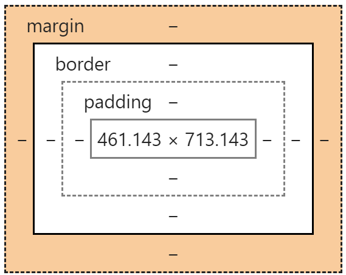

<style>
    .reveal .slides {
        text-align: left;
        font-size: 36px;
    }
    .reveal .slides section>* {
        margin-left: 0;
        margin-right: 0;
    }
</style>

Kliensalkalmazások

# 2. Előadás

HTML, CSS, Bootstrap

---
## Ismétlés előző óráról

### A web alapvető működése
 * Adott egy böngésző
 * A felhasználó beír egy URL-t
 * A böngésző kérést küld egy webszervernek (a cím az URL-ből jön)
 * A webszerver visszaküld egy HTML tartalmat, amit a böngésző megjelenít
    * Amennyiben a HTML fájlban vannak további fájlok hivatkozva, azokat a háttérben letölti a böngésző (pl. képek, stíluslapok, JavaScript fájlok)

----
 * A HTML tartalomban van JavaScript kód, amelyet a böngésző futtat &rarr; interaktív alkalmazások
    * A JavaScript kód módosíthatja az éppen megjelenített HTML tartalmat
    * A JavaScript kód a háttérben további kéréseket küldhet a szervernek, amire a szerver válaszol (AJAX)
        * A szerver válasza tetszőleges formátumú adat lehet

----
#### Miért van szükség a HTTP protokollra?
 * A kérések válaszol leírására a HTTP protokollt használjuk. 
 * A böngésző a webszervernek és webszerver a böngészőnek egyszerű bájtsorozatokat küld
 * Meg kell egyezniük abban, hogy a bájtosorozatot hogyan kell értelmezni? 
    * &rarr; szabványosított **protokoll**
 * A böngésző az erőforrásazonosítót kell elküldje és további paramétereket
 * A webszerver a válaszban a kért erőforrás adatait és további paramétereket küldd
 * Ezt teszi lehetővé a HTTP, ami egy egyszer szöveg alapú adatátviteli protokoll

----
#### HTTP segítségével elosztott API fejleszthető:
 * Hálózati végpontokat (URL-ek) definiálhatunk
 * Amelyeken keresztül hozzáférhetünk az adatokhoz és manipulálhatjuk azokat 
    * Általánosan: távoli metódusokat hívhatunk
 * A böngésző ezeket a távoli metódusokat hívja

---
# XML (ismétlés)

eXtensible Markup Language

---
* Szöveges dokumentum jelölő nyelv
* Elemek
    * nyitó-záró tag, vagy egyetlen elem
    * attribútumok
* Nincsenek előre definiált elemek
    * Bővíthetők
    * Önleíró (sémák)
* Struktúrált adatleírás
    * Fastruktúra: egyetlen gyökér elem
    * A több elemnek mind van egyetlen szülője

----
Példa

```xml
<library>
    <book isbn="123455678" title="Egri csillagok">
        <description>...</description>
    </book>
    <book title="Gyűrűk Ura">
    ...
    </book>
    <book title="Galaxis útikalauz stopposoknak" />
</library>
```

---

# HTML 
### HyperText Markup Language

* Jelölőnyelv, ami leírja a böngészőnek, hogyan épül fel egy weboldal struktúrája
* A böngésző képes a HTML dokumentumok megjelenítésére. 

----

Referenciák:
* [Mozilla developer network (MDN)](https://developer.mozilla.org/en-US/docs/Web/HTML)
* [w3schools](https://www.w3schools.com/html/)
* [Hivatalos szabvány](https://dev.w3.org/html5/html-author/)

----

Történelem, verziók:
 * Tim Berners Lee (CERN) ~ 1991
 * Hosszú fejlődés, több verzió, 
    * egyre (többnyire inkrementálisan) bővülő funkcionalitás
 * HTML5: a jelenlegi legfrissebb verzió

---
### ~XML

Egy elemet tag párokkal írunk le:
* `<a>` ... `</a>`, vagy `<input />` 
* attribútumok: 
    * `` 
    * (mindig a nyitó tagben)
* Szöveges tartalom `<p><span>alma</span></p>`
* XML-szerű, de vannak olyan tagek, amiket nem kötelező lezárni. 
    * Többnyire a legjobb, ha XML szabványnak megfelelően írjuk le a dokumentumokat. &rarr; XHTML

----
#### Az elemeknek és az attribútumoknak szabványban rögzített jelentése van, ezeket a böngészők ismerik.

---

### Kötelező elemek
DEMO ([`initial.html`](demo/initial.html))
```html
<!DOCTYPE html>
<html lang="en">
  <head>
    <meta charset=UTF-8>
    <title>Hello World!</title>
  </head>
  <body>
      Hello World!
  </body>
</html>
```
----

* `DOCTYPE`: (régen nagyobb jelentősége volt, amikor nagy eltérések voltak az egyes böngészők között)
    * Azt jelzi az oldal elején, hogy szabványos módon (**full standards**) szeretnénk az oldalt megjeleníteni
    * Ha hiányzott, akkor a különböző böngészők saját megoldásokat alkalmaztak (**quirks mode**) &rarr; nem egységes megjelenítés
* `html`: kötelező gyökérelem
* `head`: kötelező elem a metainformációknak, linkeknek
    * `meta`: metainformációk, például az oldal kódolása
    * `title`: az oldal címe, ami böngésző tabon megjelenik
    * `link`: hivatkozások más fájlokra (ld. később)
* `body`: kötelező elem a megjelenített tartalomnak

---

### Box modell
DEMO: [`box-model.html`](demo/box-model.html)


----
#### Block és inline típusú elemek
* Mi határozza meg, hogy egy elem milyen?
    * Szabvány
    * Felülírható (ld. `display` css tulajdonság később)
* A box modellen használt méretek:
    * külső margó: `margin`
    * keret: `border`
    * belső margó: `padding`
* Alapvető rendszerező elemek: 
    * `div` (block)
    * `span`(inline)

---

### Fontosabb elemek
[Szemantikus elemek](https://www.w3schools.com/html/html5_semantic_elements.asp)
* `header`: fejléc
* `nav`: navigációs sáv
* `aside`: csatolt információ
* `section`: fejezetek, láblécek, fejlécek jelölésére
* `article`: önálló tartalmak jelölésére
* `footer`: lábléc
* Miért jók? (`div` vs szemantikus tagek)
    * **jelentéssel bírnak** &rarr;
        * Google kereső értelmezi
        * Felolvasó szoftverek

----
* Címsorok (`h1`, `h2`, `h3`...)

* Kattintható link: [`a`](https://developer.mozilla.org/en-US/docs/Web/HTML/Element/a), 
    * `href`: az URL, amire mutat
    * `target`: hol nyissa meg az oldalt 
        * `_blank`: új ablakban
        * `_self`: ez az alapértelmezett érték - az aktuális tartalmat cseréljük le

```html
<a href="http:/www.google.com">Átirányítás a Google oldalára</a>

<a href="http:/www.google.com" target="_blank">
    Google megnyitása új ablakban
</a>
```

----
* Kép: `img` 
    * `src`: az kép URL-je
    * `alt`: alternatív szöveg, ha a kép nem lenne elérhető

```html

```

* Sortörés: `<br />`
* Vízszintes vonal: `<hr />`
* Bekezdés: `p` 

----
* Felsorolás: 
    * `ul` (unordered list)
    * `ol` (ordered list) 
    * `li`: list item

```html
<ul>
    <li>első elem</li>
    <li>második elem</li>
</ul>
```

----

* Táblázat: 
    * Alapvető elemek: 
        * Táblázat: `table`, 
        * Sor: `tr`, 
        * Cella: `td`
    * Fejléc cella. `td` helyett `th`
    * A fejléc, törzs, lábrész jelölésére: `thead`, `tbody`, `tfoot`

----
```html
<table>
    <thead>
        <tr>
            <th colspan="2">The table header</th>
        </tr>
    </thead>
    <tbody>
        <tr>
            <td>The table body</td>
            <td>with two columns</td>
        </tr>
    </tbody>
</table>
```

----
Mit kezd a böngésző a nem definiált tagekkel?

----
Általános attribútumok:
* `id`: valójában nincsen többlet jelentése, de tipikusan az elemek egyedi azonosítására használjuk. 
* `title`: tooltip (a legtöbb elemhez) - ha az egeret az elem fölé visszük, ez a szöveg jelenik meg

---
### HTML 5
 * Fő célja, hogy a webes alkalmazásokhoz ne legyen szükség pluginek használatára: Adobe Flash, Microsoft Silverlight, JavaFX
 * Kompatibilitás: 
    * Ma már elég jó (ritkán kell  fejlesztés során azzal foglalkozni, hogy olyan böngészőkben is működjön az oldal, ami nem támogatja HTML5-öt)
        * HTML 5 újdonságok: nem nézzük meg részletesen a tárgykeretében, hogy mi nem volt régebben, de utána lehet nézni
    * [Can I use](https://caniuse.com/): összegyűjtve, hogy az egyes feature-öket milyen böngészők támogatják
 
---

### Űrlapok
* Cél, hogy adatot tudjunk küldeni a szervernek a HTTP kérésekben
    * Generálunk egy HTTP kérést, aminek paraméterei vannak. 
    * A böngésző elüld egy HTML kérést, aminek az eredményeképpen visszakapott tartalmat megjeleníti
* Hogyan generálunk HTTP-t? 
    * Láttuk már, hogy javascript-ben tudunk küldeni a háttérben egy HTTP kérést. Ilyenkor ennek az eredményét kódban dolgozzuk fel, tehát a böngésző nem fogja megjeleníteni. 

----
Példa: bejelentkezés (DEMO: [`form.html`](demo/form.html))
* HTML elemek: 
    * `form`: az űrlap megjelenítésére.
    * `input`: szöveg beviteli mezők
        * `type` - a mező típusa: `text`, `checkbox`, `password`, `submit`, `hidden`
        * `value`: az aktuális mező értéke
    * `textarea`: többsoros szöveges beviteli mező
    * `select`: legördülő menü

----
Hogyan generálunk HTTP kérést?
* A `form`ban lévő gombok (például `<input type="submit" value="Elküld" />`) megnyomására a böngésző generál egy HTTP kérést
* A beviteli mezők értéke belekerül a HTTP kérésbe
    * A beviteli mezőket a `name` attribútum azonosítja 
    * Ha nincs `name`, nem kerül bele az érték a HTTP kérésbe
* Hova küldjük a kérést? 
    * `form` tag `action` attribútuma

----
Milyen HTTP-t akarunk generálni? 
 * `form` tag `method` attribútuma: pl. `GET`, `POST`

Hogyan szállítja a HTTP a paramétereket?
 * GET esetén URL paraméterként (`?`, `=`, `&`)
    * Egyszerű, mivel az URL másolható és tartalmaz minden paramétert
    * Mivel az URL látható mindenkinek, nem lehet titkosítani
 * POST esetén body-ban utaznak a paraméterek
    * HTTPS esetén titkosítható

----
```http
GET /mails?sender=ABC&maxDate=20200101 HTTP/1.1


 
```

```http
POST /mails HTTP/1.1

sender=ABC&maxDate=20200101
```


---

# CSS
Cascading StyleSheets
 
---

A HTML-lel szorosan összefüggő szabvány. 
* Célja, hogy le tudjuk írni a HTML elemek kinézetét (stílusát) és 
* ezt a leírást el tudjuk választani az oldal struktúrájától
* HTML5 &rarr; CSS3

----

CSS tulajdonságok: 
 * Sokféle tulajdonság, amiket beállíthatunk az egyes HTML elemekre. 
    * A [tulajdonságok listája](https://www.w3schools.com/cssref/), jelentésük és lehetséges értékeik [szabványban](https://www.w3.org/Style/CSS/specs.en.html) rögzítettek. 
    * Egy tulajdonság leírása: `név:érték`
        * `background-color: blue;`
    * A tulajdonságok összefügghetnek: 
        * pl. `border-width:0` és `border-color:blue` és egymást befolyásolhatják

----
Hogyan rendeljük a tulajdonságokat az egyes elemekhez?
1.  Megadhatók bármely elem `style` attribútumában egy lista, az elemeket `;`-vel elválasztva: 

```html
<span style="font-size: larger; color: lightgray">szöveg</span>
```
2. A tulajdonságokat csoportokba (`{...}`) rendezhetjük, majd a csoportokat összeköthetjük az egyes elemekkel (**css szelektorok**)

```css 
<css_szelektor> {
    border-width: 0;
    border-color: blue;
}
```

----

Hova tegyük a csoportokat a HTML fájlban?
1. `style` HTML elem

```html
<style type="text/css">
    css csoportok
</style>
```
* A `type="text/css"` az alapértelmezett érték, ezért ez az attribútum elhagyható.
2. Különálló CSS fájlba, amire `link` taggel kell hivatkozni a `head`-ben.

```html
<link rel="stylesheet" href="style.css">
```

----
Milyen [css szelektorok](https://www.w3schools.com/cssref/css_selectors.asp) vannak?

DEMO ([`css.html`](demo/css.html))

Szelektorok:
* *element*: az adott tag nevére szűr
* *class*: a class attribútumra szűr,
* *id*: az elemek azonosítójára szűr
* *attribute*: az elemek attribútumaira szűr
* ...
* Ezek kobinálása
* Hierarchia megadása 
    
---

### Fontosabb CSS tulajdonságok:
* `display`: `block`/`inline`
    * Az elem inline, vagy block módon jelenjen-e meg
* Margók, keretek: `margin`, `padding`, `border`
* Méretek: `height`, `width`, `min-height`, `,min-width`
    * mértékegységek: `1px`, `1em` stb.
    * Relatív mértékegységek: `50%` stb.
* Színek: `color`, `background-color`
    * színek megadása névvel (pl. `blue`), vagy rgb értékkel (`#112233`, vagy `rgb(11, 22, 33)`)

----
CSS tulajdonságok alkalmazási sorrendje:
* A tulajdonságok felülírhatják egymást
* CSS szelektorok a felsorolás (betöltés) sorrendjében
* `class`ban felsorol css osztályok a felsorolás sorrendjében
* `style` attribútumban felsorolt lista legvégül
* `!important` előkerül a sorban
    * Ha több `!important` van, akkor megint a betöltési sorrend számít

----
```html
<style>
.kek { 
    color: blue; 
}
.sarga { 
    color: yellow !important;
}
.piros { 
    color: red; 
}
</style>

<span class="kek sarga piros" style="color: black">Milyen színű?</span>
```
* Sárga lesz az `!important` miatt
* Ha nem lenne `!important`, akkor fekete

---
### Elrendezések (layoutok)
* Középre rendezett oldal: DEMO  [`layout1.html`](demo/layout.html)
* Táblázatokat nem használunk elrendezéshez, oldal struktúrájának meghatározására.
* Elemek szélességének, magasságának megadása egyesével: 
    * nehézkes és nem adaptálódik jól, ha átméretezzük a böngészőt
* Speciális CSS tulajdonságok:
    * `position`, `left`, `right`, `top`, `bottom`
    * Nem egységes böngészőkezelés

----
* "Lebegtett" tartalmak: 
    * [`float` és `clear` tulajdonságok](https://developer.mozilla.org/samples/cssref/float.html)
    * Régen sokat használtuk, de a modern bögnészőkben *szerencsére* nem kell
* [`flexbox` elrendezés](https://css-tricks.com/snippets/css/a-guide-to-flexbox/): nagyon rugalmas, a modern böngészők jól támogatják


----
* Grid rendszerek: az oldalunkat felosztjuk oszlopokra és sorokra. 
    * Az elemeket az egyes cellákba helyezzük el. 
    * A céllák szegélyei tipikusan nem látszanak, ezek kizárólag az elrendezés miatt szükségesek. 
    * A sorok olyan magasak, mint a bennük lévő tartalom, de az oszlopok szélessége rögzített. 
    * Természetesen lehet több egymás melletti cellát összevonni. (ld. Bootstrap később)

---
### Reszponzív tervezési elvek

Különböző méretű képernyőkön máshogyan szeretnénk megjeleníteni a tartalmat. Például ha elég széles az ablak, akkor egymás mellett, de mobiltelefonon egymás alatt megjelenített elemekkel. 
* Legfontosabb eleme: `@media`

```css
@media` CSS3 szelektor, pl: `@media only screen and (min-width: 600px)
```

* [Példa](https://www.w3schools.com/css/tryit.asp?filename=tryresponsive_col-s)

---
### CSS keretrendszerek

Az elrendezésekbe és a reszponzív tervezési elvekbe nem megyünk bele részletesen, mert nagyon speciálisak, sok idő a használatuk megismerése.  
* Szerencsére nagyon sok ingyenes sablon érhető el, amikből érdemes kiindulni. 
* Vannak ezeken kívül CSS keretrendszerek. Ezek olyan CSS szabályok gyűjteményei, amivel egy-egy speciális elrendezést, vagy stílust tudunk alkalmazni az oldalunkon azzal, hogy egyszerűen hivatkozzuk a keretrendszer által publikált CSS fájlt. 
* A legfontosabb, legelterjedtebb ilyen keretrendszer a bootstrap (https://getbootstrap.com/), de van más is. 

----
#### Bootstrap
* [Dokumentáció](https://getbootstrap.com/docs/4.4/getting-started/introduction/)
* Használata: 

```html
<link rel="stylesheet" 
    href="https://stackpath.bootstrapcdn.com/bootstrap/4.4.1/css/bootstrap.min.css" 
    integrity="sha384-Vkoo8x4CGsO3+Hhxv8T/Q5PaXtkKtu6ug5TOeNV6gBiFeWPGFN9MuhOf23Q9Ifjh" 
    >
```


----
* Legfontosabb elemek (DEMO)
    * Layout: `container` és `grid`
    * Flexbox elrendezés
    * Egységes tipográfia
    * Egységes színek
* Miért van benne JavaScript? 
    * Bizonyos elemek, stílusok, animációk csak JavaScript segítségével oldhatók meg. 


---
# Markdown 
* Cél, hogy egyszerűen tudjunk html-t generálni szövegből kevesebb gépeléssel.
* [Jelölések](https://guides.github.com/pdfs/markdown-cheatsheet-online.pdf)
    
----
````markdown
Egyszerű szöveg, **félkövér**, *dőlt*, `kód`
# 1. Címsor
# 2. Címsor
Felsorolások:
* a
    * b
    * c
* b
1. első
2. második
[Link szövege](link URL-je)

<span style="color:red">Tetszőleges HTML tartalom</span>
```js
//formázott, adott nyelvű kód
```
````
----
Markdown nyelvű jegyzetből diasor:
* [RevealJS](https://revealjs.com/#/)
* [RemarkJS](https://remarkjs.com/#1)
 

---
### Ellenőrző kérdések
* Mire való a HTML nyelv?
    * Milyen kötelező elemei vannak egy HTML dokumentumnak? 
    * Mire való a `DOCTYPE`?
    * Mire valók a `html`, `head`, `body` elemek?
    * Ismertesse a következő elemeket és legfontosabb attribútumaikat: `a`, `img`, `p`
    * Hogyan kell táblázatot definiálni HTML-ben? 
    * Mi a különbség a `div` és `span` elemek között?

----
* Mire való a CSS nyelv? 
    * Mi az a CSS szelektor?
    * Milyen CSS szelektorokat ismer?
    * Mi rendezünk reszponzív designnak?
* Ismertesse a box modellt!
* Mire szolgálnak az űrlapok?
    * Hogyan kell űrlapokat létrehozni? 
    * Milyen adatbeviteli mezők vannak egy űrlapban? 
    * Ismertesse az űrlapok beviteli mezőiben szereplő `name` attribútum jelentését!
    * Mi lesz egy űrlap alapján készített HTTP kérés tartalma?


