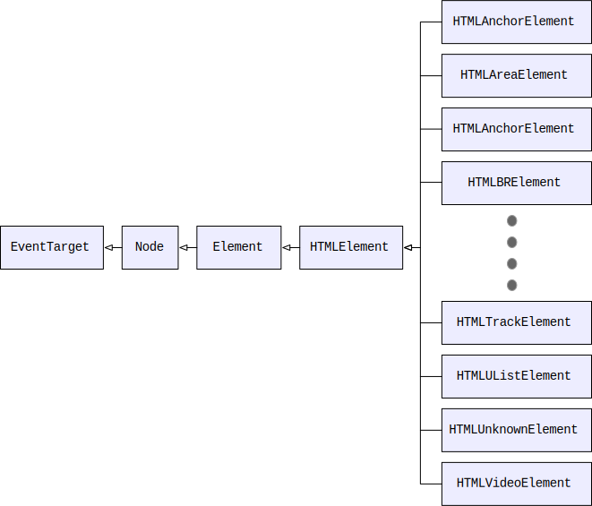

<style>
    .reveal .slides {
        text-align: left;
        font-size: 36px;
    }
    .reveal .slides section>* {
        margin-left: 0;
        margin-right: 0;
    }
    .reveal pre {
        font-size: .70em
    }
</style>

Kliensalkalmazások

# 4. Előadás

JavaScript folytatás
---

## Prototípusok
----

### Ismétlés
* Gyengén típusos nyelv
* Beépített metódusok, propertyk
    * `"abc".length`
    * `[1,2,3].push(4)`
* Minden adat rendelkezik `toString` metódussal...

---
### Prototípus alapú öröklés
* Egy objektumnak lehet legfeljebb 1 prototípusa: 
    *  A prototípus egy másik `objektum`, vagy null, ha nem létezik.
* Ha egy objektum egy property-jét olvasni akarjuk, de az nem létezik, akkor megnézzük, hogy az benne van-e a prototípusban és ha igen, akkor azt adjuk vissza. 
    * Írni nem tudjuk a prototípus property-jét. 


----
Protítpus objektum elérése és módosítása:
*  `__proto__` (getter, setter)
* `Object.getPrototypeOf(obj), Object.setPrototypeOf(obj)`


Jegyzet:
A JavaScript nyelv objektum-orientált, de gyengén típusos nyelv. Továbbá nincsenek hagyományos értelemben vett osztályok, helyette az ún. prototípus alapú öröklés került megvalósításra. Ez azt jelenti, hogy az egyes objektumoknak lehet prototípusa. A prototípus egy másik `objektum`, vagy null, ha nem létezik. Ha egy objektum egy property-jét olvasni akarjuk, de az nem létezik, akkor megnézzük, hogy az benne van-e a prototípusban és ha igen, akkor azt adjuk vissza. Írni nem tudjuk a prototípus property-jét. Egy példa erre a `toString` metódus, amellyel minden objektum rendelkezik, még az is, amelyet a `{}` kifejezéssel hoztunk létre. Ugyanis minden objektum alapértelmezett prototípusa egy olyan objektum, amely ezzel és még néhány egyéb metódussal is rendelkezik. 

Hagyományosan a protípust a `__proto__` property-n keresztül tudjuk elérni (lekérdezni és módosítani.) Fontos tudni, hogy ez valójában egy getter/setter property.  A prototípus szintén lekérdezhető és módosítható a következő metódusokkal: `Object.getPrototypeOf(obj), Object.setPrototypeOf(obj)`. (Valójában a prototípus a `[[Prototype]]` nevű property-n keresztül lenne elérhető, de ehhez nincs közvetlen hozzáférésünk.)

----
```js
let o = {};
console.log(o.toString()); // --> "[object Object]"
console.log('toString' in o.__proto__); // --> true
o.__proto__ = null;
console.log(o.toString()); 
    // --> TypeError: o.toString is not a function
```
----
```js
let parent = {
    name: 'x',
    greet() {
        console.log(this.name);
    }
};
let child = {
    id: "ABC123"
};

//Az alábbi ezzel azonos: 
// Object.setPrototypeOf(child, parent);
child.__proto__ = parent;
```
----
```js
console.log(child.id); //ABC123
console.log(child.name); // x
child.greet();  // x

child.id = "EFG456";
console.log(child.id); //EFG456 

console.log('name' in child); //true
child.name = "y";
console.log(child.name); // y
console.log(parent.name); // x
child.greet(); //y
parent.greet(); //x
```
----
```js
child.__proto__ = null;
console.log(child.name); //y
console.log(child.greet); //undefined
```

----
A prototípus tehát egyfajta öröklést tesz lehetővé. 

Betartandó szabályok:
* Nincs körbeverés (nem lehet ciklus a prototípus öröklésben).
* A protoípusok csak objektumok, vagy `null` lehet, primitív típus nem. 

----

A `this` értékét a prototípus nem befolyásolja, azaz ha egy objektumon keresztül egy prototípus property-jét érjük el, attól még a a `this` az aktuális leszármazott gyerekre mutat. 

```js
let user = {
	greet() {
		console.log(this.name);
	}
};

let admin = {
	name : "admin"
};

admin.__proto__ = user;
admin.greet(); // "admin"
```

---
### Konstruktor függvények
* Konstuktor függvényeknek van `prototype` propertyje
    * Nem azonos a `__proto__` property-vel!!!
* Amikor létrehozunk egy új objektumot a konstruktor függvénnyel, akkor annak a prototípusa ez az objektum lesz.
* Ez lehetővé teszi, hogy a prototípust akár futási időben újabb property-kkel egészítsük ki, amelyek ezután minden öröklött helyen elérhetővé válnak.


```js
function User(name) {
	this.name = name;
}
let user = new User();
User.prototype.greet = function () { console.log("hello"); }
user.greet();
```

Jegyzet:
Speciálisan működnek a konstruktorfüggvények. Ezeknek ugyanis van egy alapértelmezett `prototype` propertyje. Amikor létrehozunk egy új objektumot, akkor annak a prototípusa ez az objektum lesz. Ez lehetővé teszi, hogy a prototípust akár futási időben újabb property-kkel egészítsük ki, amelyek ezután minden öröklött helyen elérhetővé válnak.

----

Beépített típusok prototípusa:
* `Object.prototype`
* `Boolean.prototype` 
* `Number.prototype` 
* `String.prototype`
* stb.

Jegyzet:
Ugyanígy elérhető az `Object.prototype`, illetve az egyes típusok csomagoló objektumaihoz tartozó prototípusok: `Boolean.prototype, Number.prototype, String.prototype`. Ezért lehet metódusokat és más property-ket lekérdezni primitív típusokon is. 

A fentiek alapján természetesen lehetőség van újabb property-kkel kiegészíteni akár az alapértelmezett prototípus objektumokat is. Ez azonban nem jó megközelítés, mert ha több különböző könyvtárat használunk és mindegyik beletesz újabb metódusokat például a `String` prototípusába, akkor a különböző funkciók összeakadhatnak. 

Egy kivétel van, amikor elfogadott a beépített prototípus objektumok kiterjesztése: a *polyfill*. A JavaScript nyelv fejlődésével újabb és újabb funkciók kerültek bele. Azonban a régebbi JavaScript motorok (pl. régebbi böngészők) nem támogatják mindig ezeket az új funkciókat. Ez sok esetben megodlható ún. polyfill könyvtárak segítségével, amelyek egyszerűn a régi környezetben a prototípusokat egészítik ki. Például az egyes JavaScript verziók újabb és újabb metódusokkal egészítették az `Array` objektumot. Ahhoz, hogy a kódunk hordozható legyen és régebbi motorokon is működjön egy megfelelő polyfill könyvtárat kell importálnunk. 

---
## Osztályok

Konstruktor függvényekkel ~ osztályokhoz hasonló funkcionalitás

```js
function User(name) {
    this.name = name;
    this.greet = function() {
        console.log(this.name);
    }
}
```

----
&#10026;

### *Factory* minta megvalósítása
```js
function User(name) {
    return {
        name: name,
        greet() {
            console.log(this.name);
        }
    };
}
```

Jegyzet:
A létrehozott objektumokat mezőkkel és metódusokkal is ki tudjuk egészíteni.

---
### `class` kulcsszó
* Szintaktikai édesítőszer
* Prototípus alapú öröklés a korábban ismertetett konstruktor függvények alapján

Jegyzet:
JavaScriptben alapértelmezetten nincsenek osztályok, hiszen a prototípusok segítségével megoldható az öröklés, azonban az egyszerűség kedvéért bevezették ezek használatát, mint szintaktikai édesítőszert. Tudni kell azonbban, hogy az osztály nem csak egy nyelvi konstrukció, a háttérben ugyanolyan függvényekre fordul, mint amiket fent láttunk.

----
```js
class User {
    name = "";
    greet() { //metódus
        console.log(this.name);
    }
}
```
A fenti kód teljesen ekvivalens az alábbival: 
```js
function User () {
    this.name = "";
}
User.prototype.greet = function() {
    console.log(this.name);
}
```
----
#### Konstruktorok
Az osztályok rendelkezhetnek konstruktorral is: 
```js
class User {
    constructor(name) {
        this.name = name;
    }
}
```

----
#### Láthatóságok
A `private, public, protected` módosítószavakat tudjuk használni az egyes mezők és metódusok láthatóságának befolyásolására. 

----
#### Konstruktor paraméter eltárolása tagválozóban
```js
class User {
    constuctor(public name ) {        
    }
}
let user = new User("XY");
console.log(user.name); //XY
```

Jegyzet: 
Amennyiben a konstruktor paraméterével megegyező property-t akarunk létrehozni és abba bemásolni a paraméter értékét, akkor az egyszerűen így is leírható: 

---
### Öröklés
Az osztályok egymásből öröklődhetnek, erre az `extends` kulcsszót használjuk:
```js
class A { }
class B extends A { }
```

```js
class User { 
    constructor(name) {
        this.name = name;
    } 
}
class Person extends User {
    constructor(age, name) {
        super(name);
        this.age = age;
    }
}
```
---
### static
 * Lehet statikus függvényeket létrehozni a `static` kulcsszóval. 

```js
class A {
    static greet() {
        console.log("hello");
    }
}
A.greet(); // hello
(new A()).greet(); // error
```
----
Az `instanceof` operátorral eldönthető, hogy egy objektum egy adott osztály példánya. 

```js
function F() { }
class A {}
class B extends A { }
let f = new F();
let a = new A();
let b = new B();

console.log('f instanceof F: ', f instanceof F); //true
console.log('a instanceof F: ', a instanceof F); //false
console.log('a instanceof A: ', a instanceof A); //true
console.log('a instanceof B: ', a instanceof B); //false
console.log('b instanceof A: ', b instanceof A); //true
console.log('b instanceof B: ', b instanceof B); //true

```
---
&#10026;

### Osztálykifejezések

A `class` kulcsszó valójában csak egy szintaktikai édesítőszer, ezért az osztálydefiníciók valójában egyszerű kifejezések. Így osztálykifejezést is lehet írni:
```js
function BFactory() {
    return class {
        //...
    }
}
class A extends BFactory() { }
```

---
## JavaScript a böngészőben

A JavaScriptet eredetileg böngészőkbe tervezték, innen fejlődött tovább egy teljes értékű programozási nyelvvé. 
---
### `window`

* Minden JavaScript motor biztosít egy globális objektumot, amely bárhonnan elérhető.
    * Ha létrehozunk egy globális változót, az ennek lesz egy property-je. 
    * `NodeJS`-ben ennek a változónak a neve `global`
    * Böngészőkben, ennek a változónak a neve: `window`
* A globális objektum propertyjei elérhetőek a `window` előtag nélkül is

```js
var x = 5;
console.log(window.x); //5
console.log(x); //5
```
----
#### Néhány hasznos segédfüggvény böngészőben
* `alert(text)`: feldob egy messageboxot a megadott szöveggel
* `confirm(text)`: megerősítést kér a felhasználótól, visszatérési értéke `true` vagy `false`

```html
<script>
let result = confirm("Rendben?");
alert(result);
</script>
```
Kipróbálás: egy böngészőben a developer toolbar console tabján írjuk be: `alert(confirm("Rendben?"))`
---
### `document`

#### DOM (Document Object Model)
Ez jelképezi a böngészőben megjelenített, JavaScript kódból változtatható HTML tartalmat.
* A HTML tartalom egy fastruktúraként képzelhető el, 
* ennek a gyökere a `document`
* A `document` metódusai és tagváltozói segítségével bejárhatjuk és módosíthatjuk a HTML tartalmat
    * Minden HTML elemet egy objektumként érhetünk el
        * Lekérdezhetjük, vagy módosíthatjuk a tulajdonságait
    * `document.body`: a `body` elemnek megfelelő objektum

----
[Típusok a DOMban](https://mdn.mozillademos.org/files/16587/dom-structure.svg)


Jegyzet: 
Ez a kép mutatja a DOM struktúráját. A `window` tartalmazza a `document`-et, az tárol `element`eket. Minden `element` további elemeket tartalmaz. 
----
[Típusok a DOMban](https://mdn.mozillademos.org/files/16596/html-dom-hierarchy.svg)



Jegyzet:
Amikor hozzáférünk a fastruktúra egy eleméhez, akkor az adott HTML elemeknek megfelelő típusú objektumot kapunk, pl. `HTMLAnchorElement` (`a`), vagy `HTMLImageElement` (`img`). Ezek mindegyik az adott HTML attribútumainak megfelelő property-ket biztosít az elem tulajdonságainak módosítására. 

----
#### Hogyan tudjuk bejárni a fát?
* `document.body`
* Bármelyik elemen: 
    * `parentNode`
    * `previousSibling`, `nextSibling`
    * `firstChild`, `nextChild`,`childNodes`

----
### Keresés
* `document.getElementById(id)`: id alapján keres egy elemet
* `elem.getElementsByClassName(className)`
* `elem.querySelectorAll(cssSelector)`: CSS szelektor alapján keres és visszaadja az összes találatot az `elem` alatt található részfában
* `elem.querySelector(cssSelector)`: csak a legelső találatot adja vissza
* ...

---
### Módosítás
Ha megtaláltunk egy elemet, akkor annak minden tulajdonságát tudjuk módosítani. 
* A property-knek utána lehet nézni a referenciákban
* Tipikusan megegyeznek a HTML attribútumokkal, pl.:
    * `HtmlInputElement`: `value`, `type`, `disabled`, `required` stb.
    * `HtmlAnchorElement`: `href`
* Néhány fontos általános property (minden `HtmlElement` leszármazotton):
    * `tagName`
    * `className`,
    * `innerHtml` (stringként a belső HTML tartalom)

----
```html
<h1 style="color:white; padding:2em;" id="hTimer">
  Időzítő példa
</h1>
<script>
    let counter = 0;
    let h = document.getElementById("hTimer");
    let colors = ["red", "green", "blue"];
    let timerId = setInterval(() => {
        counter = (counter +1) % 3;
        h.style.backgroundColor = colors[counter];
    }, 1000);
</script>
```
[teljes példa](demo/timer.html)

---
### Létrehozás, törlés
* Új elem létrehozása: `document.createElement(elemName)`
* Beszúrás a DOMba: 
    * `append`, `prepend`, ...
* Létező elem törlése: 
    * `elem.remove()`

[Példa](demo/dom-manipulation.html)

---
### Az itt bemutatott API-k és property-k, csak töredéke a `document` által nyújtott API-nak.

---
### Eseménykezelés

A DOM elemei (és más objektumok is, pl. `window`, `document`) jelezhetnek eseményeket, pl:
* Egér események: kattintás (`click`), egérmozgatás (`mousemove`) stb.
* Billentyűet események: `keydown`, `keyup` stb.
* Életciklus események: `loaded` (document)
Az egyes eseményekhez megadhatunk **eseményekezelő függvény**eket:
    * olyan függvény, amely feliratkozik egy eseményre, azaz meghívásra kerül, ha az esemény bekövetkezik
----
Mit kell ehhez tudni? 
1. Feliratkozás módja?
2. Milyen függvényt adhatunk meg?
 
----
#### Feliratkozás

1. HTML kódban: 
    * Speciális attribútumok: `on<esemény_neve>`
    * Az attribútum értéke: JS kód

```html
<button onclick="alert('megnyomtad a gombot')">
    Kattints ide!
</button>
```
----
2. JS kódban: ha hozzáfértünk egy elemhez, akkor feliratkozhatunk annak egy eseményére
    * `addEventListener(eventName, action)` 
    * előnye, hogy le is tudunk iratkozni: `removeEventListener(eventName, action)`

```html
<button id="btn">Kattints ide!</button>
<script>
let btn = document.getElementById("btn");
btn.addEventListener("click", () => {
  alert('megnyomtad a gombot');  
});
</script>
```

----
#### Eseménykezelő függvény
* `this`: mindig arra az elemre mutat, amin az esemény történt

```html
<button id="btn">Kattints ide!</button>
<script>
let btn = document.getElementById("btn");
btn.addEventListener("click", () => {
  alert('megnyomtad a gombot, aminek a szövege: ' 
        + this.innerText);  
});
</script>
```
----
* Minden eseménykezelőfüggvénynek van egy paramétere, amit megkap
    * `Event` típusú JS object
    * Információt tárol az adott eseményről
        * `type`: az esemény neve (pl. `click`)
    * Valójában az `Event` egy "leszármazottját" kapjuk, amely eseményspecifikus információkat is nyújt
        * pl. `MouseEvent`: `altKey`, `screenX`, `screenY` stb.

```js
document.addEventListener(
    'click', 
    (event) => console.log(event.screenX, event.screenY));
```
---
#### Bubbling
Sok esemény ún. "bubbling" típusú:
* ha rákattintunk egy gombra (`button`), az generál egy kattintás eseményt a gombon
* ha a gomb egy `div`ben van, akkor a gomb után, a `div` is jelzi a `click` eseményt
* így fel egészen a `document`-ig a tartalmazási hierarhiában
* Bárhol feliratkozhatunk az eseményre
* Az `Event` `target` propertyje jelzi, hogy valóban ki volt az eredeti célzott
* A "bubbling"-ot az `Event` `stopPropagation` metódusával állíthatjuk meg

[Példa](demo/bubbling.html)

---
### Storage API
Storage:
* Kisméretű adatok tárolására alkalmas (néhány MB)
* Tárolás kulcs érték párok formájában, ahol a kulcs és az érték is string
* Egységes programozói felület (API)

----
Storage típusok
* `sessionStorage`: 
    * böngészőtabonként (valójában *domain*enként) elkülönített tárolóhely
    * a böngésző bezárásakor törlődik
* `localStorage`: 
    * A böngésző újraindításakor is megmarad

Ezek elérhetők globális változóként, vagy a `window` objektumon.

----
* `setItem(<kulcs>, <érték>)`: új érték beírása (vagy felülírása)
* `getItem(<kulcs>)`: érték lekérdezése
* `clear()`: minden elem törlése

----
```js
function saveUserData(data) {
    let dataStr = JSON.stringify(data);
    localStorage.setItem('userData', dataStr);
}

function loadUserData() {
    let dataStr = localStorage.getItem('userData');
    return JSON.parse(dataStr);
}
let data = { name: "XY" }; 
saveUserData(data);
let data2 = loadData();
```

----
&#10026;

#### Storage Event
Értesítések a storage változásáról:
* `window` objektumon
* Eseménye neve: `storage`

```js
window.addEventListener('storage', () => {
  console.log(
      JSON.parse(
        window.localStorage.getItem('sample')));    
});
```

---
## Aszinkronitás

----
```ts
console.log("szinkron");
setTimeout(() => { 
    console.log("hello");        
}, 1000);
console.log("aszonkron");
```

```console
szinkron
aszonkron
hello
```

----

* A JavaScript motor eredetileg egyszálú
    * `Web worker`: munkaigényes feladatok elvégzése a háttérben külön szálon
* Szinkron vs aszinkron kód:
    * szinkron kód blokkolja a végrehajtást, amíg véget nem ér
    * aszinkron kód másik szálon fut, így az erdeti szálat nem blokkolja
        * aszinkron függvényhívás visszatérési értéke: esemény jelzi, hogy véget ért a végrehajtás és az esemény tartalmazza a visszatérési értéket
        * Ha értesülni akarunk az eredményről, fel kell iratkozni az eseményre egy **callback** függvénnyel

----
```js
function add(a, b) { 
    console.log('add');
    return a + b; 
}
function addAsync(a, b, callback) {
    console.log('addAsync');
    setTimeout(() => {
        let sum = a + b;
        callback(sum);
    }, 1000)
}
```

----
```js
console.log('1');
add(1,2);
console.log('2');
addAsync(1,2, sum => {
    console.log('addAsync végetért');
});
console.log('3');
```

```console
1       
add     
2       
addAsync
3       
addAsync végetért
```

----
#### A `setTimeout` és a `setInterval` aszinkron módon futtatja a kódot, még akkor is, ha 0 ezredpásorperc van beállítva időintervallumnak.

---
### Promise minta

Függvény általánosítása:
* Adott egy művelet, amely valamilyen eredményt állít elő. (*producer*)
* Meg szeretnénk hívni a műveletet és az eredményét fel akarjuk dolgozni. (*consumer*)
* A műveletet aszinkron módon hajtjuk végre, ezért
    * szeretnénk értesülni arról, ha a művelet végetért és rendelkezésre áll az eredmény.
* A függvényünk visszaétéri értéke egy **promise**:
    * Egy JS objektum, amely nem az eredményt tartalmazza, hanem 
    * Egy API-t, amin feliratkozhatok arra az eseményre, hogy az eredmény elkészült
----
Miben több ez, mint a korábbi callback megoldás?
* callback: ahány aszinkron függvény, annyiféle API a feliratkozásra
    * promise: egységes API
* Hibakezelés: mi történik, ha hiba lesz az aszinkron művelet végrehajtása során?
    * Hiába tesszük `try...catch` blokba az aszinkron függvény meghívását...
    * Megoldás: legyen egy másik callback, amit hiba esetén meghívunk
    * promise: erre is egységes API-t biztosít

----
```js
function addAsyncWithError(a, b, callback) {
    setTimeout(() => {
        throw new Error();
        callback(a + b);
    }, 1000);
}
try {
    addAsyncWithError(1, 2, sum => { console.log(sum); });
} catch (error) {
    console.log(error);
}
console.log('vége');
```
----
```console
vége
Error
    at Timeout._onTimeout (temp.js:3:15)
    at listOnTimeout (internal/timers.js:549:17)
    at processTimers (internal/timers.js:492:7)
```
----
```js
function addAsync(a, b, callback, callbackOnError) {
    setTimeout(() => {
        try {
            throw new Error();
            callback(a + b);
        } catch (error) { callbackOnError(error); }
    }, 1000);
}
addAsync(1, 2, 
    sum => console.log(sum),
    error => console.log('hiba történt'));
        
console.log('vége');
```
```console
vége
hiba történt
```
----
Milyen API-t biztosít egy promise (`Promise` típusú JS objektum) a feliratkozásokra?
* `then(<callbackOnSuccess>, [<callbackOnError>])`:
    * *callbackOnSuccess*: egy függvény, amely egy paramétert vár, ez lesz az eredmény
    * *callbackOnError*: egy függvén, amely egy paramétert vár, ez lesz a hiba
* `catch(<callbackOnError>)`: csak a hibára iratkozunk fel
* `finally(<callbackAlways>)`: egy függvényt vár, ami mindig megíhvódik, akkor is, ha megvan az eredmény, akkor is, ha hiba történik

---
### Állapotgép
Egy `Promise` állapotát leírja a `result` és a `state` property:
* Amíg az aszinkron művelet végrehajtás alatt van és még nincs eredménye:
    * `state`: `pending`
    * `result`: `undefined`
* Ha sikeresen végetért a művelet:
    * `state`: `fulfilled`
    * `result`: az aktuális eredmény
* Ha hiba történt:
    * `state`: `rejected`
    * `result`: `error`

----
`fulfilled` &xlarr; `pending` &xrarr; `rejected`
* Nincs visszatérés a kezdő állapotba

----
#### Időzítés
* Egy `Promise`-ra akkor is fel lehet iratkozni, ha már `fulfilled` állapotban van:

```js
let promise = new Promise((resolve, reject) => {
    resolve(1);
});

setTimeout(() => {
    promise.then(result => console.log(result));
}, 1000);
```
```console
1
```

---
###  Érdekességek
* Egy `Promise`-ra többször is fel lehet iratkozni

```js
promise.then(...);
promise.then(...);
```

----
####  `Promise` chaining
* A `then` visszaétérési értéke is egy `Promise`
* Ha a `then`-ben átadott függvénynek van egy visszatérési értéke, a lesz az új Promise visszatérési értéke

```js

promise
    .then(result => 2)
    .then(result => 3)
    .then(result => 4)
    .then(result => console.log(result));
```

```console
4
```


---
### Promise pattern és aszinkron műveletek
Egy művelet aszinkronná tehető, ha visszatérési értéke egy `Promise` objektum. 

---
### Promise létrehozása
* Sok beépített függvénynek `Promise` a visszatérési értéke
* Létrehozhatunk sajátot is: 
    * `new Promise(action)`
    * Az `action` egy függvény:
        * Két paramétere van: `resolve` és `reject`, amelyek függvények
        * Az action végrehajtja a számítást és az eredménytől függően az egyik függvényt kell meghívja. 
            * Tehát `return <value>` helyett `resolve(value)`-t hív, illetve
            * `throw Error()` helyett `reject(...)`-et hív
----
```js
function divideAsync(a, b) {
    return  new Promise((resolve, reject) => {
        if (b === 0)
            reject('0-val nem lehet osztani');
        else 
            resolve(a / b);
    });
}
divideAsync(1,2)
    .then(result => console.log(result));
divideAsync(1,0)
    .catch(result => console.log(result));
```
```console
0.5
0-val nem lehet osztani
```

---
### `Promise` API
* `Promise.resolve(value)`: egy `Promise`, ami visszaadja az adott értéket
* `Promise.all(listOfPromises)`: várakozik az összes paraméterként kapott `Promise`-ra 
    * Visszatérési értéke egy `Promise`, ami az eredmények listáját tartalmazza
    * A paraméterben nem csak `Promise`-ok, hanem konstansok is lehetnek

```js
Promise.resolve(1).then(value => console.log(value)); 
//1
Promise.all([1,2,3]).then(values => console.log(values)); 
//[1,2,3]
```

---
## `fetch` API
AJAX küldése JavaScriptből:
* `XMLHttpRequest`: régi API, bonyolult a használata
* Helyette kialakult sok utility könyvtár: pl. `jQuery.ajax()`
* `fetch` API

----


----
`fetch(resource, [init])`:
* `resource`: URL 
* `init`: 
    * `method`
    * `headers`
    * `body`
* Aszinkron művelet, ami egy *promise*-szal tér vissza
    * A promise eredménye egy *response stream*
    * Segédfüggényekkel kiolvasható a streamből a tartalom
        * `json()`: egy JS objektum promise-szal tér vissza
        * `blob()`
        * `text()`

----
[Példa](demo/fetch.html)

<div style="font-size:smaller">

```html
<script>
    function queryBooks() {
        fetch('books.json')
            .then(response => response.json())
            .then(books => {
                let ul = document.getElementById('ulBooks');
                for (let book of books) {
                    let li = document.createElement("li");
                    li.innerText = `${book.title} (${book.isbn})`;
                    ul.append(li);
                }
            });
    }
</script>
<button onclick="queryBooks()">Könyvek lekérdezése</button>
<ul id="ulBooks"></ul>
```

</div>

---
## Async/await

Speciális nyelvi szintaxis `Promise`-okkal kezeléséhez:
 * `async`
 * `await`

----
### `async`
*  kulcsszó egy függvény neve előtt: a függvény visszatérési értéke egy `Promise`
* A függvényben elég egy egyszerű értéket visszadnunk, azt a végrehajtó motor becsomagolja egy `Promise`-ba

```js
async function f() {
return 1;
}

f().then(alert); // 1
```

* Természetesen visszaadhatunk magunk is `Promise`-t, ilyenkor az nem lesz becsomagolva

----
### `await`
* Egy promise elé írhatjuk:

```js
let result = await promise;
```

* a kódnak a végrehajtása akkor folytatódik, amikor a promise végeredménye rendelkezésre áll
* az eredmény lesz a visszatérési érték

* Csak `async`-kal megjelölt függvényben szerepelhet

----
Async/await vs szinkron végrehajtás:
* Úgy tűnik, mintha szinkronná tennénk egy `Promise` mögötti függvény végrehajtását, hiszen a hívó kódunk blokkolódik
* Valójában nem ez történik, hanem:
    * Elindítjuk az aszinkron műveletet
    * A környezet elmenti a végrehajtás aktuális állapotot (pl. lokális változók, stb.) és generál egy olyan callback függvényt, amely az `await` utáni kódot tartalmazza
    * **Tehát nem blokkolja a végrehajtást**

---
## `jQuery`
* Korábbi JS verziókban sok feladatot nagyon nehézkes volt megcsinálni:
    * DOM módosítás bizonyos feladatai
        * Elemek stílusának módosítása
    * Eseménykezelés
    * AJAX hívás
* `jQuery`: első nagy JS könyvtár, amely rengeteg segédfüggvényt biztosított

Jegyzet: 
A `jQuery` nagy mértékben egyszerűsítette a HTML DOM manipulációt és lehetővé tette, hogy  komplexebb kódot le tudjunk írni sokkal rövidebben. Ez szintlépést tett lehetővé a webes alkalmazások írásában. 

---
## Ellenőrző kérdések


Jegyzet:
* Mit nevezünk egy objektum prototípusának?
* Mit jelent a prototípus alapú öröklés?
* Mire szolgál a konstruktor függvények `prototype` propertyje?
* Valójában mit takar `class` kulcsszó JS-ben?
* Mit jelent a `public` kulcsszó a következő kódrészletben? `class User { constuctor(public name ) { } }`
* Mi az a `window`?
* Mi az a `document`?
* Ismertesse a következő függvények feladatát: `getElementById`, `querySelectorAll`?
* Hogyan működik az eseménykezelés JavaScriptben?
* Milyen módokon lehet feliratkozni DOM eseményekre? 
* Hogyan működik az eseménykezelő függvény? 
* Mit nevezünk *bubblingnak*, mire szolgál a `stopPropagation` függvény?
* Ismertesse a `localStorage` és a `sessioStorage` szerepét!
* Ismertesse a `Storage API`-t!
* Mi a különbség a szinkron és az aszinkron műveletvégrehajtás között?
* Ismertesse a **promise mintát**!
* Mire valók a `then`, `catch`, `finally` függvények, mik a paramétereik? 
* Milyen állapotai vannak egy promise-nak?
* Hogyan kell létrehozni egy promise-t?
* Mire való a fetch API?
* Írjon egy egyszerű kódo, amely fetch API-val lekérdez egy JSON adatot a `data.json` URL-ről és kiírja az eredményt a konzolra!
* Mi az a jQuery?


 

