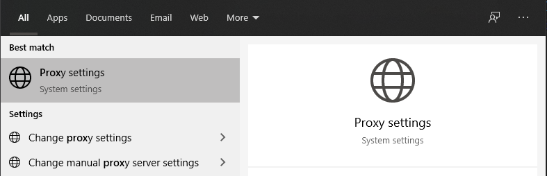
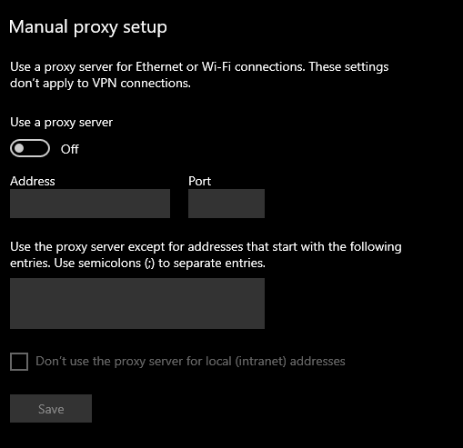
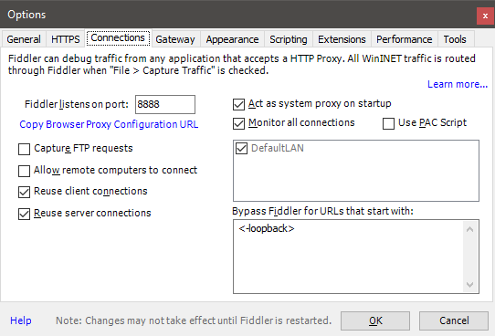
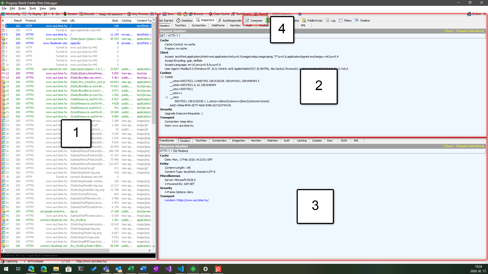
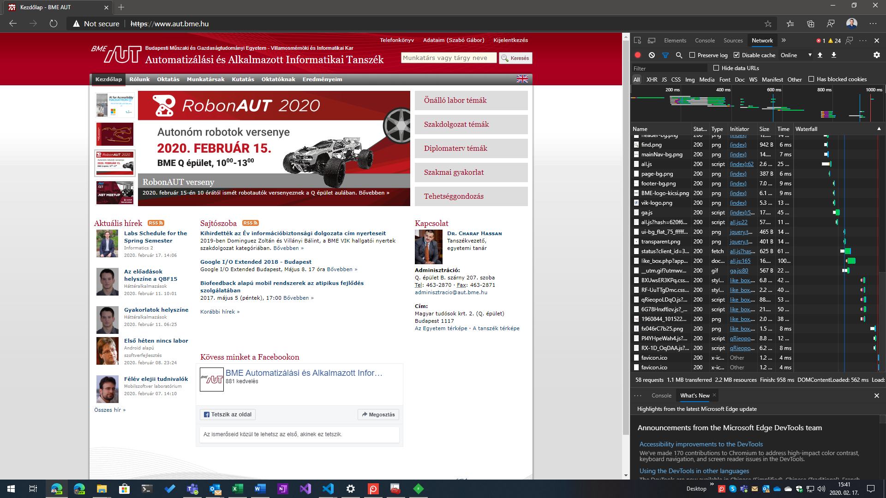
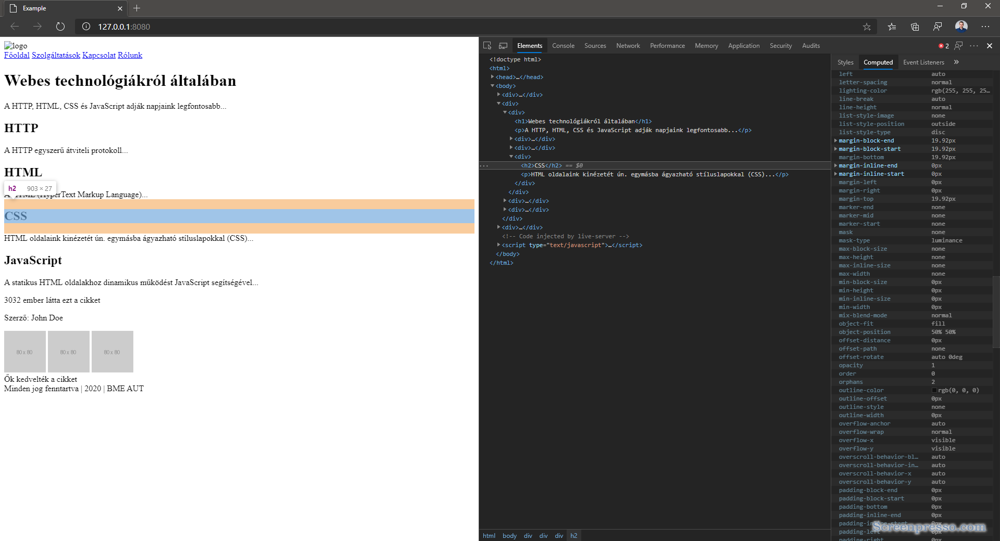
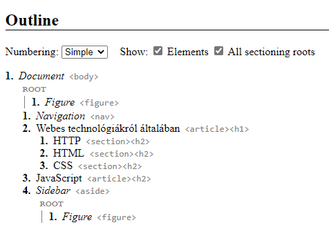

[wip]: ../assets/wip.png "Kidolgozás alatt..."

# Labor 01 - Fejlesztőeszközök, HTTP, HTML alapok

## Beugró
A labor elején a korábbi előadások és laborok anyagából beugrót tartunk.
A beugróhoz BME eduID azonosítóhoz megadott Office365-ös azonosítás szükséges. Ehhez az [alábbi oldalon](https://login.bme.hu/admin/) Neptun kóddal és jelszóval bejelentkezve, az [alábbi oldalon](https://login.bme.hu/admin/username/) felhasználónevet megadva kell létrehozni egy *felhasznalonev*@edu.bme.hu e-mail címet.

[Beugró kedd 12:15](https://forms.office.com/Pages/ResponsePage.aspx?id=q0g1anB1cUKRqFjaAGlwKdZsyXOvlN1KkyDxKogpmGRUQk5DWUtHUEdOUUZIMkNJS1pPM0FHSkRLVi4u)

[Beugró szerda 16:15](https://forms.office.com/Pages/ResponsePage.aspx?id=q0g1anB1cUKRqFjaAGlwKdZsyXOvlN1KkyDxKogpmGRUNFRGMTlDSUg4VVVHOU9WQU5HUU5KNk1NNi4u)

Ha probléma volna a felhasználó létrehozásával, bejelentkezés nélkül az alábbi beugrók használhatók:

[Beugró kedd 12:15 - anonim](https://forms.office.com/Pages/ResponsePage.aspx?id=q0g1anB1cUKRqFjaAGlwKdZsyXOvlN1KkyDxKogpmGRUQzNBOFI4TEJGOVk3TDMwUUFRVDVRWVcwTi4u)

[Beugró szerda 16:15 - anonim](https://forms.office.com/Pages/ResponsePage.aspx?id=q0g1anB1cUKRqFjaAGlwKdZsyXOvlN1KkyDxKogpmGRUMUhRVzRRU1BGTE5OTzZYMFc4NUdNVVNVRi4u)

## Bevezetés

A labor folyamán a hallgatók megismerkednek a webes fejlesztéshez szükséges legalapvetőbb eszközökkel. Az eszközök alapvető ismerete elengedhetetlen a házi feladat elkészítéséhez.

Felhasznált technológiák és eszközök:
- [Telerik Fiddler](https://www.telerik.com/download/fiddler),

- webböngészők beépített hibakereső eszközei,

- [Visual Studio Code](https://code.visualstudio.com/download) kódszerkesztő alkalmazás.

---

## HTTP hibakeresés

> ### Röviden a HTTP-ről 
>
> A HTTP egy **egyszerű, elsősorban szöveges adatátviteli protokoll**. A HTTP tehát "csak" egy string/karaktersorozat, amit jellemzően kliens-szerver kommunikációban használunk adat átvitelére a kliens és a szerver gépek és alkalmazások között.
>
> A legfontosabb HTTP igék (verb, method) a GET, PUT, POST, DELETE, de ezen felül még számos szabványos (HEAD, OPTIONS, CONNECT) igét is használhatunk a helyzettől és körülményektől függően.
>
> A HTTP kérés-válasz alapú, tehát minden kéréshez legfeljebb (de jó esetben pontosan) egyetlen válasz tartozik. A kérés időben mindig megelőzi a választ.
>
> A HTTP protokoll üzenetalapú, a legegyszerűbb esetben a kliens (jellemzően egy webböngésző) összeállítja a HTTP üzenet tartalmát és ezt TCP/IP felett egy szervernek címezve elküldi a hálózatra.
>
> A HTTP üzenet az alábbi összetevőkből épül fel:
> - fejléc,
>   - HTTP ige,
>   - URL/URI,
>   - HTTP verzió,
>   - tetszőleges fejlécmezők kulcs-érték párokként "kulcs: érték" formában, egymástól újsorral elválasztva,
>     - gyakran használt fejlécek pl.: Location, Accept, User-Agent,
>     - a sütik szintén kulcs-érték párok a Cookie fejléc értékében "kulcs=érték" formában, egymástól a "; " stringgel elválasztva,
> - kötelező üres sor,
> - opcionális törzs (tetszőleges adat)
>   - GET kérés esetén a törzs megadása nem szabványos,
> - kötelező üres sor.


Indítsuk el a Fiddler alkalmazást!

A Fiddler a Telerik cég ingyenes terméke, az egyik leggyakrabban használt webes hibakereső (debugger) eszköz. A Fiddler egy közbeékelődéses „támadást” (man in the middle attack) játszik el a gazda számítógépen azáltal, hogy proxy-ként viselkedik. A számítógépről kifelé induló HTTP kéréseinket elkapja, naplózza azokat feldolgozás és a felületen történő megjelenítés céljából, majd elküldi az eredeti címzett felé. Ugyanezt a sorozatot játssza el a visszairányban is, amikor a gépünk a hálózatról kap adatot.


Ne zárjuk be a Fiddler alkalmazást! Indítsuk el a Windows beépített proxy beállító felületét! A Windows billentyűt nyomjuk le, a Start menü megnyílása után gépeljük be: "proxy", és nyissuk meg a proxybeállításokat!



Ha a proxybeállításokat a Fiddler indítása után nyitjuk meg, úgy láthatjuk, hogy a proxy értéke kitöltésre került:


Ha bezárjuk a proxy beállításokat, aztán a Fiddlert, majd újra megnyitjuk a proxybeállításokat, úgy láthatjuk, hogy a Fiddler indítása állítja be a proxy szerver címét:



A Fiddler a local loopback (127.0.0.1) hálózati címen, alapértelmezetten a 8888 porton hallgatózik a kimenő és bejövő HTTP kérésekre/válaszokra. Ezt a Fiddler Tools/Options/Connections oldalon is láthatjuk:



A Fiddler futása közben:
- Indítsunk el egy böngészőt (pl. Chrome-ot)!
- A böngészőben nyomjunk F12-t és állítsuk be, hogy a böngésző ne használja a beépített gyorsítótárat (Disable cache lehetőség)!
- Töröljük a Fiddler history-ját a bal oldali listából a __Ctrl+X__ billenyűkombinációval,
- Navigáljunk a http://www.aut.bme.hu címre! Fontos, hogy a címet pontosan gépeljük be (vagy kattintsunk a fenti linkre), különben rossz eredményt fogunk kapni! Tekintsük át a program felületét az így keletkező HTTP kérések alapján!

A Fiddler alapvető felépítése az alábbi:


> 1. HTTP kérések időrendi listája: itt látjuk, hogy milyen kéréseink mentek ki a hálózatra. A **protokoll** HTTP vagy HTTPS lehet, a **Result** a válaszüzenetben érkező HTTP **státuszkódot** jelzi. A **Body** mezőben láthatjuk, hogy a válasz hány bájt méretű volt. A bal oldali listában bármely **kérést** kiválasztva annak **részleteit jobb oldalon 
láthatjuk**. Jobb egér gombbal a lista elemein lehetőségünk van azok **újrajátszására**.
>    - Lehetőségünk van a listában aktív szűrő beállítására pl. alkalmazás (process ID) vagy host alapján.
> 2. A jobb oldali fülön alapértelmezés szerint az **Inspectors** fül van kiválasztva, ami az *aktuálisan kiválasztott* HTTP **kérés-válasz párost** részletezi. A **felső** panel a **kimenő kérés** panelje. A tabok során váltogatva az üzenetet különböző **formázásokkal** is megvizsgálathatjuk, a fontosabbak:
>    - **Headers**: itt láthatjuk a HTTP fejléc legfontosabb elemeit, úgy mint a HTTP igét és protokollt, csoportokba szervezve a HTTP üzenet tartalmát.
>    - **TextView**: szöveges nézet.
>    - **WebForms**: űrlapok küldése esetén a paraméterek nevét és értékét tartalmazza.
>    - **Cookies**: a felküldött/fogadott sütik megjelenítése.
>    - **Raw**: a nyers HTTP üzenet megjelenítése.
>    - **JSON/XML**: az üzenet megjelenítése JSON/XML objektumokként (csak megfelelő formátum esetén).
> 3. A jobb oldali panelen az **Inspector**t választva az alsó részen a válaszból kinyerhető adatok találhatók meg, ezek jelentős része analóg a kérés formátumával és a Request panelen található adatokkal.
> 4. Egy fontos eszköz lehet még számunkra a **Composer**, amellyel teljes HTTP kérést tudunk összeállítani és elküldeni.

Elemezzük a böngésző által generált kéréseket!

A böngészőbe a weboldal címének beírása után egy HTTP kérés indult meg a www.aut.bme.hu szerver irányába. A Fiddlerben megvizsgálva következtetéseket vonhatunk le a kérés-válasz adatai alapján.

Az első kérés az általunk beírt webcímre került kiküldésre az alábbihoz hasonló formában:

``` HTTP
GET http://www.aut.bme.hu/ HTTP/1.1
Host: www.aut.bme.hu
User-Agent: Mozilla/5.0 (Windows NT 10.0; Win64; x64) AppleWebKit/537.36 (KHTML, like Gecko) Chrome/81.0.4044.9 Safari/537.36 Edg/81.0.416.6
Accept: text/html,application/xhtml+xml,application/xml;q=0.9,image/webp,image/apng,*/*;q=0.8,application/signed-exchange;v=b3;q=0.9
Accept-Encoding: gzip, deflate
Accept-Language: en-US,en;q=0.9,hu;q=0.8
Cookie: ...=...; ...=...
```

> - A kérés GET igét használt, ezért nem tartozik hozzá törzs (body) a küldött HTTP üzenetben.
> - A böngésző kulcs-érték párok formájában további adatokat küldött a szerver felé, mint pl. a böngészőt azonosító karakterláncot (**User-Agent**), a várt adat formátumát (**Accept**, **Accept-Encoding**, **Accept-Language**), eltárolt sütiket (**Cookie**) 
stb.
>    - Érdekesség, hogy bizonyos kulcsok többször előfordulhatnak egy HTTP üzenetben, ekkor az összes ugyanolyan kulcshoz tartozó értékek egy kollekcióként/tömbként értelmezhetők.
> - A **HTTP üzenet egyszerű szöveges formátumú**, láthatóan ember által is olvasható.
> - Az első elküldött üzenet után további HTTP kérések indultak el a stíluslapok (CSS), képek és szkriptek (JavaScript) letöltéséért. Ennek az az oka, hogy a böngésző felépíti a HTML oldalt, amiben a további linkek további HTTP kéréseket indukálnak.

A kérésünkre az alábbihoz hasonló válasz érkezett:
``` HTTP
HTTP/1.1 302 Redirect
Content-Type: text/html; charset=UTF-8
Location: https://www.aut.bme.hu/
Server: Microsoft-IIS/8.0
X-Powered-By: ASP.NET
X-Frame-Options: deny
Date: Mon, 17 Feb 2020 14:23:01 GMT
Content-Length: 146

<head><title>Document Moved</title></head>
<body><h1>Object Moved</h1>This document may be found <a HREF="https://www.aut.bme.hu/">here</a></body>
```

- A kérésünkre 302-es státuszkóddal (Found) válaszolt a szerver, jelezve, hogy az oldalt a https://www.aut.bme.hu címen érhetjük el (tehát átirányításra kerültünk a HTTP végpontról a HTTPS-re, ahol biztonságos kommunikáció történik). A "helyes" címet a Location fejléc értéke mutatja.
- Ezt követően a böngésző automatikusan átirányított minket a HTTPS-es végpontra, ezért a következő kérésben láthatjuk a HTTPS-re történő GET kérést:
``
GET https://www.aut.bme.hu/ HTTP/1.1
``
- A következő kérés sikeres volt, ezt a válasz fejlécének elején található státuszkódból (200) és státusz üzenetéből (OK) látjuk.
- A válasz formátuma megegyezik a kérés formátumával: üzenet címe, fejlécek kulcs-érték párokként, üres sor, és egy opcionális törzs.
- A fejlécekben található fontosabb elemek a szerver típusa (Server), szerveridő (Date), a küldött adat típusa (Content-Type) és mérete bájtban (Content-Length). Ezen kívül a szerver a Set-Cookie headerrel két sütit állít be a kliensen, ill. különböző fejlécekben definiálja a gyorsítótárazáshoz (cache) szükséges szabályokat.
- A fejléceket egy üres sor követi, majd a HTTP üzenet törzse következik, ami egy HTML5 dokumentum. Ezt jeleníti meg a böngésző.

Vegyük észre, hogy a HTTP kérésünkhöz tartozó válasz kizárólag a korábban elküldött kérésünkben megtalálható információk alapján készült el! Ez jelenti azt, hogy **a HTTP állapotmentes**: az általunk elküldött kérés alapján kapjuk meg a választ, további állapoinformációkat nem feltételezhetünk a szerver részéről. Ez **nem összekeverendő azzal, hogy 
a szerver vagy kliens tárol-e állapotot vagy sem**: napjainkban mindkét oldalon tárolunk információt az állapotunkkal kapcsolatban, viszont a kérésben található meg minden olyan információ, ami alapján a szerver azonosítani tudja a kérőt és a kérési igényt, ami alapján összeállítja a választ.

Állítsunk össze egy egyszerű HTTP kérést a Fiddlerből!

Navigáljunk a jobb oldali panelen a **Composer** fülre! Itt lehetőségünk van összeállítani egy HTTP üzenetet. A Parsed 
lehetőség kicsit szofisztikáltabb, nekünk most megfelelő lesz a **Raw** (nyers) összeállítás is. Küldjük el az alábbi HTTP
üzenetet és vizsgáljuk meg az erre érkező választ:

``` HTTP
GET http://www.aut.bme.hu/ HTTP/1.1


```

**Fontos**, hogy a fenti kérésben egy üres sor legyen a fejléc után, tehát két Entert is kell ütnünk.

A fenti kérésünk formailag helyes HTTP üzenet: csak a HTTP ige, cím, és protokoll megadása kötelező, az összes fejléc 
opcionális, a törzs GET kérésnél pedig nem szabványos.

Ha megvizsgáljuk a kérésünkre érkező válaszokat, és összehasonlítjuk a korábban a böngészőnek küldött válasszal, akkor 
láthatjuk, hogy nem igazán van érdemi különbség a két válasz között.

## Hibakereső eszközök

Weboldalak készítésekor szükség lehet a HTTP forgalom megvizsgálására, viszont az esetek jelentős részében elegendő lehet, ha a böngésző forgalmát meg tudjuk vizsgálni. A mai böngészők mindegyike tartalmaz eszközöket, amellyel a weboldalak hibakeresése nagyon egyszerűen kezelhetővé válik.

A böngészők Inspector nézetét a böngészőben általában az **F12** billentyűvel nyithatjuk meg.

Vizsgáljuk meg, mit kínálnak a böngészőkbe épített hibakereső eszközök!

A laborvezető által kijelölt böngészőn navigáljunk a [www.aut.bme.hu](https://www.aut.bme.hu) oldalra és vizsgáljuk meg az
oldal felépítését! Nyissuk meg a hibakeresési eszköztárat az F12-vel, nézzük meg, milyen lehetőségeink vannak! 



A Chrome, Internet Explorer, Edge és Firefox böngészők eszközkészlete kisebb eltérésektől eltekintve megegyezik, 
a leggyakoribb funkciók az alábbiak:
- A dokkolás módja megadható: az ablak alsó részére vagy oldalára is (Chrome, Firefox) dokkolható az eszköztár, ill. kivehető a saját ablakába.
- **DOM vizsgálata (DOM Explorer, Elements, Inspector)**: a dokumentumfa felépítését tudjuk megvizsgálni, látható a kirajzolt HTML tartalom. Lehetőségünk van szerkeszteni az elemeket, beszúrni attribútumokat, elemeket, törölni őket. Kiválasztható egy DOM elem egérrel a kirajzolt oldalon vagy a szöveges megjelenítőben is. Egy elemet kiválasztva jobb 
oldalon az elemre illeszkedő stíluslap-szabályok (CSS) láthatók, ezek is szerkeszthetők.
- **JavaScript konzol (Console)**: a JavaScript standard outputja a konzol, az alkalmazások által írt tartalmak itt láthatók. Lehetőségünk van kód futtatására is a konzol ablakban, ami azonnal kiértékelődik.
- **Hálózat (Network)**: a Fiddlerhez hasonlóan láthatjuk a kimenő kéréseket és a rájuk érkező válaszokat. Előnye, hogy csak a konkrét oldalhoz tartozik, nem a teljes böngészőhöz, így könnyebb leszűrnünk, melyik kérések tartoznak melyik alkalmazáshoz/oldalhoz. Láthatók a pontos időzítések is, HTTP kérések indítását viszont nem lehetséges kézzel megejtenünk a beépített lehetőségekkel.
- **Hibakereső (Debugger)**: az oldalhoz betöltött JavaScript forráskód hibakeresését teszi lehetővé.
- **Teljesítménymérők**: különböző teljesítménymérő eszközök állnak rendelkezésünkre a weboldalak elemzéséhez, amik jellemzően a memória- és processzorhasználatot mérik.
- **Emuláció**: a böngészőkbe épített emulációs lehetőségek korlátozottak, általában csak a user agent string cseréjét és a kirajzoló terület felbontását állítják át (magát a böngészőmotort természetesen nem cserélik le futási időben, ami a valódi hibák jelentős részéért felelős).

## Szemantikus HTML

A HTML (HyperText Markup Language) a web nyelve. A böngészők elsősorban HTTP-n keresztül eljuttatott HTML tartalom kirajzolásáért és feldolgozásáért felelősek.

A HTML egy XML-szerű nyelv, amelyben elemek (tag) írják le a dokumentumunkat. Az egyes elemeknek lehetnek tulajdonságai, amiket attribútumoknak (attribute) nevezünk. Az attribútum értéke leggyakrabban szám, szöveg, korlátozott értékkészletű szöveg (enumeráció), ritkábban felsorolás vagy objektum lehet. A HTML-ben bizonyos szabályrendszernek kell eleget tennünk: megkötések vonatkoznak például arra, hogy milyen jellegű elemeket milyen más elemekben helyezhetünk el.

A szemantikus web alapelve, hogy a HTML elemeink ne csak klasszikus "tároló" funkcionalitást lássanak el, hanem jelentést is hordozzanak. Előnye kettős: gépi és emberi feldolgozása egyaránt egyszerűbb.

**Fontos**, hogy a HTML-ben vétett esetleges hibák **csendes** hibák, az esetleges hibás elhelyezések vagy helytelen formázás/szintaxis következtében a böngésző meg fogja jeleníteni az oldalt, amennyire a HTML alapján azt meg tudja tenni. Egy lemaradt `</lezáró tag>` pl. nem minden esetben rontja el a HTML oldal kinézetét, de okozhat nemkívánatos 
mellékhatásokat.


Forrás: https://internetingishard.com/html-and-css/semantic-html/

Nézzük meg, miként javítja a HTML szemantikus felépítése az alkalmazásunkat!

1. A laborvezető által kijelölt elérési útvonalon hozzunk létre egy új munkakönyvtárat, amiben nyissuk meg a VS Code szerkesztőt! Hozzunk létre itt egy fájlt, a neve legyen `index.html`, tartalma az alábbi:

```HTML
<!doctype html>
<html>

<head>
	<meta charset="utf-8">
	<title>Example</title>
</head>

<body>
	<div>
		<div>
			
		</div>
		<div>
			<a href="index.html">Főoldal</a>
			<a href="services.html">Szolgáltatások</a>
			<a href="contact.html">Kapcsolat</a>
			<a href="about.html">Rólunk</a>
		</div>
	</div>
	<div>
		<div>
			<h1>Webes technológiákról általában</h1>
			<p>A HTTP, HTML, CSS és JavaScript adják napjaink legfontosabb...</p>
			<div>
				<h2>HTTP</h2>
				<p>A HTTP egyszerű átviteli protokoll...</p>
			</div>
			<div>
				<h2>HTML</h2>
				<p>A HTML (HyperText Markup Language)...</p>
			</div>
			<div>
				<h2>CSS</h2>
				<p>HTML oldalaink kinézetét ún. egymásba ágyazható stíluslapokkal (CSS)...</p>
			</div>
		</div>
		<div>
			<h2>JavaScript</h2>
			<p>A statikus HTML oldalakhoz dinamikus működést JavaScript segítségével...</p>
		</div>
		<div>
			<p>3032 ember látta ezt a cikket</p>
			<p>Szerző: John Doe</p>
			<div>
				
				
				
				<div>Ők kedvelték a cikket</div>
			</div>
		</div>
	</div>
	<div>
		Minden jog fenntartva | <span id="ev"></span> | BME AUT
		<script>
			document.getElementById("ev").textContent = new Date().getFullYear()
		</script>
	</div>

</body>

</html>
```

A kód jól értelmezhető, az egyes elemek nyitó és záró tag-je között találhatók a hozzárendelt gyerekelemek. A whitespace-ek,
behúzások csak az olvashatóságot segítik, a böngésző nem rajzolja ki az elemek közötti whitespace-eket, és nem tesz több whitespace karaktert egymás után folyószövegben sem.

2. Nyissuk meg VS Code-ban a Terminalt (Ctrl+ö, vagy View > Terminal), ami egy beépített Powershell futtatókörnyezetet ad. Itt adjuk ki az alábbi parancsot:
    
	`live-server`

    A laborgépeken elérhető a [live-server](https://www.npmjs.com/package/live-server) csomag, ami egy nagyon egyszerű, fejlesztésre szánt webes fájlkiszolgáló. Ha a gépén nincsen telepítve a live-server, azt az `npm i -g live-server` paranccsal lehet telepíteni. Ha nem tudjuk globálisan telepíteni, a lokális mappába az `npm i live-server` paranccsal telepíthetjük, ekkor a `.\node_modules\.bin\live-server` paranccsal kell indítanunk.

Az npm parancs futtatásához telepített NodeJS-re is szükség van.

3. A parancs futtatásával megnyílik az alapértelmezett böngésző a http://127.0.0.1:8080/ URL-en (ha nem, nyissuk meg mi magunk). Teszteljük le, mit látunk! A létrehozott index.html fájl automatikusan megjelenítésre kerül a böngészőben. A live-server automatikusan frissíti a kapcsolódott böngészőt, ha szerkesztjük a megtekintett fájlt.

4. Láthatjuk, hogy a szövegek formázását nem a whitespace-ek, hanem az elemek típusa adja. Ha szeretnénk látni, melyik elem hol helyezkedik el a felületen ill. a DOM-ban, az F12 eszköztáron, a DOM Explorer felső során levő ikonokkal változtathatjuk, hogy a felületen navigálva a DOM elem kijelölődjön-e, ill. a DOM-ban navigálva a felületen jelezve legyen-e a kiválasztott elem. 

4. Az alapértelmezett formázást a böngészők beépítetten adják, ezért nagyobbak az egyes címsor (`<h1>`, `<h2>`) mezők, ill. ezért kerülnek egymás alá a `<div>` elemek (ami blockszintű elem, a `display: block` alapértelmezett CSS tulajdonság által), és marad folyószöveg a `<span>` (ami `display: inline`).

5. A beépített stílusokat megvizsgálhatjuk egy elemet kijelölve a jobb oldali panel Computed fülén az ábrán jelölt ikonra kattintva (ne legyen engedélyezve a 'Display user styles only' vagy legyen engedélyezve a 'Show all' lehetőség).




Forrás: https://internetingishard.com/html-and-css/semantic-html/

Módosítsuk a HTML dokumentum tartalmát úgy, hogy szemantikus elemeket használunk a nemszemantikus (pl. div) elemek helyett! A szükséges elemek: `article`, `aside`, `figure`, `figcaption`, `footer`, `header`, `main`, `nav`, `section`.

Az így elkészült dokumentum részletes szemantikus körvonalát az alábbi linken feltöltött index.html fájl segítségével nézhetjük meg:
https://hoyois.github.io/html5outliner/

Próbáljunk törekedni az alábbi ábrán látható eredményre!


---

## HTML űrlapok

A HTML űrlapok egységes, megszokott adatbeviteli eszközként szolgálnak számunkra a felhasználóval való kommunikációra. 

---

Az előadáson elhangzottak gyakorlásaként állítsunk össze egy űrlapot, mely megfelel az alábbi feltételeknek:
- Az űrlap az alábbi adatokat kéri be a felületen a felhasználótól (a *-gal jelölt mezők kötelezően kitöltendők):
    - Név*: szöveges mező
    - Jelszó*: jelszó mező (nem látható karakterek – használd a "kliensapp" jelszót szemléltetésre)
    - Leírás: szöveges mező, többsoros
    - Születési dátum*: dátum
    - Nem: fiú/lány/egyéb, legördülő menüből
    - Lábméret: szám, 0.5-ös léptékkel
    - Kutya: igen/nem, jelölőnégyzettel megadható
- Minden mezőhöz tartozzon egy címke is, amely tőle balra helyezkedjen el! A címkére kattintva a fókusz kerüljön a releváns mezőbe (használjuk az `id` és `for` attribútumokat)! Az egyes mezők egymás alatt helyezkedjenek el!
- Legyen egy Küldés feliratú gomb, amely az adatokat a saját szerverünknek küldi a /postform.html URL-re GET kéréssel, ahol egy egyszerű oldal jelenjen meg a kérés hatására!
	- Érdekességképp JavaScript segítségével az így URL-ben kódolt adatok meg is jeleníthetők a felületen!
- Vizsgáljuk meg, hogyan és mikor keletkeznek validációs hibák a felületen, ha hibás adatokat adunk meg!
- Vizsgáljuk meg Fiddlerrel és a böngésző Network fülének segítségével az űrlapadatok elküldésének tényét GET és POST igék használatával is (POST esetén a live-server nem ad sikeres választ, ez nem gond)! Mi a különbség az adatok küldésében GET és a POST használatakor (a HTTP kérés melyik részében utazik az adat)?

**Tipp:**

Szükséges elemek: `form`, `input`, `label`, `option`, `select`, `textarea`. 

Szükséges attribútumok: `action`, `for`, `id`, `method`, `name`, `required`, `step`, `type`, `value`.

---
