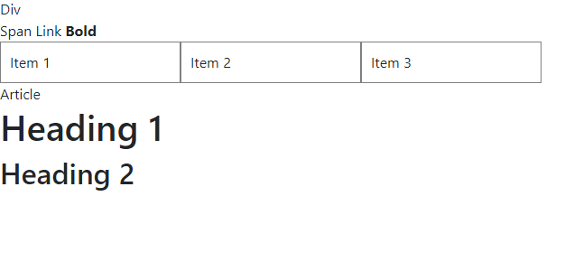
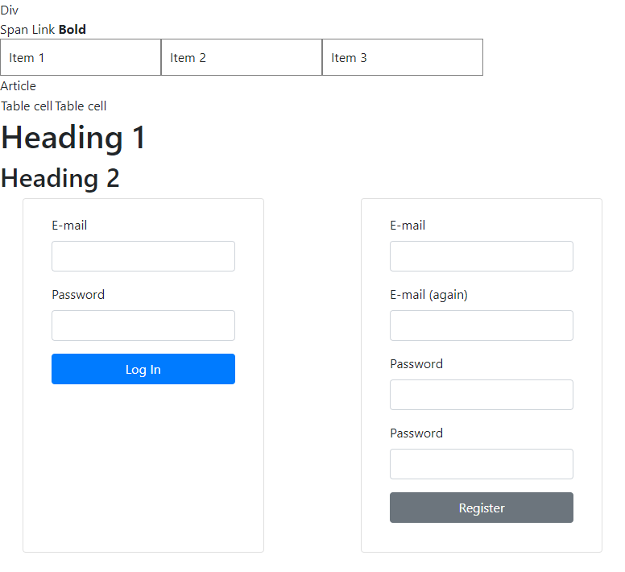
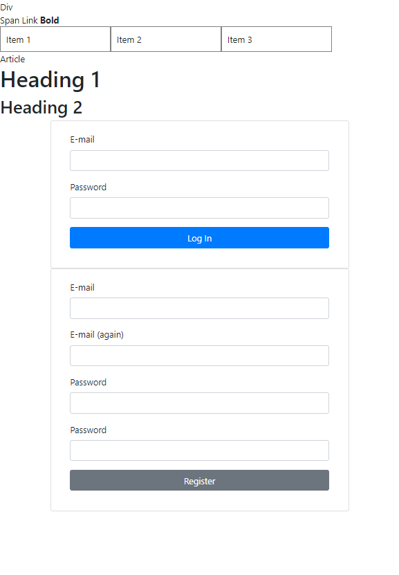
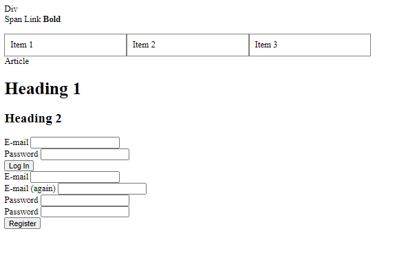
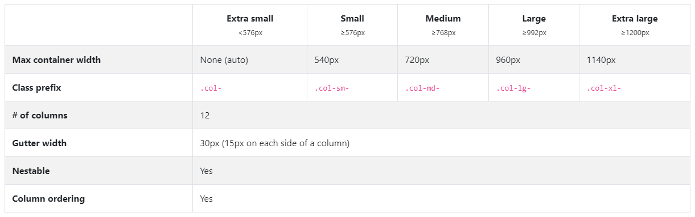

[wip]: ../assets/wip.png "Kidolgozás alatt..."

# Labor 02 - HTML, CSS

## Beugró

[Beugró kedd 12:15](https://forms.office.com/Pages/ResponsePage.aspx?id=q0g1anB1cUKRqFjaAGlwKdZsyXOvlN1KkyDxKogpmGRUMEU2UFdLTlJLR1lDQU1CMEtVQzAxNlZYTS4u)

[Beugró szerda 16:15](https://forms.office.com/Pages/ResponsePage.aspx?id=q0g1anB1cUKRqFjaAGlwKdZsyXOvlN1KkyDxKogpmGRUNjJEMkRWUlpCUElWMjJMQVNFTjM1MUNZNy4u)

## Bevezetés

A labor folyamán a hallgatók a laborvezető segítségével és önállóan végeznek feladatokat a webes technológiák gyakorlati megismerése érdekében.

Felhasznált technológiák és eszközök:

- webböngészők beépített hibakereső eszközei,
- npm, a [NodeJS](https://nodejs.org/en/download/) csomagkezelője,
- [Visual Studio Code](https://code.visualstudio.com/download) kódszerkesztő alkalmazás.

## Laborfeladatok

Webes HTML tartalmak stílusozására CSS-t használunk. A CSS alapjai:
- szabály (mintaillesztés) alapú, deklaratív programozási nyelv,
- DOM elemekhez megjelenést rendel.

A böngészőben megjelenített HTML tartalmak alapértelmezés szerint formázatlanok, viszont bizonyos szabályokat a böngésző alapértelmezetten illeszt az egyes elemekre, az elem típusa szerint.

Vizsgáljuk meg, milyen szabályokat illeszt a böngésző a HTML, a BODY, a DIV, a SPAN, a H1, H2, az A és a B elemekre!

- Nyissuk meg a Visual Studio Code-ot egy üres munkamappában!
- Vegyünk fel egy index-1.html fájlt az alábbi tartalommal:

    ``` HTML
    <!DOCTYPE html>
    <html lang="en">
    <head>
    </head>
    <body>
        <div>Div</div>
        <span>Span</span>
        <a>Link</a>
        <b>Bold</b>
        <ul>
            <li>Item 1</li>
            <li>Item 2</li>
            <li>Item 3</li>
        </ul>
        <article>Article</article>
        <table>
            <tbody>
                <tr>
                    <td>Table cell</td>
                    <td>Table cell</td>
                </tr>
            </tbody>
        </table>
        <h1>Heading 1</h1>
        <h2>Heading 2</h2>
    </body>
    </html>
    ```
- Használjuk a VS Code-ban található Live Server bővítményt, hogy megnyissuk a fájlt böngészőben (jobb klikk a fájlon, Open with Live Server).


Vegyük észre, hogy az oldalhoz nem vettünk fel saját stíluslapot, valamilyen formázás mégis érvényesült. Egyes elemek félkövérek, kisebbek-nagyobbak, elrendezésük sorfolytonos vagy tördelt.
 
Vizsgáljuk meg, milyen szabályok érvényesülnek az egyes elemekre!

Nyissuk meg a böngésző beépített fejlesztői eszközeit (**F12**)! Lehetőségünk van az elemeket kijelölni (**Jobb klikk** > **Inspect Element**), megnézni elhelyezkedésüket a felületen és a DOM szöveges reprezentációjában egyaránt.


**Fontos!** A böngészők agresszívan gyorsítótárazhatnak bizonyos fájlokat, pl. a HTML és CSS fájljainkat. A cache letiltásához a Developer Tools eszköztáron ki kell kapcsolnunk a cache-t (Chrome-ban ez a 'Disable cache' lehetőség).

Jellemzően a menüsor bal oldalán találhatók a kijelöléshez szükséges műveletek ikonjai, jobb oldalon a részletes nézet.

A kiválasztott elemhez a jobb oldali **Computed** fülön a ténylegesen érvényre jutott szabályokat láthatjuk. Mivel nincs explicit CSS fájlunk linkelve és CSS szabályokat sem írtunk a HTML-ben, ezért kizárólag a böngésző beépített **user agent stylesheet**-je érvényesül. Itt láthatjuk a **CSS Box Model**t is, ami az elem **tartalma**, a hozzá tartozó **padding**, **border** és **margin** értékek egymásra halmozását jelenti a *2 dimenziós téglalap* oldalaihoz mérten.

> A CSS feloldásában a `cascading`, azaz "egymásba ágyazható" rész szerint több stíluslap létezik a származás szempontjából; mi most a *böngészőbe beépített*, ún. `user agent stylesheet`-et látjuk.

Ez alapértelmezetten nem látható a felületen, a Computed fülön van lehetőségünk ezek megtekintését bekapcsolni:


A fenti szűrőt használva van lehetősünk az alkalmazott CSS szabályok között keresni.

A **h1**, **h2** és **b** elemek alapértelmezetten félkövérek, ezt a `font-weight: 700;` tulajdonság írja le nekünk.

A **html**, **body**, **div**, **h1**, **h2** elemek `display` tulajdonsága `block`, a **span**, az **a** és **b** elemek pedig `inline` típusúak. A `display: block;` tulajdonságú elemek egy blokkot (sort) foglalnak el az őket befoglaló elemben, az inline típusúak sorfolytonosak (egymás mellett is elhelyezkedhetnek).

Láthatjuk, hogy a `body` elemen található `8px` margó (`margin`) mind a 4 irányban:


---
Válaszoljuk meg az alábbiakat:

- Mekkora a **margin**, **padding** és **border** értéke az `<ul>` elemnek?

- Hány pixel a (függőleges) távolság a `<h1>` és `<h2>` elemek tartalma között (ügyelve az átfedő margókra)? 

---

> ## Emlékeztető a CSS szabályok definiálásához:
> 
> Saját CSS szabályokat többféle módon tudunk az oldalunkhoz rendelni:
> 
> - CSS fájlokra történő hivatkozással,
> - CSS szabályok felvételével a HTML tartalmán belüli `<style>` tagben,
> - inline, a HTML elemek `style` attribútumának beállításával.
> 
> Ütköző CSS szabályok közül az érvényesül, amelynek nagyobb a specificitása (megegyező specificitás esetében az utoljára definiált).
> 
> Emlékeztetőként a szabályok specificitási sorrendje:
> - inline stílus (`<div style="..."> `),
> - ID-k száma (`#azonosito`),
> - osztályok, attribútumok és pszeudo-osztályok száma (`.osztaly`, `[attributum]`, `[attributum="ertek"]`, `:hover`),
> - pszeudo-elemek (`:before`, `:after`).
> 
> A sorrendhez hozzátartozik az `!important` kulcsszó, ami önmagában a fentiektől specifikusabb, viszont az `!important` szabályokra a fenti specificitási sorrend szintén érvényesül.
>
> A szabályok definiálása:
>
> 
> 

Módosítsuk az oldal megjelenését futási időben!

- Rejtsük el a böngésző beépített stílusait, és láthatjuk, hogy kizárólag az üres inline stílus illeszkedik így az elemre. Itt hozzá tudunk adni új inline stílust az elemhez.
- Ha új szabályt akarunk felvenni, akkor a kapcsoszárójelek közé kattintva tehetjük ezt meg, ezután az automatikus kiegészítés funkcióval láthatjuk az összes, a böngésző által ismert CSS tulajdonságot (Firefox Developerben ezt az üres kurzoron a **fel-le nyilak**kal tehetjük meg, Edge-ben és Chrome-ban a **Ctrl+szóköz**zel).
- Vegyük fel a `<h1>` elemhez az alábbi CSS tulajdonságot:
    ``` CSS
    color: red;
    ```
    
- Közben vegyük észre a DOM reprezentációban, hogy bár a jobb oldali panelen szerkesztünk, pontosan ugyanaz történik, mintha a HTML elem `style` attribútumát adtuk volna meg.

- Ha beállítjuk a `font-weight: bold;` tulajdonságot a `<body>`-n, akkor láthatjuk, hogy az összes gyermekére is érvényesül a szabály. Bizonyos szabályok öröklődnek (a `font-weight` ilyen), mások (például a `padding` és `margin`) viszont nem.

Lehetőség van esetenként több szabály aggregált megadására is ún. shorthandek használatával. Gyakori például a 4-irányú értékadás, ami a **top-right-bottom-left** iránysorrend szerint ad meg több értéket.
- A `padding: 50px 30px 10px 5px;` szabály mind a négy értéket beállítja a fenti sorrend szerint.
- A `padding: 10% 1mm;` szabály a fenti-lenti értékeket 10%-ra, a jobb-balt 1 mm-re.
    > A százalékos értékek a szülő elem *szélességéhez* viszonyítottak (ha `padding-top`-ot vagy `margin-bottom`-ot adunk meg, akkor is *szélességhez*).
- A `padding: 0;` mind a 4 oldalon 0-ra állítja a paddingot (nem szükséges mértékegység 0 esetén).

> Inline stílusokat csak kivételes esetekben használjunk, jellemzően programozottan (JavaScriptből) elfogadott lehet egy elem megjelenését ilyen módon állítani, de a nyers HTML-ben nem!

Az oldalhoz alapvetően kétféle módon van lehetőségünk stíluslapot rendelni: külső CSS fájlból vagy az oldalban definiált `<style>` tag(ek)ben.

Az **index-1.html** forráskódját egészítsük ki, a `<head>` elembe helyezzük el az alábbi kódot:

```HTML
<style>
    ul {
        list-style: none;
        padding: 0;
    }

    ul > li {
        float: left;
        padding: 10px;
        min-width: 200px;
        border: 1px solid grey;
    }
</style>
```

Ha frissítjük az oldalt (nem szükséges újraindítani a szervert, csak menteni a fájlt), akkor az elrendezés módosul: a listánkban a listaelemek egymás mellé kerülnek, és a listaelemet jelző pötty eltűnik.

> A `float: left;` tulajdonság állításával nem ugyanazt érjük el, mintha a listaelemet `display: inline-block;`-ra állítanánk, mert az `inline-block` megtartja az egymást követő elemek közötti whitespace-eket, a `float: left;` viszont nem.

A float segítségével komplexebb elrendezéseket is el tudunk érni, viszont a float-olást meg kell tudnunk szüntetni. Ehhez a `clear: both;` értéket állíthatjuk be egy elemen.

Az alábbi szabályt használhatjuk a float-olás megszüntetéséhez, ekkor az `<article>` elemre a `clearfix` osztályt alkalmazva az már új sorba is kerül.

```CSS
.clearfix {
    clear: both;
}
```
``` HTML
<article class="clearfix">
  <!-- ... -->
</article>
```

A CSS szabályainknak az esetek nagy többségében nem tesz jót, ha túl általánosak. A fenti szabályok minden listaelemre általánosan illeszkedni fognak, ami ebben a konkrét esetben nem jó döntés, ugyanis valahol az oldal törzsében lehet, hogy szeretnénk használni a "klasszikus" listás megjelenítést is. Ezért a szabályunkat át kell gondolnunk, specifikusabb szabályt érdemes írni:

``` CSS
ul.menu {
    list-style: none;
    padding: 0;
}

ul.menu > li {
    float: left;
    padding: 10px;
    min-width: 200px;
    border: 1px solid grey;
}
```

A fenti osztállyal megkülönböztettük a `menu` osztállyal ellátott `ul` elemeket azoktól, amiken nincs rajta az osztály.

A pszeudoosztályok használatával az elemek különböző állapotainak különböző stílust tudunk adni. Ha a listaelemek kijelölése a felhasználó számára speciális állapot, ezt érdemes jeleznünk a felületen. Használjuk az alábbi szabályt:

``` CSS
ul.menu > li:focus {
    font-weight: bold;
    color: #44AA44;
}
```

Önmagában a `focus` pszeudoosztály használata nem elegendő, ugyanis a li elem nem fókuszálható. A `<li>` elemen elhelyezett tabindex attribútum jelzi a böngészőnek, hogy az elem képes fókuszt kapni:

``` HTML
<ul class="menu">
    <li tabindex="1">Item 1</li>
    <li tabindex="2">Item 2</li>
    <li tabindex="3">Item 3</li>
</ul>
```

Ezután lehetséges az egér kattintással vagy a Tab billentyű használatával kijelölni az elemet.

A HTML-be ágyazott CSS-sel a probléma, hogy ugyanaz a stílus nem újrahasznosítható a különböző oldalaink között. Ezért érdemes kiszervezni a CSS tartalmainkat a saját dedikált CSS fájljainkba. A CSS tartalmát mozgassuk át a HTML `<head>` részéből egy új fájlba az **index-1.html** mellett, legyen a neve **index-1.css**.

A fájlt a HTML-ből az alábbi módon tudjuk linkelni: tegyük az oldal `<head>` részébe (a korábbi oldalon belüli stílus-definíciók helyére) az alábbi hivatkozást:

``` HTML
<link rel="stylesheet" type="text/css" href="index-1.css">
```

Ezután figyeljük meg a böngésző F12 eszköztár Network fülén, hogy a HTML betöltődése után újabb HTTP kérés indul, ami lekéri a linkelt CSS fájlt.

### Reszponzív elrendezés

A weboldalakat különböző képernyőméretű és -felbontású eszközökről szoktuk látogatni. A túl részletes táblázatok, hosszú, meg nem törő sorok nem felhasználóbarátak kisebb méretű kijelzőkön, még ha az eszköz felbontása kellően nagy is. A mobil eszközök ezért szorzókat alkalmaznak a valós és a hasznos felbontás közötti megkülönböztetésképpen.

A reszponzív elrendezés során a legfontosabb koncepciók közé tartozik a szélesség függvényében történő átméretezése az oldalnak. Ezeket az alábbi szintaxis alapján, ún. *media query*-kkel tudjuk implementálni:

``` CSS

.medium-only {
    display: none;
}

@media (min-width: 768px) and (max-width: 991px) {
    .medium-only {
        display: block;
    }
}

```

A fenti szabály 768 és 991 pixel közötti szélességű viewport-on jelenik meg, tehát nem a képernyő mérete, hanem a rendelkezésre álló hely függvényében változik (pl. ablak átméretezésekor is). A `medium-only` osztállyal ellátott elemek csak ilyen képernyőméreten jelennek meg, ugyanis a media query szabály specifikusabb, mint az azon kívül definiált.

Próbáljuk ki, mi történik, hogyha a két szabály sorrendjét felcseréljük!

## <a href="https://getbootstrap.com/docs/4.4/getting-started/introduction/" target="_blank">Bootstrap CSS</a>

A Bootstrap egy CSS és JavaScript osztálykönyvtár, aminek segítségével egyszerűbbé válik az oldalunk egységes dizájnjának kialakítása és az egységes komponensek használata.

A Bootstrap egységes kinézetű komponenseket ad nekünk, amiket jellemzően előre definiált osztályok felhelyezésével kezelhetünk. Ezekhez a komponensekhez esetenként előre definiált működés is társul, amelyet a kapcsolódó JavaScript fájlok hivatkozásával használhatunk ki.

Az index-1.html `<head>` elemébe linkeljük be a Bootstrap osztálykönyvtárat CDN-ről.

``` HTML
<head>
    <link rel="stylesheet" type="text/css" href="index-1.css">
    <link rel="stylesheet" href="https://stackpath.bootstrapcdn.com/bootstrap/4.4.1/css/bootstrap.min.css" integrity="sha384-Vkoo8x4CGsO3+Hhxv8T/Q5PaXtkKtu6ug5TOeNV6gBiFeWPGFN9MuhOf23Q9Ifjh" crossorigin="anonymous">
    <script src="https://code.jquery.com/jquery-3.4.1.slim.min.js" integrity="sha384-J6qa4849blE2+poT4WnyKhv5vZF5SrPo0iEjwBvKU7imGFAV0wwj1yYfoRSJoZ+n" crossorigin="anonymous"></script>
<script src="https://cdn.jsdelivr.net/npm/popper.js@1.16.0/dist/umd/popper.min.js" integrity="sha384-Q6E9RHvbIyZFJoft+2mJbHaEWldlvI9IOYy5n3zV9zzTtmI3UksdQRVvoxMfooAo" crossorigin="anonymous"></script>
<script src="https://stackpath.bootstrapcdn.com/bootstrap/4.4.1/js/bootstrap.min.js" integrity="sha384-wfSDF2E50Y2D1uUdj0O3uMBJnjuUD4Ih7YwaYd1iqfktj0Uod8GCExl3Og8ifwB6" crossorigin="anonymous"></script>
</head>
```

A Bootstrap hatása azonnal észrevehető, letisztultabb dizájnnal találkozunk.


A `<h2>` elemünk alá másoljuk be az alábbi kódot:

``` HTML
<div class="container">
    <div class="row">
        <div class="col-md-5 mr-auto card">
            <form class="card-body" action="/api/login" method="POST">
                <div class="form-group">
                    <label for="email">E-mail</label>
                    <input class="form-control" id="email" name="email">
                </div>
                <div class="form-group">
                    <label for="password">Password</label>
                    <input class="form-control" id="password" name="password" type="password">
                </div>
                <div class="form-group">
                    <button type="submit" class="btn btn-primary btn-block">
                        Log In
                    </button>
                </div>
            </form>
        </div>
        <div class="col-md-5 card">
            <form class="card-body" action="/api/register" method="POST">
                <div class="form-group">
                    <label for="email">E-mail</label>
                    <input class="form-control" id="email" name="email">
                </div>
                <div class="form-group">
                    <label for="emailAgain">E-mail (again)</label>
                    <input class="form-control" id="emailAgain" name="email">
                </div>
                <div class="form-group">
                    <label for="password">Password</label>
                    <input class="form-control" id="password" name="password" type="password">
                </div>
                <div class="form-group">
                    <label for="passwordAgain">Password</label>
                    <input class="form-control" id="passwordAgain" name="password" type="password">
                </div>
                <div class="form-group">
                    <button type="submit" class="btn btn-secondary btn-block">
                        Register
                    </button>
                </div>
            </form>
        </div>
    </div>
</div>
```

Ennek hatására az alábbi kinézetet kapjuk:


A mobil nézet reszponzívan átalakul egy töréspont után:


Ha a Bootstrap stíluslapokat töröljük vagy nem importáljuk, a fenti nyers HTML-ünk és saját CSS szabályaink ennyit érnek el magukban:


Említésre méltók az alábbiak:
- A Bootstrap által definiált CSS szabályok egy része automatikusan alkalmazásra került az alapértelmezett böngésző stílusok helyett (pl. a font lecserélődött).
- A Bootstrap komponenseinek használata vagy teljesen automatikusan történik, vagy a Bootstrap által definiált CSS oszályokat kell alkalmazzuk.
- A Bootstrap elrendezéshez egy [grid rendszert](https://getbootstrap.com/docs/4.4/layout/grid/) használ. Ennek alapja, hogy `.container` (vagy `.container-fluid`, ami faltól-falig tart) típusú elemekben `.row` osztálú sorokat definiálunk, ezek egymás alatt helyezkednek el a konténerben, majd a sorokon belül a különböző `.col-*` osztályokkal definiáljuk az ezekben található oszlopokat. Használatuk során érdemes figyelembe venni a különböző méretfüggő lehetőségeket (lásd alább).
- Az <a href="https://getbootstrap.com/docs/4.4/components/forms/" target="_blank">űrlapok</a> definiálása kellően magától értetődő módon a `form-group`, `form-control` osztályok segítségével történik.
- A <a href="https://getbootstrap.com/docs/4.4/components/card/" target="_blank">kártya komponenst</a> a `.card` osztállyal és ehhez kapcsolódó `.card-body` (`.card-title`, `.card-text`) osztályokkal készítettük el.
- A <a href="https://getbootstrap.com/docs/4.4/components/buttons/" target="_blank">gombok</a> használatához a `.btn` osztályt és egy módosító osztályt (`-primary`, `-secondary`, `-success`, `-danger`, `-warning`, `-info`, `-light`, `-dark`, `-link`) kell alkalmaznunk. Ezt több helyen találhatjuk meg, pl. <a href="https://getbootstrap.com/docs/4.4/components/alerts/" target="_blank">üzenetek</a> megjelenítésénél is.



## A CSS alapok gyakorlása egy komplexebb feladatban

Töltsük le a mellékelt <a href="index-2.html" target=_blank>index-2.html</a> és <a href="index-2.css" target=_blank>index-2.css</a> fájlokat és vizsgáljuk meg, mit látunk! Indítsuk el a Live Servert az index-2.html-en!

Figyeljük meg, hogy négy különbőző CSS állományt töltünk be, egy kivételével CDN-ről:
1. Az első magát a Bootstrap-et tölti be
2. Ezt követően egy gyakran használt ikongyűjteményt, a Font Awesome-ot töltjük le.
3. Ezen felül, mivel egyedi betűtípust használunk, azt a Google fonts oldaláról töltjük le.
4. A legutolsó hivatkozás pedig az általunk készített CSS fájlt hivatkozza be.

> A CSS és JS könyvtárakat többféleképpen is be tudjuk tölteni:
> - CDN-ről, publikus webről tölti le a CSS fájlt, amit most is használunk,
> - van lehetőségünk csomagkezelőt (npm, bower) használni letöltésre és magunk kiszolgálni a fájlt,
> - akár saját magunk kézzel is letölthetjük a megfelelő fájlokat. Ebben az esetben is a saját webszerverünk szolgálja ki ezeket a fájlokat.

Ha az alkalmazás elrendezését szeretnénk megadni, elég sok boilerplate-jellegű CSS kódot kellene írnunk. A Bootstrap megközelítése, hogy a gyakori elrendezési lehetőségeket és stílusozási lehetőségeket készen és konfigurálhatóan adja nekünk.

A megvalósítanó oldal az alábbi főbb részekből áll
- Navigációs sáv
- Oldal központi eleme, ahol most egy űrlap fog szerepelni
- Lábléc

## Navigációs sáv

A navigációs sáv felépítése legyen a következő (a HTML váz szerepel a kiinuló HTML-ben):
- Bal szélen szerepeljen egy a BME AUT logo, ami a `/logo-bme-aut.png` útvonalon érhető el.
- Ezt követően a két navigációs link (Home, Register)
- A sáv jobb szélén pedig egy keresés szövegdoboz és egy Search feliratú gomb legyen (ez valójában egy űrlap!)
 
A navigációs sáv az alábbiak szerint nézzen ki:
- Magas felbontáson
> 

Mivel a navigáció is egy gyakori probléma, a Bootstrap ad rá kész komponenst, a **navbar**t.
A megvalósítás előtt nézzük meg, hogyan épül fel a <a href="http://getbootstrap.com/docs/4.4/components/navbar/" target="_blank">Bootstrap navbar komponense</a>. Az oldalon találunk kész HTML vázakat is, amiből ha a megfelelőt kiválasztva bemásoljuk a saját kódunkba, apró módosításokkal el tudjuk érni a megfelelő kinézetet.

A legfontosabb osztályok, amire a navbar épít:
- `.navbar-brand` cég logo megjelenítésére.
- `.navbar-nav` teljes magasságú egyszerű navigációs elemek megadásához (a legördülő lista is támogatott).
- `.navbar-toggler` mobil nézeten el lehessen rejteni a linkeket egy hamburger menü alá.
- `.form-inline` ha valamilyen form controlt szeretnénk a navigációs sávba tenni.
- `.navbar-text` ha függőlegesen középre igazított szöveget szeretnénk használni.
- `.collapse.navbar-collapse` elemek csoportos elrejtésére használható.

> Érdemes keresni a dokumentációban egy ahhoz hasonló megjelenést amire nekünk is szükségünk van és az ott található HTML kódot átalakítani a saját igényeinknek megfelelően.
> - A sötét hátterú navbarhoz használjuk a `.navbar-dark` osztályt.

#### Reszponzív megjelenés

A navigációt is reszponzívan kell megvalósítani, tehát ha átmérezezzük az oldalt, akkor a navigációs menüpontokat el kell rejteni és egy úgynevezett hamburger menüt kell megjeleníteni helyette, amire kattintva megjelennek a menüpontok.

Még mielőtt nekiesnénk az egyedi megoldás kitalálására érdemes megnézni, hogy a Bootstrap támogatja ezt a funkcionalitást is, tehát csak a megfelelő HTML vázat kell kikeresni a <a href="http://getbootstrap.com/docs/4.4/components/navbar/" target="_blank">Bootstrap navbar</a> dokumentációjából és az alapján kiegészíteni a kódunkat. Tipp: `.navbar-toggler`

A kész oldalnak így kell kinéznie.
- Mobil eszközön zárva.

- Mobil eszközön lenyitva


### Oldal lábléc elkészítése

- A lábléc elkészítésekor a footerben egyedi CSS osztályban adjuk meg, hogy fekete legyen a háttér és fehér a betűszín.
- Ezen felül adjuk meg a megfelelő méretű paddingot, amihez használhajtuk a `p-4` CSS osztályt illetve annak egyéb változatait. Részletes leírás a <a href="http://getbootstrap.com/docs/4.4/utilities/spacing/" target="_blank">Bootstrap spacing</a> fejezetben található.
- A copyright szöveg kerüljön balra, az ikonok pedig jobbra. Ehhez a <a href="http://getbootstrap.com/docs/4.4/utilities/flex/" target="_blank">flexboxot</a> használjuk.
- Ügyeljen arra, hogy az egyes ikonok mérete és távolsága is megfelelő legyen.


### Regisztrációs űrlap létrehozása

Az elkészített oldal tetején található egy Register feliratú link, ami a register.html oldalra irányít. A feladat ennek az oldalnak az elkészítése.
Az oldal fejléc és lábléc része változatlan, tehát azt másolja át a meglévő index.html oldalról. Csak a navigáció utáni rész fog változni.

Az oldalon egy űrlapot kell készíteni, ahol a felhasználótó bekérjük a következő alábbi adatokat: **Email cím**, **Password**, **Address**, **City**, **State** (Tipp: `select`), **ZIP**.
Az űrlap végén legyen egy checkbox, hogy elfogaja a feltételeket illetve egy Sign in feliratű gomb, ami elküldi az űrlapot.

- Az inputok létrehozásánál ügyeljen mindig a megfelelő típus használatára.
- A szövegdobozokba tegyen placeholder szöveget is.
- Az alábbi képen látható elrendezést valósítja meg.

> 

- Ellenőrizze, hogy az oldal kis képernyő méreten az alábbi elrendezésben jelenik-e meg. Ha nem, akkor javítsa a kódot, hogy az alábbi kinézetet kapja.

> 

## Szorgalmi feladatok

Ha marad idő, a főoldali tartalmak elrendezésével érdemes folyatni.


### Egy kártya (blog bejegyzés) formázása

A navigáció után térjünk át a fő tartalmi elemre, a blog bejegyzésre. Először csak egy bejegyzést formázzunk meg. A blog post HTML váza már szerepel az index oldalon, ezt kell kiegészíteni a megfelelő Bootstrap osztályokkal és helyenként készíteni egy-egy CSS szabályt, amivel kiegészítjük a Bootstrap-es osztályokat.

A megoldáshoz használjuk a <a href="http://getbootstrap.com/docs/4.4/components/card/">Bootstrap card</a>-ját.
- Mivel majd több kártya kerül egymás mellé a szélességet a grid oszlopaihoz használt `col-x` segítségével adjuk meg.
- A kép igazításához használjuk a `card-img-top` oszátly
- A szöveges rész legyen a kártya törzse `card-body`
- A címhez a `card-title` osztályt használjuk
- Az egyéb adatok pedig a kártya láblécében `card-footer` jelenjenek meg
  - a lábléc fölötti vonal legyen szaggatott, 
  - a betűméret 12px, 
  - a háttérszín átlátszó,
  - a láblécben szereplő linkek legyenek szürkék és ha fölé visszük az egeret akkor zöldek, de ne legyen aláhúzva. Az ikonok mindig legyenek zöldek.
  - Tipp: A lábléchez érdemes egyedi CSS osztály(oka)t is definiálni.
- Ügyeljen arra, hogy a margók és paddingok hasonlóak legyenek. Tipp: használja a `m-0`, `py-2`.... osztályokat. Részletesen a <a href="http://getbootstrap.com/docs/4.4/components/spacing/">Bootstrap spacing</a> szekcióban lehet róla olvasni.

Az egyes blog bejegyzéseknek, az alábbi képen látható módon kell megjelennie:
> 

### Reszponzív blog bejegyzés lista

Egészítse ki a HTML kódot úgy, hogy az oldalon összesen 6 blogbejegyzés jelenjen meg. Az egyes bejegyzések minden adata lehet azonos, csak a képeket cserélje le. A képeket az [assets](/assets) könyvtárban találja.

Az oldalt úgy valósítsa meg, hogy magas felbontáson 3 hasábos legyen, közepesen 2, kicsin pedig 1 hasábos.

- Magas felbontáson

- Közepes felbontáson

- Kicsi felbontáson


