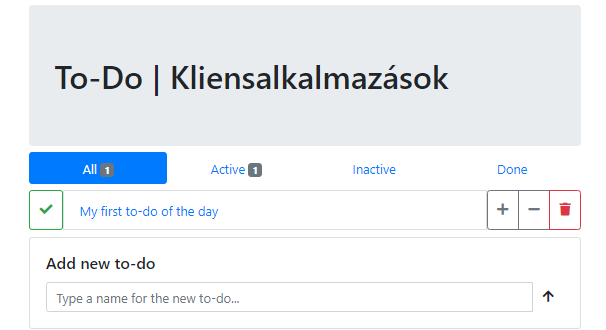
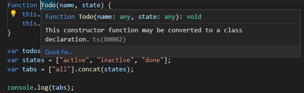

[wip]: ../assets/wip.png "Kidolgozás alatt..."

# Labor 03 - HTML DOM, JavaScript

## Beugró

[Beugró kedd 12:15](https://forms.office.com/Pages/ResponsePage.aspx?id=q0g1anB1cUKRqFjaAGlwKdZsyXOvlN1KkyDxKogpmGRUQU1HSUZROVdUVE0wVVJSSUIyMTRGWE1RVS4u)

[Beugró szerda 16:15](https://forms.office.com/Pages/ResponsePage.aspx?id=q0g1anB1cUKRqFjaAGlwKdZsyXOvlN1KkyDxKogpmGRUME00SU81N0g3OEkyUklNRVNHMDc4RTFaTi4u)

## Bevezetés

A labor folyamán a hallgatók a laborvezető segítségével és önállóan végeznek feladatokat a webes technológiák gyakorlati megismerése érdekében.

Felhasznált technológiák és eszközök:

- webböngészők beépített hibakereső eszközei,

- npm, a [NodeJS](https://nodejs.org/en/download/) csomagkezelője,

- [Visual Studio Code](https://code.visualstudio.com/download) kódszerkesztő alkalmazás,
  - otthoni vagy egyéni munkavégzéshez használható bármilyen más kódszerkesztő vagy fejlesztőkörnyezet, de a környezet kapcsán felmerülő eltérésekről önállóan kell gondoskodni.

### Előkészítés

- Nyissuk meg a Visual Studio Code-ot egy üres munkamappában!

### A JavaScriptről dióhéjban

A korábban megismert HTML és CSS adják a weboldalunk vázát, alapműködését és kinézetét, viszont a korai dokumentum-alapú weboldalaktól áttértünk a dinamikus weboldalakra, melyek futás időben módosítják az aktuális dokumentumot (a DOM-ot), így interakciót kezelhetünk, és a weboldalunkra (a kliens oldalra) önálló alkalmazásként tekintünk.

Az alkalmazásainkhoz dinamizmust (időbeni változást) szkripteléssel rendelünk, erre JavaScriptet használunk. A JavaScript egy dinamikusan típusos, interpretált szkriptnyelv, a hozzá tartozó futtatókörnyezetek végrehajtó egységei pedig alapvetően egyszálúak, így nincsen kölcsönös kizárási problémánk.

Érdemes továbbá megemlíteni a felhasználandó típusokat (`function`, `object`, `string`, `number`, `undefined`, `boolean`, `symbol`), az ezek közötti szabad konverziót és a JavaScript eseményhurkot (**event loop**). Az event loop a JavaScriptet folyamatosan befejeződésig futtatja (**"Run-to-completion"**), amíg a futás be nem fejeződik, majd aszinkron eseményre vár. Az események bekövetkeztével az eseményhez regisztrált eseménykezelők lefutnak. Az események lehetnek:
- felhasználói interakció,
- időzítés,
- IO műveletek eredménye (pl. AJAX, Websocket).

> A fontosabb kulcsgondolatok tehát röviden:
> - interpretált futtatás,
> - DOM dinamikus manipulációja,
> - dinamikus típusosság és típuskonverzió,
> - egyszálúság, event loop és aszinkronitás.

Említésre méltó még, hogy a JavaScript (klasszikus értelemben véve) nem objektum-orientált, az osztályok koncepciója a nyelvben később jelent meg és nem minden böngészőben támogatott; a nyelv a **prototipikus öröklés** módszerét alkalmazza az objektumorientált megközelítéshez. Ezen kívül különös sajátosságai vannak, a `this` kulcsszó pl. nem az aktuális *objektumra*, hanem az aktuális *függvényre* mutat (kivétel az *arrow syntax*, ami a `this`-t az eredeti értéken hagyja).

## Laborfeladatok

A feladatunk egy egyszerű "offline" To-Do alkalmazás készítése.

### Egyszerű eseménykezelés

Az alkalmazás alapjaként egy egyszerű HTML oldal szolgál, amihez a saját JavaScriptünket írjuk. A JS kódot HTML-ben is elhelyezhetnénk, viszont az nem karbantartható és alapvetően nem best practice, úgyhogy saját **.js** fájlba fogjuk tenni a kódot, amit behivatkozunk (hasonlóan a CSS szabályaink **.css** fájlba helyezéséhez). A stílusozást Bootstrappel oldjuk meg.

> A böngésző különböző körülmények függvényében **cache-elheti a fájljainkat**, ezért a frissítést ilyenkor kézzel kell megoldanunk. Ne felejtsük el menteni a fájlt, ezután a böngészőben állítsuk be az F12 Developer Tools-ban a Network fülön az "Always refresh from server"/"Disable cache" vagy hasonló elnevezésű beállítást!

Töltsük le és csomagoljuk ki a <a href="kiindulo.zip" target="_blank">kiinduló projektet</a> a munkamappánkba, indítsuk el a Live Server segítségével a kapott index.html-t, és vizsgáljuk meg, mit látunk!



Láthatjuk, hogy a statikus oldal az alábbiakból tevődik össze:
- cím,
- fülek az összes, aktív, inaktív és kész elemek szűrésére,
- a to-do elemek listája, az egyes elemek mellett az értelmezett műveletek,
- új elem hozzáadása panel, melyen az új to-do bejegyzés szövegét kell megadnunk egy űrlapon.

A `<body>` végén egy `<script>` az üres **todo.js** fájlra hivatkozik, itt fogjuk írni az alkalmazás logikáját. A szkript az oldal lényegi tartalmának betöltődése után fut le, így nem kell majd várakoznunk a dokumentum teljes betöltődésére. A gyakorlatban ez változó, szokás a `<head>` elemben in betölteni JS fájlokat amikor kritikus, viszont az gátolja a HTML megjelenését, amíg a JS fájl le nem töltődik (kivéve, ha explicit aszinkron kérjük a letöltését).

Az egyes to-do-k modelljére érdemes saját osztályt definiálnunk. 

> JavaScriptben egy függvény konstruktorfüggvény, ha a `this` változón tulajdonságokat helyez el és nem tér vissza semmivel. Ekkor a `new` kulcsszóval meghívva a függvényt az konstruktorként funkcionál és a `this` értékét kapjuk vissza. Ezen felül az `instanceof` kulcsszóval megvizsgálhatjuk, hogy adott függvény konstruktora által készített objektumról van-e szó.

A fülek lehetséges állapotai az "all", "active", "inactive" és "done", az "all" kivételével ezeket az állapotokat veheti fel egy to-do elem is. 

A **todo.js** elejére vegyük fel a Todo konstruktorfüggvényt és a konkrét példányokat tároló (üres) tömböt, valamint a lehetséges állapotokat:

``` JS

function Todo(name, state) {
    this.name = name;
    this.state = state;
}

const todos = [];
const states = ["active", "inactive", "done"];
const tabs = ["all"].concat(states);

console.log(tabs);

```

> ### `var`, `const`, `let`
> JavaScript változóink lehetnek a "klasszikus" `var` kulcsszóval definiált "félig globális" változók, a `const` kulcsszóval definiált lokális, immutábilis változók vagy a `let` kulcsszóval definiált lokális, mutábilis változók.

A legnyilvánvalóbb módja a hibakeresésnek az, ha a konzolra írunk. Az F12 segítségével a Console fülön láthatjuk a kimenetet. Láthatjuk az F12 segítségével a Sources fülön betöltött JS fájljainkat is, amiben elhelyezhetünk breakpointot, megvizsgálhatjuk az alkalmazás aktuális állapotát.

A böngészők az ECMAScript szabványban definiált elemeket egyre hamarabb és hamarabb szokták támogatni, így a fenti konstruktorfüggvény helyett használhatunk újabb szintaxist is, pl. a `class` kulcsszót, amivel ekvivalens működést érhetünk el, de explicitebb, átláthatóbb kódot eredményez. Erre használhatjuk a VS Code-ba beépített javaslati lehetőségeket is, ami a háttérben a TypeScript fordítót használja (amiről a következő alkalommal lesz szó). A VS Code "villanykörtét" Ctrl+.-tal, ráklikkelve, vagy az egeret a kérdéses (finoman aláhúzott) részre húzva majd a *Quick fix...* lehetőséget választva tudjuk aktiválni.



``` JS
function Todo(name, state) {
    this.name = name;
    this.state = state;
}
// ˇˇˇˇˇˇˇˇˇˇˇˇˇˇˇˇˇˇˇˇˇˇˇˇˇ
class Todo {
    constructor(name, state) {
        this.name = name;
        this.state = state;
    }
}

```

Iratkozzunk fel a form `submit` eseményére és kezeljük az új to-do elem létrehozását! A feliratkozást megtehetjük HTML-ből és JavaScriptből is, most az utóbbit alkalmazzuk!

``` JS

const form = document.getElementById("new-todo-form");
const input = document.getElementById("new-todo-title");

form.onsubmit = function (event) {
    event.preventDefault(); // meggátoljuk az alapértelmezett működést, ami frissítené az oldalt ("Full Postback")
    if (input.value && input.value.length) { // ha érvényes érték van benne
        todos.push(new Todo(input.value, "active")); // új to-do-t aktív állapotban hozunk létre
        input.value = ""; // kiürítjük az inputot
        // TODO: újrarajzolni a listát
    }
}

```

Definiálnunk kell még a gombokat, amiket a Todo-hoz fogunk rendelni. Nem volna szükség a modellek definiálására, elvégre is a JS egy dinamikus nyelv, de struktúrát ad a kódnak, objektum-orientáltabban kezelhető.

> A VS Code-ban valószínűleg az IntelliSense nyomára tudunk bukkanni a JS kód írása közben. Ennek az oka nem a JavaScript, hanem a háttérben futó TypeScript fordító. Mivel minden JavaScript egyben TypeScript kód is, ezért a típusinformációk kinyerhetők a kódból. Ez a TypeScript nagy előnye a JS-sel szemben. Fordítási hibáink nem lesznek JavaScriptben, de az IntelliSense segítségét ki lehet így használni.

``` JS

class Button {
    constructor(action, icon, type, title) {
        this.action = action; // a művelet, amit a gomb végez
        this.icon = icon; // a FontAwesome ikon neve (class="fas fa-*")
        this.type = type; // a gomb Bootstrapbeni típusa ("secondary", "danger" stb.)
        this.title = title; // a gomb tooltip szövege
    }
}

const buttons = [ // a gombokat reprezentáló modell objektumok tömbje
    new Button("done", "check", "success", "Mark as done"),
    new Button("active", "plus", "secondary", "Mark as active"),
    // az objektumot dinamikusan is kezelhetjük, ekkor nem a konstruktorral példányosítjuk:
    { action: "inactive", icon: "minus", type: "secondary", title: "Mark as inactive" },
    new Button("remove", "trash", "danger", "Remove"),
];

```

Így már fel tudunk venni új elemet, viszont ez nem látszik a felületen, ugyanis csak memóriában dolgoztunk, nem módosítottuk a DOM-ot. Írjunk egy függvényt, ami az összes to-do elemet kirajzolja a felületre! A jelenlegi sablon alapján kódból összeállítjuk a DOM-részletet:

``` JS

function renderTodos() {
    const todoList = document.getElementById("todo-list"); // megkeressük a konténert, ahová az elemeket tesszük
    todoList.innerHTML = ""; // a jelenleg a DOM-ban levő to-do elemeket töröljük
    todos.forEach((todo) => { // bejárjuk a jelenlegi todo elemeket (alternatív, funkcionális bejárással)
        const item = document.createElement("a"); // az elemet tároló <a>
        item.className = "list-group-item col";
        item.href = "#";
        item.innerHTML = todo.name;

        const buttonContainer = document.createElement("div"); // a gombok tárolója
        buttonContainer.className = "btn-group";

        buttons.forEach(button => { // a gomb modellek alapján legyártjuk a DOM gombokat
            var btn = document.createElement("button"); // <button>
            btn.className = "btn btn-outline-" + button.type + " fas fa-" + button.icon;
            btn.title = button.title;
            if (todo.state === button.action) // azt a gombot letiljuk, amilyen állapotban van egy elem
                btn.disabled = true;

            // TODO: a gomb klikk eseményének kezelése

            buttonContainer.appendChild(btn); // a <div>-be tesszük a gombot
        });

        const row = document.createElement("div"); // a külső konténer <div>, amibe összefogjuk az elemet és a műveletek gombjait
        row.className = "row";
        row.appendChild(item); // a sorhoz hozzáadjuk az <a>-t
        row.appendChild(buttonContainer); // és a gombokat tartalmazó <div>-et

        todoList.appendChild(row); // az összeállított HTML-t a DOM-ban levő #todo-list elemhez fűzzük
    });
}

renderTodos(); // kezdeti állapot kirajzolása

```

> ### JavaScript *Arrow function* (`x => { /* ... */ }`)
> A JavaScript lokális függvényei (`function`) a `this` változót a függvényre, mint objektumra állítják. Az arrow function a `this` változót "ott hagyja", ahol azt pl. C#-ból megszoktuk: a függvényt definiáló objektumra mutat.

Most már látjuk, hogy mi fog kerülni a `// TODO` komment helyére a form elküldésekor:

``` JS

renderTodos();

```

> Ha abba a hibába esnénk, hogy a DOM elemeket egyesével szeretnénk eltávolítani a DOM-ból a szülő elem `children` tulajdonságának segítségével, vigyáznunk kell, ugyanis ez egy "élő" kollekció: miközben az elemeket töröljük, a kollekció length tulajdonsága is változik! Persze egy egyszerű `for` ciklussal megoldható, de mindenképpen a végétől indulva járjuk be a kollekciót, amíg az ki nem ürül!

### Állapotok

A DOM elemekre kattintva be tudjuk állítani az aktuális állapotot, ezt a **DOM elemhez eseménykezelő rendelésével** tehetjük meg. Eseménykezelőt a HTML-ben az `on\*` attribútumok megadásával tudunk kötni, JavaScriptben a DOM API-t használva pl. az elem referenciáját megszerezve az `.addEventListener("eseménynév", callbackFüggvény)` függvény meghívásával vagy a megfelelő feliratkoztató függvény beállításával (pl. `onclick = callbackFüggvény`). A JS kódot az alábbival egészítsük ki:

``` JS

let currentTab; // a jelenleg kiválasztott fül

function selectTab(type) {
    currentTab = type; // eltároljuk a jelenlegi fül értéket
    for (let tab of document.getElementsByClassName("todo-tab")) {
        tab.classList.remove("active");// az összes fülről levesszük az .active osztályt
        if (tab.getAttribute("data-tab-name") == type)
            tab.classList.add("active");
    }

    renderTodos();
}

selectTab("all");

```

> A fenti minta, amikor egy függvényt a definiálása után közvetlenül meghívunk, egy csúnyább, de elterjedt alternatívával szokták alkalmazni, ez az ún. *self-invoking function declaration*, aminek sok változata ismeretes, ez az egyik:
> ``` JS
> (var selectTab = function(type) { /* ... */})("all");
> ```

A `selectTab` függvény hívását a HTML-ből kössük a klikk eseményre, cseréljük le a tabok tartalmát:

``` HTML

<a class="todo-tab nav-item nav-link active" data-tab-name="all" href="#all" onclick="selectTab('all')">
    All <span class="badge badge-secondary">1</span>
</a>
<a class="todo-tab nav-item nav-link" data-tab-name="active" href="#active" onclick="selectTab('active')">
    Active <span class="badge badge-secondary">1</span>
</a>
<a class="todo-tab nav-item nav-link" data-tab-name="inactive" href="#inactive" onclick="selectTab('inactive')">
    Inactive <span class="badge badge-secondary"></span>
</a>
<a class="todo-tab nav-item nav-link" data-tab-name="done" href="#done" onclick="selectTab('done')">
    Done <span class="badge badge-secondary"></span>
</a>

```

Az elemhez adatparamétert is rendeltünk, ezt az attribútumot a `data-` előtaggal láttuk el jelezvén, hogy az attribútum kizárólag adathordozásra szolgál. A `this` paraméter az aktuális DOM elemet jelent ebben a kontextusban, ezt kapja meg a `selectTab` függvényünk.

Az elemek állapotának változását hasonlóképpen kezelhetjük, amikor a gombokat gyártjuk a `renderTodos()` függvényben, az eseménykezelőket ott helyben fel tudjuk regisztrálni (a `// TODO` komment helyére kerüljön):

``` JS

btn.onclick = button.action === "remove"
    ? function () { // klikk eseményre megerősítés után eltávolítjuk a to-do-t
        if (confirm("Are you sure you want to delete the todo titled '" + todo.name + "'?")) {
            todos.splice(todos.indexOf(todo), 1); // kiveszünk a 'todo'-adik elemtől 1 elemet a todos tömbből
            renderTodos();
        }
    }
    : function () { // klikk eseményre beállítjuk a to-do állapotát a gomb által reprezentált állapotra
        todo.state = button.action;
        renderTodos();
    }

```

> Érdekesség a `confirm()` függvény, amely böngészőben natívan implementált: a felhasználónak egy egyszerű megerősítő ablakot dob fel a megadott szöveggel, és blokkolva várakozik a válaszra. A válasz egy boolean érték, így az `if` törzse csak akkor fut le, ha a felhasználó OK-val válaszol. Hasonló az `alert()`, az viszont csak egy OK-zható figyelmeztetést dob fel, ami nem tér vissza semmivel, vagy a `prompt()`, ami egy input bekérését teszi blokkolva lehetővé, dodern weben ritkán találkozunk ezekkel.

Egészítsük ki a `renderTodos()` függvényt, hogy frissítse a fülek mellett található badge-ben megjelenő számértékeket:

``` JS

document.querySelector(".todo-tab[data-tab-name='all'] .badge").innerHTML = todos.length || "";

for (let state of states)
    document.querySelector(".todo-tab[data-tab-name='" + state + "'] .badge").innerHTML = todos.filter(function (t){ return t.state === state; }).length || "";

```

> A `querySelector()/querySelectorAll()` API-val egy CSS szelektort adhatunk meg a document-en vagy egy elemen, és az illeszkedő első/összes elemet kapjuk vissza.

> A `filter()` függvénynek egy callbacket adunk át, ez fog kiértékelődni minden elemre: ha a feltétel igaz, akkor az elemet visszakapjuk, különben nem. Magyarul: azokra az elemekre szűrünk, amelyek állapota az aktuálisan bejárt állapot ("active", "inactive", "done"), tehát megszámoljuk, hány elem van az adott státuszban. Ezen felül, ha az érték `falsey`, tehát esetünkben 0, helyette üres stringet adunk vissza, így nem fog megjelenni a badge.

Utolsó lépésként logikus, hogy az aktuális fül alapján szűrjük le az elemeket. Ezt a `renderTodos()` apró módosításával tudjuk megtenni, a `todos.forEach()` helyett írjuk az alábbit:

``` JS

const filtered = todos.filter(function(todo){ return todo.state === currentTab || currentTab === "all"; });
filtered.forEach(function (todo) { // ...

```
> A legtöbb böngészőben már használható az *arrow syntax*, ami amellett, hogy jelentősen rövidebb kódot eredményez, a `this` működését is "feljavítja": igazából a this értékét nem változtatja meg, mint minden függvény, hanem a körülötte levő értékén hagyja. A fenti kód *arrow syntax*-szal és egy kis fényezéssel, erősen funkcionális megközelítésben az alábbi lehet:
> ``` JS
> todos.filter(todo => ["all", todo.state].includes(currentTab)).forEach(todo => {
> ```

### Sorrendezés

Legyenek fel-le mozgathatók a to-do elemek az `all` listában!
- Hozzon létre két új gombot, amely a felfelé és lefelé mozgatást jelzik az elemnél! Használja a `fas fa-arrow-up` és `fas fa-arrow-down` osztályokat az ikonokhoz! A gombok csak az `all` fülön legyenek láthatók!
- A gomb legyen letiltva, ha nem mozgatható a megadott irányba az elem!
- A gombra kattintva az elem kerüljön előrébb/hátrébb az elemek listájában!

### Perzisztálás

Egy to-do listának nem sok értelme van, ha nem menthetők el az adataink. A mentésre egyértelmű lehetőséget biztosít a `localStorage` és a `sessionStorage`. Mindkettő kulcs-érték tároló, a kulcsok és értékek egyaránt `string` típusúak. A különbség a kettő között az élettartamuk: míg a `localStorage` - bár korlátos méretű - a böngészőt újraindítva is megtartja állapotát, a `sessionStorage` a böngészőt/fület bezárva elvész. A `sessionStorage` adatokat memóriában, a `localStorage` adatokat viszont perzisztensen, fájlban tárolja a böngésző.

A tároláshoz minden renderelési ciklus elején volna érdemes mentenünk. Bár az alkalmazásunk `renderTodos()` függvénye nevéből fakadóan a DOM-ot manipulálja, ez az a pont, ahol bármilyen változásról értesülünk. Fontos, hogy tartsuk be a *separation of concerns* elvet: mindenki a saját feladatával foglalkozzon! Ezért ne itt valósítsuk meg a perzisztálást, hanem egy saját függvényben, amit meghívunk minden változást indukáló ponton a kódban:
- elem állapotának változása,
- elem létrehozása,
- elem törlése.

> Komplexebb alkalmazásfejlesztő keretrendszerekben is problémát okoz a változásokról történő értesülés, a React, az AngularJS és az Angular mind más és más módszereket alkalmaznak a változások detektálására.

A tároláshoz a `localStorage.setItem(key, value)` függvényt használjuk. A sorosítandó objektumot egyszerűen JSON-be sorosíthatjuk: `JSON.stringify(object)`, illetve visszafejthetjük: `JSON.parse(string)`.

> Fontos, hogy a `JSON.parse()` által visszafejtett objektumok egyszerű objektumok, ha a forrás objektumunkon pl. függvények is szerepeltek, azok a deszerializált objektumon nem lesznek elérhetők!

A részfeladatok tehát:
- készítsen egy függvényt, ami elmenti a teljes todos tömb tartalmát `localStorage`-ba,
- bármilyen változás hatására (elem állapotváltozása, létrejötte, törlése) mentse el a függvény segítségével az elemeket,
- alkalmazás indulásakor egyetlen alkalommal töltse vissza az összes eltárolt todo elemet, és ez legyen a `todos` változó kiinduló tartalma!

> A storage tartalmát böngészőtől függően különböző helyen tudjuk megvizsgálni, jellemzően a Storage vagy Debugger fülön található.