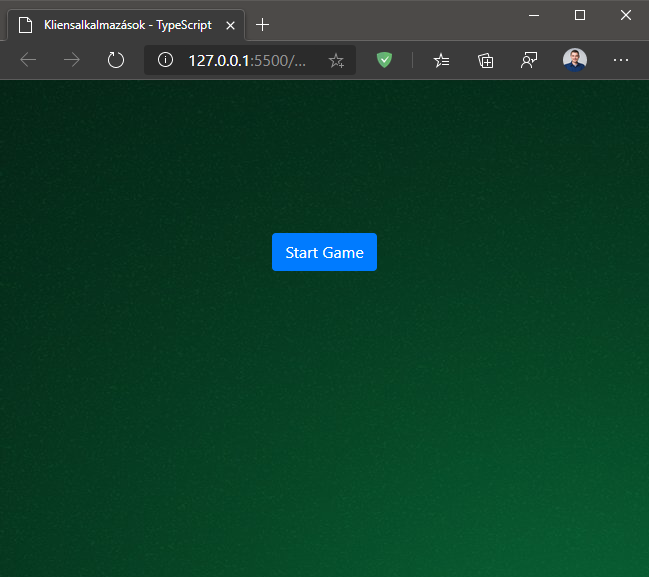
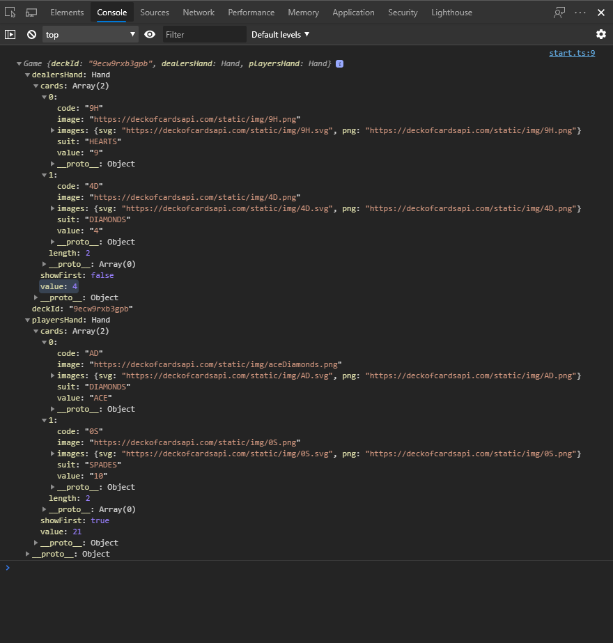
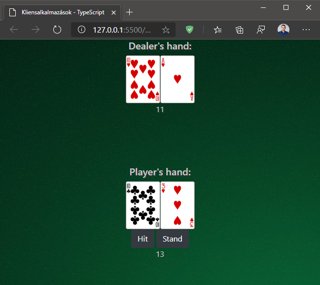

[wip]: ../assets/wip.png "Kidolgozás alatt..."

# Labor 04 - TypeScript, AJAX

## Beugró

[Beugró kedd 12:15](https://forms.office.com/Pages/ResponsePage.aspx?id=q0g1anB1cUKRqFjaAGlwKdZsyXOvlN1KkyDxKogpmGRUNFI4UjJVNFhHQlNUNDk1UVFPSzQzOEpHRi4u)

[Beugró szerda 16:15](https://forms.office.com/Pages/ResponsePage.aspx?id=q0g1anB1cUKRqFjaAGlwKdZsyXOvlN1KkyDxKogpmGRUREtBSjU0TDY5MzhHWTNVNVEyWDJMTk9GSi4u)

## Bevezetés

A labor folyamán a hallgatók a laborvezető segítségével és önállóan végeznek feladatokat a webes technológiák gyakorlati megismerése érdekében.

Felhasznált technológiák és eszközök:

- webböngészők beépített hibakereső eszközei,

- npm, a [NodeJS](https://nodejs.org/en/download/) csomagkezelője,

- [Visual Studio Code](https://code.visualstudio.com/download) kódszerkesztő alkalmazás,
  - otthoni vagy egyéni munkavégzéshez használható bármilyen más kódszerkesztő vagy fejlesztőkörnyezet, de a környezet kapcsán felmerülő eltérésekről önállóan kell gondoskodni.

### A TypeScriptről dióhéjban

A TypeScript opcionális, statikus típusrendszerrel felturbózott JavaScript, tehát elsősorban szintaktikai édesítőszereket ad a JavaScripten felül, amik könnyebbé teszik a JavaScript alkalmazások fejlesztését.

A TypeScript kulcsfontosságú eleme a `tsc`, azaz a TypeScript compiler, aminek segítségével a TypeScript forráskódunkat fordíthatjuk le JavaScript forráskóddá (tehát ez egy *source-to-source compiler*, vagy más néven *transpiler*).

**A TypeScript a JavaScriptre épít, így minden JavaScript fájl egyben értelmezhető TypeScript kód is.** A VS Code alapértelmezetten IntelliSense segítséget ad nekünk a JavaScript forrásokban is, ezt a TypeScript compiler segítségével teszi a háttérben.

### Előkészítés

- Nyissuk meg a Visual Studio Code-ot egy üres munkamappában, ahová töltsük le és csomagoljuk ki a [blackjack-kiindulo.zip](./blackjack-kiindulo.zip) fájl tartalmát!

## BlackJack

Vizsgáljuk meg a kiinduló projektet! A kiinduló index.html a `<head>` részben hivatkozza a függőségeket, köztük a saját `blackjack.js` fájlunkat. Vegyük észre, hogy ilyen fájl nem található, mi magunk kézzel nem is fogjuk létrehozni; ezt a TypeScript compiler fogja nekünk generálni a `blackjack.ts` fájlból indulva. Vizsgáljuk meg a `tsconfig.json` nevű fájlt, ami a TypeScript compiler konfigurációját tartalmazza!

Terminálból (Ctrl+ö) adjuk ki az alábbi parancsot a munkamappában:
> `npm install`

Ezzel a paranccsal a package.json fájlban található függőségeket telepítjük a Node.js Package Manager (`npm`) segítségével. Itt a Bootstrap, a JQuery és Popper osztálykönyvtárak találhatók (utóbbi kettő a Bootstrap függősége).

Indítsuk el Terminálból a TypeScript compilert `watch` módban, ami figyelni fogja az összes hivatkozott TypeScript fájl módosítását, és újragenerálja szükség esetén a kimenetet:
> `node_modules\.bin\tsc -w`

Indítást követően a következő képernyő fogad minket:


A Start gombra kattintva nem történik egyelőre semmi.

Vizsgáljuk meg a `game.ts` fájl tartalmát!

``` TS
class Game {
    private constructor(public readonly deckId: string) {
    }

    static readonly apiBaseUrl = "https://deckofcardsapi.com/api/";

    static async NewGame(deckCount: number = 6) {
        var response = await this.NewDeck(deckCount);
        return new Game(response.deck_id);
    }

    static async NewDeck(deckCount: number) {
        return await this.Call<NewDeckResponse>(`deck/new/shuffle/?deck_count=${deckCount}`);
    }

    async Draw(count: number = 1) {
        return await Game.Call<DrawCardResponse>(`deck/${this.deckId}/draw/?count=${count}`);
    }

    private static async Call<ResponseType extends DeckOfCardsResponse>(relativeUrl: string) {
        const response = await fetch(`${this.apiBaseUrl}${relativeUrl}`);
        const responseJson: ResponseType = await response.json();
        if (!responseJson.success) {
            console.error("Error from Deck Of Cards API:", responseJson);
        }
        return responseJson;
    }

    dealersHand: Hand = new Hand([], false);
    playersHand: Hand = new Hand([], true);
}
```

- Ez az osztály a <a href="https://deckofcardsapi.com/api/" target="_blank">Deck of Cards API</a> klienseként szolgál.
- Konstruktora privát, példányosítani egy `Game` objektumot a statikus, aszinkron `NewGame` függvény meghívásával lehetséges.
- A konstruktorban jelzett `public` módosítószóval az objektumon automatikusan létrejön a konstruktorparaméter nevével és értékével egy egyszer beállítható, csak olvasható `deck_id` mező.
- Minden távoli HTTP hívás a `Call` függvényen megy keresztül, ahol egy relatív útvonalat kell megadnunk, ami a `https://deckofcardsapi.com/api/`-hoz képesti relatív útvonalra indít egy aszinkron AJAX kérést a <a href="https://developer.mozilla.org/en-US/docs/Web/API/Fetch_API/Using_Fetch" target="_blank">fetch</a> API használatával.
- Érdemes észrevenni a C#-ból már ismeretes `async/await` minta használatát. A Call hívás ekvivalens az alábbi JavaScript kóddal:

``` JS
function Call(relativeUrl) {
  return new Promise((resolve, reject) => {
    fetch(`${this.apiBaseUrl}${relativeUrl}`).then(response => {
      response.json().then(responseJson => resolve(responseJson), reject)
    }, reject);
  });
}
```

Látható, hogy a kód ebben a formájában jóval kevésbé volna olvasható. A háttérben egy (esetenként komplex) állapotgépet készít a fordító, aminek segítségével ekvivalens működést tudunk elérni, csak nem egymásba ágyazott függvények, hanem `async/await` szintaxis segítségével.

Próbáljuk ki az alábbi hívást a böngésző URL-jébe írva:
> `https://deckofcardsapi.com/api/deck/new/shuffle/?deck_count=6`

Az így kapott válaszból helyettesítsük be a `deck_id` értékét az alábbi hívásba, és azt is próbáljuk ki:
> `https://deckofcardsapi.com/api/deck/<<deck_id>>/draw/?count=2`

Láthatjuk, hogy az így kapott válasz az alábbihoz hasonló lesz:
``` JSON

{
    "cards": 
    [
        {
            "images": 
            {
                "svg": "https://deckofcardsapi.com/static/img/3D.svg",
                "png": "https://deckofcardsapi.com/static/img/3D.png"
            }, 
            "image": "https://deckofcardsapi.com/static/img/3D.png", 
            "value": "3", 
            "code": "3D", 
            "suit": "DIAMONDS"
        }, 
        {
            "images": 
            {
                "svg": "https://deckofcardsapi.com/static/img/2S.svg", 
                "png": "https://deckofcardsapi.com/static/img/2S.png"
            }, 
            "image": "https://deckofcardsapi.com/static/img/2S.png",
            "value": "2", 
            "code": "2S",
            "suit": "SPADES"
        }
    ], 
    "remaining": 310, 
    "deck_id": "g7ldwoe33ss4", 
    "success": true
}

```

Ezt a fenti választ modellezendő, vegyük észre, hogy a típus leírója interfész formájában szerepel a `draw-card-response.ts` fájlban:

``` TS

interface DrawCardResponse extends DeckOfCardsResponse {
    cards: Card[];
}

```

A fenti interfész egy kártya tömböt tartalmaz, továbbá származik a DeckOfCardsResponse-ból:

``` TS

interface DeckOfCardsResponse {
    success: boolean;
    deck_id: string;
    remaining: number;
}

```

A kártyák pedig így néznek ki:

``` TS

interface Card {
    image: string;
    value: Rank;
    suit: Suit;
    code: string;
    images: { [key: string]: string }
}

```

A kártyákban az images objektum egy stringekkel indexelhető objektum, ami stringeket tartalmaz. A value Rank típusú, a suit Suit típusú, amik rendre az alábbi típusoknak felelnek meg:

``` TS

type Rank = "ACE" | "2" | "3" | "4" | "5" | "6" | "7" | "8" | "9" | "10" | "JACK" | "QUEEN" | "KING";
type Suit = "SPADES" | "HEARTS" | "DIAMONDS" | "CLUBS";

```

Ezek ún. TypeScript *unió típusok* (discriminated union type), amik csak az adott értékeket vehetik fel (minden érték egyúttal saját típusa is, pl. az `"ACE"` érték egy olyan típus, ami kizárólag ezt az egyetlen értéket veheti fel).

A játék példányunkat tehát a statikus, aszinkron `NewGame` függvény meghívásával példányosíthatjuk. A játékban az osztó és a játékos kezét a `Hand` osztály reprezentálja:

``` TS
class Hand {
    constructor(public cards: Card[], public showFirst: boolean) {
    }

    get value(): number {
        let value = 0;
        let aces = 0;
        for (let card of this.showFirst ? this.cards : this.cards.slice(1)) {
            switch (card.value) {
                case "KING":
                case "QUEEN":
                case "JACK":
                case "10":
                    value += 10;
                    break;
                case "ACE":
                    aces++;
                    value += 11;
                    break;
                default:
                    const cardValue = parseInt(card.value);
                    if (cardValue > 1)
                        value += cardValue;
                    else
                        console.error(`Unknown card value: ${card.value} (${card.code})`);
                    break;
            }
        }
        // TODO: ász érhessen 1-et is, ha túllépnénk vele a 21-et!
        return value;
    }
}
```

A `value` nevű mező csak lekérdezhető, számított érték: kiszámítja a kézben szereplő kártyák értékét.

### Játék indítása

A játék indításához vegyük fel a `start.ts` fájlba az alábbi kódrészletet:

``` TS
let game : Game;

$(document).on("click", "#start-game-button", async e => {
    $("#start-game-button").hide(); 
    game = await Game.NewGame();
    game.dealersHand.cards.push(...(await game.Draw(2)).cards);
    game.playersHand.cards.push(...(await game.Draw(2)).cards);
    $("#hit-button, #stand-button").show();
    console.log(game);
    // TODO: kirajzolás
});
```

Ez a kód a dokumentum betöltődését követően figyel a `click` eseményekre. Ha a `start-game-button` ID-jú elemet nyomtuk meg, lefut a beregisztrált aszinkron callback eseménykezelő függvény, ami:
- elrejti a Start Game gombot,
- aszinkron példányosítja a játék objektumot a `Game` osztály statikus, aszinkron `NewGame` függvényének meghívásával, amit értékül ad a globális `game` változónak,
- húz 2 lapot az osztónak és a játékosnak, amit a játékosok kezeiben elhelyez, a <a href="https://www.typescriptlang.org/docs/handbook/variable-declarations.html#spread" target="_blank">spread</a> operátorral kibontva a tömbből az egyes elemeket,
- láthatóvá teszi a Hit és Stand gombokat,
- a konzolra logolja a játék állapotát.



Láthatjuk, hogy a játékunk elindult, de még nem jelenítjük meg a szükséges adatokat. A render.ts fájlba vegyük fel az alábbi kódot:

``` TS
function renderHands(game: Game) {
    $(".hand-title").show();
    $(".hand-container").text("");
    // TODO: csak akkor mutatjuk meg az osztó első lapját, ha a játékos végzett ("stand").
    // Ha nem látszik az első lap, helyette mutassunk Jokert.
    for (let card of game.dealersHand.cards) {
        addCardToContainer("dealer", card);
    }
    for (let card of game.playersHand.cards){
        addCardToContainer("player", card);
    }

    renderCardValues(game);
}

function addCardToContainer(name: "dealer" | "player", card: Card) {
    $(`#${name}-container .hand-container`).append(getCardHtml(`./img/cards/${card.code}.png`, `${card.value} of ${card.suit}`));
}

function getCardHtml(cardUrl: string, cardText: string) {
    return ``;
}


function renderCardValues(game: Game) {
    $("#dealer-container .cards-value").text(game.dealersHand.value);
    $("#player-container .cards-value").text(game.playersHand.value);
}
```

A függvények az alábbi funkciókkal bírnak:
- `renderHands`: a paraméterül kapott játék állapotának megfelelően:
  - megjeleníti a címsor mezőket,
  - kitörli az esetleg a DOM-ban levő kártyákat (felülírja őket egy üres stringgel),
  - az osztó és játékos lapjait egyenként kirendereli `addCardToContainer` függvény segítségével,
  - kirajzolja a kártyák aktuális értékét,
- `addCardToContainer`: a megfelelő játékos kezébe kirajzolja a kártyát a `getCardHtml` függvény segítségével,
- `getCardHtml`: a paramétereknek megfelelően összeállítja a kártya képét reprezentáló HTML-t.

Ezután a játék állapotát ki is tudjuk rajzolni, ha a játék indítását kezelő eseménykezelőnk végére beírjuk:

``` TS

$(document).on("click", "#start-game-button", async e => {
    // ...
    renderHands(game);
});
```



### Új kártya húzása

A következő feladatunk a játék első lényegi eleme, az új kártya húzása. Ehhez a `start.ts` függvénybe vegyünk fel egy új eseménykezelőt:

``` TS
$(document).on("click", "#hit-button", async e => {
    $(".actions button").attr("disabled", "disabled");
    game.playersHand.cards.push(...(await game.Draw(1)).cards);
    renderHands(game);
    $(".actions button").removeAttr("disabled");
    // TODO: kezelni, ha a játékos túllépte a 21-et (bust)!
});
```

A fenti kód a korrábiakhoz képest értelemszerű, az egyetlen érdekesség, hogy a hívás előtt az akciógombokat letiltjuk, a válasz megérkezése után pedig újra engedélyezzük őket.

## Önálló feladatok

A TypeScript, a DOM és a kliensalkalmazások fejlesztésének gyakorlásaképp az alábbi feladatokat végezd el önállóan! Bármely fájlban módosíthatsz, létrehozhatsz és törölhetsz is fájlokat.

- Az osztó első lapja ne legyen látható! Helyette használd a `back.png` fájlt! Ne legyen látható a `title` szöveg sem, ha az egeret a kártya fölé visszük!
- Kezeld az ászok értékét: az ász 11-et ér, ha nem lépnénk túl vele a 21-et, egyébként 1-et.
- Ha a játékos túllépi a 21-et: ebben az esetben jeleníts meg egy megfelelő üzenetet, és legyen lehetőség új játék indítására!
- Ha a játékos megnyomja a Stand gombot: a játékos nem kér több lapot, ekkor viszont az osztó nem látható lapja felfedésre kerül, majd az osztó addig húz automatikusan, amíg el nem éri a játékos pontszámát vagy túllépi a 21-et (előbbi esetben az osztó nyer, utóbbiban veszít). A feszültség fokozása érdekében használhatod a `setTimeout(2000, () => { /* ... */})` hívást, amivel várakoztathatod a futást, mintha az osztó gondolkodna 2 másodpercig.
- Kezeld, ha a játékos győz!
- Kezeld a játékos pénzét! A játékos 1000$-ról indít, minden játék 100$-ba kerül, amit győzelem esetén a játékos duplán elnyer.
- Kezeld a *split* szabályt: a játékos, ha két ugyanolyan értékű lapja van, választhat egy új lehetőséget: *split*. Ekkor az egy-egy ugyanolyan értékű lap két külön kezébe kerül, a tét duplázódik, és mindkét új kezébe 1-1 új lapot kap. Mindkét kezéhez külön kéthet új lapot, vagy megállhat. A két keze külön-külön értékelődik ki az osztó lapjaival, tehát 0, 1 vagy 2 kezével nyerhet, ennek megfelelően részesül jutalomban.