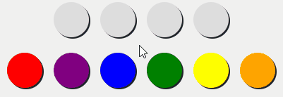
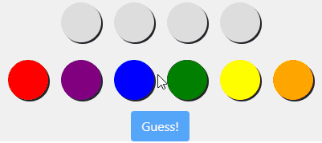
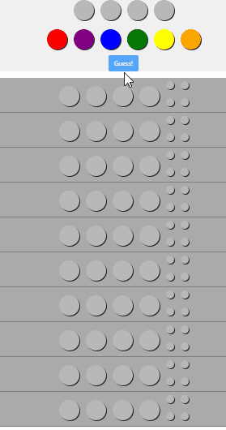

# Labor 06 - Egyszerű Angular alkalmazás fejlesztése

## Bevezetés

A labor folyamán a hallgatók jelen anyag segítségével önállóan végeznek feladatokat a webes technológiák gyakorlati megismerése érdekében.

<details>
<summary>
Mivel a labor önállóan elvégzendő, ezért a kódrészletek, feladatok egy része kinyitható blokkokba került az alábbihoz hasonlóan, hogy a feladatot teljesen önállóan is meg lehessen oldani. Klikk!<p>
</summary>

`spoiler.ts`
``` TS
export class Spoiler {
  text = "spoiler!";
}
```
<hr/>
</details>
<br/>
<details>
<summary>Ez a dokumentum egyedi stíluslapot is tartalmaz, amit a GitHub biztonsági okokból nem jelenít meg. VS Code-ot használva az egyedi stíluslap is látható lesz.</summary>

VS Code-ban történő megnyitáshoz érdemes a repository-t clone-ozni és megnyitni a megfelelő `README.MD` fájlt, ezután a jobb felső sarokban lehet váltani az előnézet és a kód nézet között (a kód nézet külön is bezárható). Természetesen figyelni kell, hogy ha változások történnének, akkor újra kell pull-ozni azokat.

GitHubon az alábbi CSS nyers szövegként jelenik meg, VS Code-ban viszont értelmezésre kerül, ezért a nyers szöveg nem látható.
<style>
details {
  padding-left: 1em;
  border-left: 1px solid;
}
details summary {
  font-size: 1.2em;
  cursor: pointer;
  color: #69f;
}
details summary:hover {
  color: #58a;
}
</style>

<hr/>
</details>
<br/>
<details>
<summary>Hogyan nyissuk ki/csukjuk be az összes elemet GitHubon?</summary>

Írjuk be a Console-ba az alábbi parancsot az összes elem kinyitásához:
``` JS
$$('.markdown-body details').map(i => i.setAttribute('open', ''))
```
Illetve becsukásához:
``` JS
$$('.markdown-body details').map(i => i.removeAttribute('open'))
```
<hr/>
</details>

Ez a labor az [előző labor](../05) folytatása, a szükséges fejlesztői eszközök megegyeznek, a korábbi végállapotot folytatjuk.

> *Figyelem!* A labor során számos, viszonylag nagyméretű (többszáz megabájt) függőségi csomag letöltésére lesz szükség, de ha valaki már sikeresen telepítette a korábbi labor során az NPM csomagokat, akkor azokat várhatóan nem kell újra letölteni.

## Előkészítés

Ha nincs meg az előző labor végállapota a gépünkön, akkor töltsük le a [kiinduló projektet](labor-6-kiindulo.zip), csomagoljuk ki egy tetszőleges munkamappába a tartalmát, majd a projekt mappájában adjuk ki az alábbi parancsot a VS Code beépített termináljának segítségével (`Ctrl+ö`):

> `npm install`

Ezután (ha letöltöttük a kiinduló projektet, vagy folytatjuk a korábbit), az alábbi parancsot kell futtatni:

> `ng serve`

*Fontos!* Ha a parancsok nem futnak le:
- Az `npm` parancs ismeretéhez szükséges telepíteni a NodeJS-t az [előző laborban](../05) leírtaknak megfelelően.
- Az `ng` parancs ismeretéhez szükséges telepíteni az `@angular/cli` csomagot globálisan, az [előző laborban](../05) leírtaknak megfelelően.
- Ha az `npm` vagy `ng` parancs akkor sem fut le, ha a NodeJS és az `@angular/cli` globálisan telepítve van, akkor vizsáljuk meg, hogy:
  - A rendszer vagy a *felhasználó* `PATH` változójában benne van-e az npm mappája: `%USERPROFILE%\AppData\Roaming\npm`); ha most adjuk hozzá, indítsunk mindent újra, hogy érvényre jusson a változás,
  - PowerShellből futtatva engedélyezve van-e a nem aláírt szkriptek futtatása. Ha nincs, akkor futtassuk az alábbi parancsot: `Set-ExecutionPolicy Bypass`. Ezt a parancsot futtatva az aktuális PowerShell shellben futtatva engedélyezésre kerülnek a nem aláírt `.ps1` szkriptek (az `ng.ps1`, amit az `ng` parancs hívásával érünk el). Ha ezt globálisan szeretnénk engedélyezni, akkor adminisztrátori PowerShellben is kiadhatjuk a parancsot, de fontos, hogy ez minden nem aláírt szkript futtatását engedélyezi, ezért veszélynek tehetjük ki a gépünket, ezért javasolt az egyes PowerShell ablakokban kiadni a parancsot, ahol szükséges.
  - Ha ezután sem sikerül futtatni az `ng` parancsot, az útmutatóban szereplő `ng` parancsokat mindenütt cserélni szükséges az alábbiak valamelyikére: `npm run ng` vagy `.\node_modules\.bin\ng` (ez utóbbi nem a gépen telepített globális, hanem az aktuális mappában, lokálisan telepített Angular CLI-t futtatja).

Ha sikeresen lefutnak a parancsok, az alkalmazást megnyithatjuk a [http://localhost:4200](http://localhost:4200)-as porton:


Javasolt feltelepíteni a böngészőnknek megfelelő bővítményt VS Code-hez, amivel debugolni tudunk:
- [Debugger for Microsoft Edge](https://marketplace.visualstudio.com/items?itemName=msjsdiag.debugger-for-edge)
- [Debugger for Chrome](https://marketplace.visualstudio.com/items?itemName=msjsdiag.debugger-for-chrome)

Debugoláshoz nyomjuk meg az `F5` billentyűt, válasszuk ki a lenyíló menüben a megfelelő debuggert (Edge/Chrome, amit az imént telepítettünk), és a létrejövő `launch.json` fájlban változtassuk meg az URL-t, hogy az a 4200-as portra mutasson. Ezután az `F5` billenyűvel indíthatjuk bármikor a debugolást (ehhez természetesen az `ng serve`-nek futnia kell). Ekkor a VS Code-ban elhelyezett töréspontokat (`F9`) meg fogjuk ütni, és megvizsgálhatjuk pl. a változók értékét a Debug fülön.

Az előző végállapothoz képest végezzük el az alábbi javítást:

> Az `unset` peg szín legyen valamivel sötétebb, hogy ne keveredjen a fehérekkel:
>
> `src\app\peg\peg.component.scss`
> ``` SCSS
> .peg.peg-unset {
>     background: #b8b8b8;
> }
> ```

## Tipp összeállítása

A tipp összeállításáért a fenti 4 üres kör, az alatta levő színpaletta és a tipp elküldéséhez szükséges gomb felel. Ezeknek az adatkötését és interakcióit fogjuk most kezelni.

Az első lépés, hogy az egyes színekre kattintva a palettában az aktuális tippünk első üres helyére kerüljön be a kattintott szín.

Ehhez az Angular beépített eseménykezelési lehetőségét fogjuk használni. Az [`@Output`](https://angular.io/guide/component-interaction#parent-listens-for-child-event) dekorátorral ellátott `EventEmitter` példányunk képes eseményeket elsütni, amire a szülő komponens feliratkozhat.

<details>
<summary>A PegComponent forráskódját egészítsük ki egy eseménykezelő függvénnyel (onPegClicked) és egy pegClick nevű Output tulajdonsággal!</summary>

`src\app\peg\peg.component.ts`
``` TS
@Output() // import { Output } from '@angular/core';
pegClick: EventEmitter<void> = new EventEmitter(); // import { EventEmitter } from '@angular/core';
// Fontos, hogy a jó csomagból importáljuk ezt az osztályt, mert több helyen is megtalálható!

onPegClicked() {
  this.pegClick.emit();
}
```
<hr/>
</details>  

A komponensünk tehát tud értesítést küldeni arról, ha valaki őt megnyomta. Az esemény tetszőleges paramétereket átadhat elsütéskor, nekünk erre nincs szükségünk, ezért egy `<void>` típusparaméterű `EventEmitter`t hozunk létre (ez tehát nem küld semmilyen objektumot paraméterül, amikor elsütjük). Az `onPegClicked()` függvény fogja magát a `pegClick` eseményt elsütni, ezt viszont még nem hívjuk meg sehonnan.

<details>
<summary>Módosítsuk a PegComponent kódját, hogy a div-en történő click esemény hatására lefusson az eseménykezelő!</summary>

`src\app\peg\peg.component.html`
``` HTML
<div class="peg peg-{{colorLower}} peg-{{type}}" 
    (click)="onPegClicked()">
</div>
```

A fenti `(click)="eventHandler"` szintaxis ekvivelens az alábbival.
``` HTML 
on-click="onPegClicked()"
```

Ezt ritkábban használják, de megfelel a HTML szabványnak, ami szerint az attribútumok csak alfanumerikus értékeket tartalmazhatnak (szemben a `(,),[,]` karakterekkel). A `[property]`-nek a megfelelője ugyanígy a `bind-property`.
<hr/>
</details>

A normál DOM elemeken elérhető nagyon sok beépített DOM esemény, mint pl. a `click`, ezeket az Angular alapételmezetten rendelkezésünkre bocsátja. A komponenseken (pl. az `mm-peg` elemen) ilyen nem érhető el, ugyanis ezek nem DOM elemekként, hanem komponensekként kezelendők. A komponensek viszont `@Output` dekorátorral ellátott eseménykezelő változókkal rendelkezhetnek, amelyek ezzel megegyező funkciót biztosítanak, ahogyan az alábbiakban is látható lesz.

<details>
<summary>Módosítsuk az AppComponent kódját, hogy kezelje a PegComponenten elérhető új eseményünket a saját addColorToCurrentGuess függvényével!</summary>

`src\app\app.component.ts`
``` TS
addColorToCurrentGuess(color: PegColor) {
  console.log(color);
}
```

`src\app\app.component.html`
``` HTML
<div class="colorpicker">
    <mm-peg *ngFor="let color of possibleValues" [type]="'code'" [color]="color"
            (pegClick)="addColorToCurrentGuess(color)"></mm-peg>
</div>
```

<hr/>
</details>

Foglaljuk össze, hogy mi történt eddig!
- A `PegComponent` osztályunk feliratkozott a `<div>` elem `click` eseményére, aminek hatására meghívja a saját `onPegClicked()` függvényét.
- A `PegComponent` deklarált egy eseményt az `@Output` dekorátorral `pegClick` néven, ezáltal az `AppComponent` fel tudott iratkozni az eseményre a `(pegClick)="eventHandler"` szintaxissal.
- A `PegComponent` az `onPegClicked()` függvényben elsüti a `pegClick` eseményt, ami tehát a `<div>`-re történő `click` eseményre van beregisztrálva.
- Az `AppComponent` minden egyes `<mm-peg>` elemre fel tudott iratkozni az `NgFor` direktívában, és így mindig a kattintott elem színét adja át az `addColorToCurrentGuess(color: PegColor)` függvénynek, ami jelenleg csak kiírja a kapott paramétert.

Nem minden `<mm-peg>` elemre fogunk feliratkoztatni eseménykezelőt. Az `EventEmitter` viszont ad lehetőséget nekünk arra, hogy lekérdezzük, hány feliratkozó van az elemre. A DOM-ban elérhető `style` tulajdonság bármely értékére tudunk kötni a speciális [`NgStyle`](https://angular.io/api/common/NgStyle) direktívával. 

<details>
<summary>Csak azok az &lt;mm-peg&gt; elemek, amikre van beregisztrálva legalább egy eseménykezelő, pointer típusú egérkurzort kapjanak!</summary>

`src\app\peg\peg.component.html`
``` HTML
<div class="peg peg-{{colorLower}} peg-{{type}}" 
    (click)="onPegClicked()"
    [style.cursor]="pegClick.observers.length > 0 ? 'pointer' : 'initial'">
</div>
```

Ezután csak azoknak az `<mm-peg>` komponenseknek a `<div>`-jeire fog felkerülni a "mutatós" egérkurzor, amikre van feliratkoztatva eseménykezelő, esetünkben tehát az egyes tippelhető színekre.
<hr/>
</details>

Már csak az "üzleti logika" megírása van hátra, tehát a megfelelő színt be kell tenni az első üres helyre.

<details>
<summary>Valósítsuk meg helyesen az addColorToCurrentGuess() függvényt!</summary>

`src\app\app.component`
``` TS
addColorToCurrentGuess(color: PegColor) {
  for (let i = 0; i < 4; i++) {
    if (this.currentGuess[i] == 'unset'){
      this.currentGuess[i] = color;
      return;
    }
  }
}
```

Fontos a `return`, ugyanis ha nem lépünk ki, miután találtunk egy üres helyet, az összes üres helyre be fog kerülni a tippünk.

A fentitől kicsit egyszerűbben is megírhatjuk a keresést és beszúrást a `splice` univerzális tömbmanipuláló függvénnyel:

``` TS
addColorToCurrentGuess(color: PegColor) {
  this.currentGuess.splice(this.currentGuess.indexOf('unset'), 1, color);
}
```

Ez annyiban működik másképpen, hogy ha az `indexOf('unset')` `-1`-gyel tér vissza, akkor a tömb végéről vesszük ki az utolsó elemet és cseréljük le. Ez nekünk így pont meg is felel.


<hr/>
</details>

## Tipp javítása

Ezek után az aktuális tippünk javítására azáltal van lehetőségünk, hogy valamelyik nem üres színű golyóra kattintunk. Ekkor, ha ezután jobbra a klikkelt golyótól még találhatók nemüres színű golyók, akkor azokat balra csúsztatjuk eggyel.

A legegyszerűbb megoldás az `NgFor` direktívában elkérni az aktuális elemünk indexét. Erre azért van szükség, mert több ugyanolyan színű golyónk is lehet, és ha csak a szín alapján próbálnánk meg kivenni az aktuális tippből az elemet, akkor rossz elemet is kivehetnénk (nem eldönthető, melyiket akartuk kivenni a 2 piros közül).

<details>
<summary>Implementáljuk értelemszerűen a removeColorFromCurrentGuess függvényt!</summary>

`src\app\app.component.ts`
``` TS
removeColorFromCurrentGuess(index: number) {
  this.currentGuess.splice(index, 1);
  this.currentGuess.push('unset');
}
```

Ez a függvény kiveszi az aktuális tippünkből az adott indexű elemet, a tömb végére pedig beszúr egy `unset` elemet. Így minden elem balra csúszik eggyel, de mivel 4 helyett csak 3 elem marad, ezért egy új üres elemet kell beszúrni a tömb végére.
<hr/>
</details>

A függvényt a megfelelő index-szel kell meghívnunk, ehhez használjuk az Angular [NgFor](https://angular.io/api/common/NgForOf) index szintaxisát!

<details>
<summary>Adjuk át az aktuális elem indexét az eseménykezelőnek az AppComponent .current-guess-row elemben!</summary>

`src\app\app.component.html`
``` HTML
<div class="current-guess-row">
    <mm-peg *ngFor="let color of currentGuess; index as i" [type]="'code'" [color]="color" 
        (pegClick)="removeColorFromCurrentGuess(i)"></mm-peg>
</div>
```

Láthatjuk, hogy az `NgFor` segítségével kivettük az aktuális elem indexét az `i` változóba, amit átadunk a `pegClick` eseménykezelőben a függvényünknek.


<hr/>
</details>

## Tipp elküldése

A `Guess!` feliratú gombot csak akkor engedélyezzük, ha már 4 színes golyó adja az aktuális tippünket!

A problémát többféleképpen megközelíthetjük. A legcélravezetőbb szintén adatkötést használni. Az `[attribútum]="érték"` szintaxissal adott DOM elem tulajdonságát adatköthetjük. Mi a gombunk `disabled` attribútumát szeretnék akkor és csak akkor engedélyezni, ha nincsen az aktuális tippben `unset` érték. Megtehetnénk, hogy minden alkalommal, amikor módosítjuk a tömböt (elemet veszünk fel vagy törlünk), újra kiszámoljuk, hogy van-e ilyen érték. Ez viszont törékeny, ugyanis minden helyen, ahol a tömböt manipuláljuk, meg kell hívnunk ezt a logikát is. Célszerűbb ahhoz a logikai értékhez kötni, ami el tudja dönteni, hogy van-e üres elem a tömbben.

<details>
<summary>Módosítsuk a gombhoz tartozó HTML részletet az `app\src\app.component.html`-ben, egyúttal vegyük fel a majdani tippelési logikát tartalmazó eseménykezelőt guess néven az `app\src\app.component.ts`-be!</summary>

`src\app\app.component.ts`
``` TS
guess() {
  console.log("Guess works!");
}
```

`src\app\app.component.html`
``` HTML
<button class="btn btn-primary" 
    [disabled]="currentGuess.indexOf('unset') !== -1"
    (click)="guess()">
    Guess!
</button>
```

Láthatjuk, hogy a `disabled` attribútum értéke azzal egyezik meg (*minden adott időpillanatban!*), hogy a `currentGuess` tömb tartalmaz-e `unset` értéket.


<hr/>
</details>

Láthatjuk, hogy a gomb `hover`-re továbbra is a `pointer`-t mutatja. Használhatnánk ismét a `[style]` adatkötést, de fontos, hogy csak azért, mert van egy kalapács a kezünkben, nem szabad mindent szögnek nézni. Ezért egyszerűsítsük le a dolgunkat.

<details>
<summary>Az AppComponent stíluslapjához vegyünk fel egy újabb CSS szabályt, ami a letiltott gombokat megfelelő kurzorral látja el!</summary>

`src\app\app.component.scss`
``` SCSS
button:disabled, .btn:disabled {
  cursor: not-allowed !important;
}
```

Láthatjuk, hogy itt használjuk az `!important` kulcsszót. Ez azért van, mert szeretnénk, ha minden esetben, ha az elemen definiált `style` esetleg másképp definiálná is, az összes HTML5 `<button>` és Bootstrap `.btn` gomb letiltott állapotban letiltott kurzorral rendelkezzen.
<hr/>
</details>

A tippünk összeállítását követően el is küldhetjük azt.

Ehhez kezelnünk kell a játék indulásakor, hogy sorsoljon ki nekünk a gép 4 véletlenszerű színt.

<details>
<summary>Egészítsük ki az AppComponent kódját egy új tulajdonsággal, ami a tippet fogja tartalmazni, valamint az initGame() függvényét, ami véletlenszerűen fog sorsolni a lehetséges értékek közül 4-et!</summary>

`src\app\app.component.ts`
``` TS
private secretColors: PegColor[];

initGame() {
  // ...
  this.secretColors = Array.from(Array(4)).map(_ => this.possibleValues[Math.floor(Math.random() * this.possibleValues.length)]);
}
```
A fenti feltöltési logika a `secretColors` tömböt tölti fel:
- veszünk egy 4 üres elemet tartalmazó tömböt,
- minden elemet transzformálunk egy véletlen értékre az alábbi módon:
  - az értéktől függetlenül (ez a `_` változó, így szokás jelölni a nem használt paramétereket) a `possibleValues` tömbből kiválasztunk egy véletlen elemet,
  - a `Math.random()` egy 0 és 1 közötti értéket ad nekünk vissza, ezt extrapoláljuk 0 és 5 közé, majd a `Math.floor()` segítségével vesszük a véletlen szám egész részét,
  - a kapott véletlen számmal kiindexeljük az egyik színt a `possibleValues` tömbből.
<hr/>
</details>

A tipp beküldéséhez kezeljük, amikor a felhasználó megnyomja a tippelésre szánt gombot. Ennek az eseménykezelőjében ki kell számítanunk, hogy melyik tippek voltak jó helyen, és melyikek rossz helyen. Itt figyelnünk kell, hogy azokat az elemeket, amiket már egyszer bármelyik módon lekezeltük, ne kezeljük a másik módon is. Ha megvannak az értékek, akkor:
- fel kell vennünk az aktuális tippet a leadott tippek közé,
- meg kell jelenítenünk a tipp helyességét a `key` típusú `peg`-ek által,
- üríteni kell az aktuális tippet.

A tipp beküldésekor vizsgáljuk, hogy eltalálta-e mind a 4 színt a játékos, mert ekkor nyer, illetve hogy ez volt-e az utolsó tippje, amivel még mindig nem találta el a színeket, mert ekkor veszít. Egyelőre egy `alert()` ablakot feldobhatunk erre az esetre. Ezt követően egyszerűen meghívjuk az `initGame()` függvényt, amivel új játékot indítunk.

<details>
<summary>A teljes guess() függvény forrása itt található.</summary>

`src\app\app.component.ts`
``` TS
guess() {
  // Készítünk egy másolatot a tippből és a sorsolt titkos sorrendből
  const current = this.currentGuess.slice();
  const secret = this.secretColors.slice();

  let matches = 0; // Itt gyűjtjük, hány talált.
  for (let i = 0; i < current.length; i++) {
    if (current[i] == secret[i]) { // Ha a két elem index szerint is megegyezik...
      matches++; // ... találtunk egyet ...
      current.splice(i, 1); // ... kivesszük mindkét tömbből ...
      secret.splice(i, 1);
      i--; // .. és visszaléptetjük az iterátorváltozót, mert változott a tömb mérete.
    }
  }
  let wrongPlace = 0; // Itt gyűjtjük, hány helyes, de rossz helyen van.
  for (let i = 0; i < current.length; i++) {
    const secretIndex = secret.indexOf(current[i]);
    if (secretIndex !== -1) { // Ha megtaláltuk az elemet a maradékban bárhol ...
      wrongPlace++; // ... találtunk egyet ...
      current.splice(i, 1); // ... kivesszük mindkettőből az első találatot...
      secret.splice(secretIndex, 1);
      i--; // .. és visszaléptetjük az iterátorváltozót, mert változott a tömb mérete.
    }
  }

  const currentInList = this.guesses.find(g => g.colors.indexOf('unset') !== -1); // Megkeressük az első elemet a listában, ahol van üres elem.
  currentInList.colors = this.currentGuess; // A tipp színeit átadjuk a listaelemnek.
  currentInList.keys = Array.from(Array(4).keys())
    .map<PegColor>(i => i < matches ? 'black' : i < matches + wrongPlace ? 'white' : 'unset') // Létrehozunk annyi fekete key-t, ahány talált, annyi fehéret, amennyi nem, a többi pedig üres.
  this.currentGuess = Array.from(Array(4)).map(_ => 'unset'); // Az új tippünk pedig legyen simán csak üres.  

  if (matches === 4) { // Ha mind talált, nyertünk.
    alert("You won!");
    this.initGame();
  }
  else if (!this.guesses.some(g => g.colors.some(c => c === 'unset'))) { // Ha minden tippet leadtunk már, vesztettünk.
    alert("You lost...");
    this.initGame();
  }
}
```

Az adatkötés segítségével a felületre automatikusan bekerül a megfelelő tipp, ugyanis az adatkötés automatikusan újrarajzolja az elemeket a felületen.
<hr/>
</details>

## Játék végét jelző modális ablak

Ezt követően a játék végállapotát kell figyeljük. A játéknak csak akkor lehet a vége, amikor a játékos tippelt, és vagy eltalálta a helyes sorrendet vagy elértük a 10 tippet és az utolsó tipp sem volt helyes. Ekkor jelenítsünk meg egy új modális ablakot, amibe tegyük ki, hogy mi volt az eredetileg sorsolt sorrend, mi volt a játékos utolsó tippje, hány tippet adott le, valamint egy gombot, amivel új játék indítása lehetséges. Jelenleg csak egy csúnya `alert` ablakot dobunk fel, viszont sokkal szebb megoldás volna, ha az [NgBootstrap modális ablakát](https://ng-bootstrap.github.io/#/components/modal/examples) jelenítenénk meg az alábbiakkal:
- jelezzük, hogy nyert vagy veszített a játékos,
- a leadott tippek száma,
- az utoljára leadott tipp,
- az eredetileg sorsolt sorrend,
- egy gomb, amivel új játék indítható.

A modális ablak kezeléséhez a komponensünknek konstruktorban kell várnia az NgbModal objektumot az `@ng-bootstrap\ng-bootstrap` modulból:

`src\app\app-component.ts`
``` TS
constructor(private modalService: NgbModal) // import { NgbModal } from '@ng-bootstrap\ng-bootstrap';
```

Ez az ún. [Dependency Injection](https://angular.io/guide/dependency-injection) (vagy *függőséginjektálás*). Amikor az alkalmazásunk moduljába (`app.module.ts`) beregisztráltuk függőségként az `NgbModule`-t, felruháztuk az Angulart annak lehetőségével, hogy az abban a modulban definiált elemeket ismerhessük, el tudjuk kérni pl. komponenseink (szolgáltatásaink stb.) konstruktorában. A komponenseket ugyanis az Angular példányosítja nekünk (sosem hívtunk `new AppComponent()`-et a saját kódunkban), és figyelembe veszi, hogy milyen függőségeket kell átadnia az egyes objektumok létrehozásához.

Ezután a komponens kódjában a `modalService` tulajdonság segítségével megjeleníthetünk egy modális ablakot. Erre több lehetőségünk is van:
- átadható az Angular komponens típusa (egyszerű függvényparaméterül) az `open` függvénynek, de ekkor magunknak kell gondoskodni a komponens paraméterezéséről,
- átadható egy [TemplateRef](https://angular.io/api/core/TemplateRef), azaz egy komponens template-jének része (beágyazott nézet).

<details>
<summary>Készítsük el és jelenítsük meg a modális ablakot!</summary>

A fent felsorolt két lehetőség közül az elsőt valósítjuk meg. Ehhez létrehozunk egy önálló komponenst, ami ki fogja rajzolni a végeredményt.

> `ng generate component game-over`

`src\app\game-over\game-over.component.ts`
``` TS
export class GameOverComponent implements OnInit {

  @Input()
  won: boolean;

  @Input()
  numberOfGuesses: number;

  @Input()
  lastGuess: PegColor[];

  @Input()
  secretColors: PegColor[];

  @Output()
  restart = new EventEmitter<void>();

  constructor() { }

  ngOnInit(): void {
  }

  initParameters(inputs: { won: boolean, numberOfGuesses: number, lastGuess: PegColor[], secretColors: PegColor[] }, outputs: { restart: (...args: any[]) => any }) {
    for (let prop in inputs)
      this[prop] = inputs[prop];
    for (let prop in outputs)
      (this[prop] as EventEmitter<any>).subscribe(outputs[prop]);
  }
}
```

A komponensünkben implementálhatunk egy ilyen függvényt, amivel beállíthatjuk az egyébként komponensparaméterként érkező változókat. Mivel most kódból példányosodik a komponensünk, ezért kézzel kell ezeket beállítanunk. Az `initParameters` függvény két paramétert vár:
- az első (`inputs`) paraméterben ugyanolyan névvel és típussal szerepelnek az elemünk `@Input` paraméterei,
- a második (`outputs`) ugyanígy a kimenő paraméterek feliratkoztatandó függvényei, de mivel ezeknek változó típusai lehetnek, ezért akárhány bemenő paramétert váró és akármivel visszatérő függvényt elfogadunk itt.

Első lépésben bejárjuk az inputs tömb kulcsait (tehát `won`, `numberOfGuesses`, `lastGuess`, `secretColors`), és a `this`-re ráindexeljük az objektum adott nevű tulajdonságait. Emlékezzünk, ezt azért tehetjük meg, mert JavaScriptben minden objektum egyben egy asszociatív tömb is.

A második lépés ezzel majdnem megegyezik, itt viszont nem adhatjuk a paraméterül kapott függvényt az `EventEmitter` értékének. Itt kiindexeljük a megfelelő nevű tulajdonságokat (most csak a `restart` nevűt), és ezt `EventEmitter<any>`-vé típusasszertálva meghívjuk a feliratkoztatás függvényét és átadjuk a feliratkoztatandó függvényt (a `restart()`-ot).

`src\app\game-over\game-over.component.html`
``` HTML
<div class="text-center" [class.won]="won">
    <h1 *ngIf="won">Congratulations! You won!</h1>
    <h2 *ngIf="!won">You lost. Better luck next time!</h2>

    <h3>You took <span class="guesses">{{numberOfGuesses}}</span> guesses.</h3>

    <h3>Your last guess was:</h3>
    <mm-peg *ngFor="let color of lastGuess" [type]="'code'" [color]="color"></mm-peg>

    <h3>The secret was:</h3>
    <mm-peg *ngFor="let color of secretColors" [type]="'code'" [color]="color"></mm-peg>

    <button class="btn btn-success btn-block" (click)="restart.emit()">Start new game</button>
</div>
```

Itt kettő újdonságot láthatunk:
- a `[class.won]` ekvivalensen működik, mint a [style.cursor], csak itt nem stílus értékét adjuk meg, hanem azt, hogy az adott nevű osztály rákerüljön-e az elemre vagy sem,
- az [`NgIf`](https://angular.io/api/common/NgIf) strukturális direktíva csak akkor helyezi a DOM-ba az adott elemet, ha az átadott feltétel igaz.

`src\app\game-over\game-over.component.scss`
``` SCSS
.guesses {
    color: red;
}
.won .guesses {
    color: green;
}
```

Ebben a CSS-ben kihasználjuk a CSS szabályok specificitását. A `.guesses` szövege piros, de a `.won .guesses` értéke zöld, és mivel az utóbbi specifikusabb, ha a játékos nyer, ez jut érvényre, egyébként a piros.

A modális ablak feldobásakor igazából egyetlen paramétert kell átadnunk egy közösen kezelhető függvénynek:

`src\app\app.component.ts`
``` TS
openGameOverModal(won: boolean) {
  let modal = this.modalService.open(GameOverComponent, { backdrop: 'static', centered: true });
  (modal.componentInstance as GameOverComponent).initParameters({
    won,
    numberOfGuesses: this.guesses.filter(g => !g.colors.includes('unset')).length,
    lastGuess: this.guesses.filter(g => !g.colors.includes('unset')).reverse()[0].colors,
    secretColors: this.secretColors.slice()
  }, {
    restart: () => {
      modal.close();
      this.initGame();
    }
  });
}
```

A korábbiak ismeretében a fenti kódrészlet már viszonylag egyértelmű. Az `NgbModal` `open` függvényének első paraméterül egy komponenstípust adunk át (konkrétan a komponens konstruktorfüggvényét, ebben az esetben, ami megegyezik a típus nevével), második paraméternek pedig átadjuk, hogy legyen nem "kiklikkelhető" a modális ablak, valamint legyen függőlegesen is középre igazítva. A függvényhívás eredménye egy `NgbModalRef`, amin keresztül bezárhatjuk a modális ablakot (ezt a `restart`-ban meg is tesszük), illetve ezen keresztül elérjük a példányosított komponensünket. A komponensen meghívjuk a szándékosan erre a célra írt inicializáló függvényünket, amiben értelemszerűen átadjuk a megfelelő input értékeket, valamint a `restart` függvényt, amit akkor hívunk meg, amikor a játékos a *Start new game* feliratú gombra kattint..

Még az `AppComponent` `guess()` függvényében fel kell dobnunk a modális ablakot.

`src\app\app.component.ts`
``` TS
guess() {
  // ...
  if (matches === 4) // Ha mind talált, nyertünk.
    this.openGameOverModal(true);
  else if (!this.guesses.some(g => g.colors.some(c => c === 'unset'))) // Ha minden tippet leadtunk már, vesztettünk.
    this.openGameOverModal(false);
}
```

<hr/>
</details>

Ezzel elkészültünk az alkalmazás önállóan játszható verziójával. A következő alkalommal a kliensoldali üzleti logikánkat átemeljük egy szerverre, ami kezelni fogja a játék logikáját.



Kérlek, a labor végeztével [értékeld ezt a labort az alábbi form kitöltésével](https://forms.office.com/Pages/ResponsePage.aspx?id=q0g1anB1cUKRqFjaAGlwKdeFMnrrGeFFtDtsgpG72jxURjBFWUpDUllMRjJVMU45NVJRUktUOEg0NiQlQCN0PWcu) (a kitöltés csak a tárgy hallgatói számára engedélyezett).
