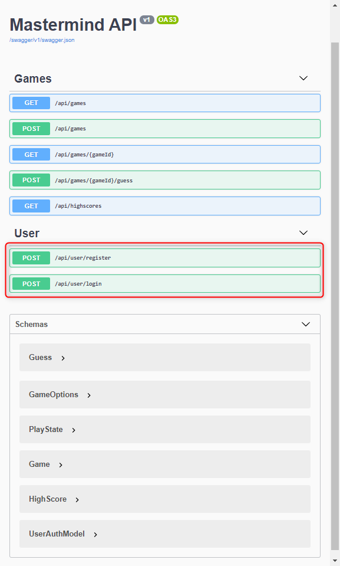
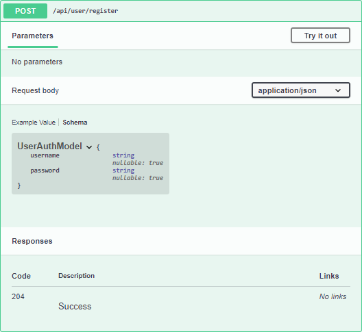
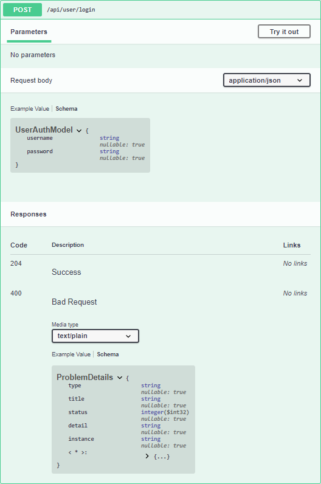

# Labor 07 - Angular Haladó

## Bevezetés

A labor folyamán a hallgatók jelen anyag segítségével önállóan végeznek feladatokat a webes technológiák gyakorlati megismerése érdekében.

<details>
<summary>
Mivel a labor önállóan elvégzendő, ezért a kódrészletek, feladatok egy része kinyitható blokkokba került az alábbihoz hasonlóan, hogy a feladatot teljesen önállóan is meg lehessen oldani. Klikk!<p>
</summary>

`spoiler.ts`
``` TS
export class Spoiler {
  text = "spoiler!";
}
```
<hr/>
</details>
<br/>
<details>
<summary>Ez a dokumentum egyedi stíluslapot is tartalmaz, amit a GitHub biztonsági okokból nem jelenít meg. VS Code-ot használva az egyedi stíluslap is látható lesz.</summary>

GitHubon az alábbi CSS nyers szövegként jelenik meg, VS Code-ban viszont értelmezésre kerül, ezért a nyers szöveg nem látható.
<style>
details {
  padding-left: 1em;
  border-left: 1px solid;
}
details summary {
  font-size: 1.2em;
  cursor: pointer;
  color: #69f;
}
details summary:hover {
  color: #58a;
}
</style>

<hr/>
</details>
<br/>
<details>
<summary>Hogyan nyissuk ki/csukjuk be az összes elemet GitHubon?</summary>

Írjuk be a Console-ba az alábbi parancsot az összes elem kinyitásához:
``` JS
$$('.markdown-body details').map(i => i.removeAttribute('open'))
```
Illetbe becsukásához:
``` JS
$$('.markdown-body details').map(i => i.removeAttribute('open'))
```
<hr/>
</details>

Ez a labor az [előző labor](../06) folytatása, a szükséges fejlesztői eszközök megegyeznek, a korábbi végállapotot folytatjuk.

> *Figyelem!* A labor során számos, viszonylag nagyméretű (többszáz megabájt) függőség letöltésére lesz szükség.

## Előkészítés

Ha nincs meg az előző labor végállapota a gépünkön, akkor töltsük le a [kiinduló projektet](labor-7-kiindulo.zip), **VAGY** a [módosított projektet](labor-7.1-kiindulo.zip), amellyel a <a href="#after-refactor" target="_blank">projekt eleji refaktort követő</a> állapotra ugorhatunk. Csomagoljuk ki egy tetszőleges munkamappába a ZIP tartalmát, majd a projekt mappájában adjuk ki az alábbi parancsot a VS Code beépített termináljának segítségével (`Ctrl+ö`):

> `npm install`

Ezután (ha letöltöttük a kiinduló projektet, vagy folytatjuk a korábbit), az alábbi parancsot kell futtatni:

> `ng serve`

*Fontos!* Ha a parancsok nem futnak le:
- Az `npm` parancs ismeretéhez szükséges telepíteni a NodeJS-t az [előző laborban](../05) leírtaknak megfelelően.
- Az `ng` parancs ismeretéhez szükséges telepíteni az `@angular/cli` csomagot globálisan, az [előző laborban](../05) leírtaknak megfelelően.
- Ha az `npm` vagy `ng` parancs akkor sem fut le, ha a NodeJS és az `@angular/cli` globálisan telepítve van, akkor vizsáljuk meg, hogy:
  - A rendszer vagy a *felhasználó* `PATH` változójában benne van-e az npm mappája: `%USERPROFILE%\AppData\Roaming\npm`); ha most adjuk hozzá, indítsunk mindent újra, hogy érvényre jusson a változás,
  - PowerShellből futtatva engedélyezve van-e a nem aláírt szkriptek futtatása. Ha nincs, akkor futtassuk az alábbi parancsot: `Set-ExecutionPolicy Bypass`. Ezt a parancsot futtatva az aktuális PowerShell shellben futtatva engedélyezésre kerülnek a nem aláírt `.ps1` szkriptek (az `ng.ps1`, amit az `ng` parancs hívásával érünk el). Ha ezt globálisan szeretnénk engedélyezni, akkor adminisztrátori PowerShellben is kiadhatjuk a parancsot, de fontos, hogy ez minden nem aláírt szkript futtatását engedélyezi, ezért veszélynek tehetjük ki a gépünket, ezért javasolt az egyes PowerShell ablakokban kiadni a parancsot, ahol szükséges.
  - Ha ezután sem sikerül futtatni az `ng` parancsot, az útmutatóban szereplő `ng` parancsokat mindenütt cserélni szükséges az alábbiak valamelyikére: `npm run ng` vagy `.\node_modules\.bin\ng` (ez utóbbi nem a gépen telepített globális, hanem az aktuális mappában, lokálisan telepített Angular CLI-t futtatja).

Ha sikeresen lefutnak a parancsok, az alkalmazást megnyithatjuk a [http://localhost:4200](http://localhost:4200)-as porton.

Javasolt feltelepíteni a böngészőnknek megfelelő bővítményt VS Code-hoz, amivel debugolni tudunk:
- [Debugger for Microsoft Edge](https://marketplace.visualstudio.com/items?itemName=msjsdiag.debugger-for-edge)
- [Debugger for Chrome](https://marketplace.visualstudio.com/items?itemName=msjsdiag.debugger-for-chrome)

Ha még nem debugoltuk a projektet: a debugoláshoz nyomjuk meg az `F5` billentyűt, válasszuk ki a lenyíló menüben a megfelelő debuggert (Edge/Chrome, amit az imént telepítettünk), és a létrejövő `launch.json` fájlban változtassuk meg az URL-t, hogy az a 4200-as portra mutasson. Ezután az `F5` billenyűvel indíthatjuk bármikor a debugolást (ehhez természetesen az `ng serve`-nek futnia kell). Ekkor a VS Code-ban elhelyezett töréspontokat (`F9`) meg fogjuk ütni, és megvizsgálhatjuk pl. a változók értékét a Debug fülön.

### Módosítások

Az alkalmazást fel kell készítenünk arra, hogy kezeljen URL-eket.

Nevezzük át az `app.component.*` fájlokat `game.component.*`-ra (F2), helyezzük őket az `src\app\game` mappába, és a `game.component.ts` fájl `@Component` dekorátorát módosítsuk az alábbira:

`src\app\game\game.component.ts`
``` TS
@Component({
  selector: 'mm-game',
  templateUrl: './game.component.html',
  styleUrls: ['./game.component.scss']
})
export class GameComponent {
  // ...
```

Ezután hozzuk újra létre az AppComponent-et:

> `ng generate component app --flat --selector=mm-root`

Az alkalmazásunk mostantól routing-ot fog használni (alapértelmezetten a CLI routing engedélyezett alkalmazást készít, mi ezt eredetileg kikapcsoltuk), ehhez importáljuk a `RouterModule`-t az `@angular/router` csomagból, majd vegyük fel a saját alkalmazásunk függőségei (`imports`) köző a RouterModule egy paraméterezett verzióját az alábbi módon:
``` TS
RouterModule.forRoot([
  { path: 'game', component: GameComponent }
])
```

Ez az útvonal a `/game` URL-re a `GameComponent`-et fogja betölteni arra a helyre, ahol az alkalmazásunk template-jében a `<router-outlet>` nevű elem szerepel. Ha visszaemlékszünk, ezt töröltük az első alkalommal, így most az `app.component.html` kódja legyen ismét az alábbi:
``` HTML
<router-outlet></router-outlet>
```

Az AppModule-ban a most hibásan GameComponentnek gondolt bootstrap elemet, tehát az alkalmazás belépési pontját, le kell cserélni ismét az AppComponentre.

<details>
<summary>
Ha mindent jól csináltunk, az `src\app\app.module.ts` fájl tartalma az alábbi lesz.
</summary>

``` TS
import { BrowserModule } from '@angular/platform-browser';
import { NgModule } from '@angular/core';
import { RouterModule } from '@angular/router';
import { NgbModule } from '@ng-bootstrap/ng-bootstrap';

import { GameComponent } from './game/game.component';
import { PegComponent } from './peg/peg.component';
import { GameOverComponent } from './game-over/game-over.component';
import { AppComponent } from './app.component';

@NgModule({
  declarations: [
    AppComponent,
    GameComponent,
    PegComponent,
    GameOverComponent
  ],
  imports: [
    BrowserModule,
    NgbModule,
    RouterModule.forRoot([
      { path: 'game', component: GameComponent }
    ])
  ],
  providers: [],
  bootstrap: [AppComponent]
})
export class AppModule { }

``` 

</details>

Ha problémába ütköztünk, akkor töltsük le a [labor-7.1-kiindulo.zip](labor-7.1-kiindulo.zip) fájlt, és folytassuk <span id="after-refactor">innen</span>.

Ha most elindítjuk a kódot, meglepődhetünk, hogy a [http://localhost:4200](http://localhost:4200)-on nem jön be semmi. Ez azért van, mert nem definiáltunk alapértelmezett útvonalat és/vagy nem adtuk meg, melyik komponens töltődjön be a gyökér útvonalon. Ez azt jelenti, hogy a játékunk továbbra is elérhető a [http://localhost:4200/game] URL-en.

## Bejelentkezés felület

A bejelentkezéshez kell készítenünk egy felületet, ahol a felhasználó nevét és jelszavát fogjuk bekérni. Ugyanitt legyen lehetőség regisztrációra is, amikor a jelszót kétszer kell megadni.

Vegyünk fel egy új komponenst LoginComponent néven!

> `ng g c login`

<details>
<summary>
A LoginComponent-et regisztráljuk be a `login` és `register` útvonalakra! Mindkét esetben ugyanazt a komponenst fogjuk használni.
</summary>

``` TS
RouterModule.forRoot([
  { path: 'game', component: GameComponent },
  { path: 'login', component: LoginComponent },
  { path: 'register', component: LoginComponent }
]),
```

</details>

Angular segítségével a komponenseink [konstruktor injektálás](https://angular.io/guide/architecture-services) segítségével használhatják az Angular által adott, illetve a magunk által definiált szolgáltatásokat. 

<details>
<summary>
Injektáljuk be az ActivatedRoute szolgáltatást a LoginComponentbe, és ennek segítségével frissítsünk egy 'register' nevű tulajdonságot, ha az aktuális útvonal a 'register'-re mutat!
</summary>

``` TS
constructor(private route: ActivatedRoute) {
}

register: boolean;
ngOnInit(): void {
  this.route.url.subscribe(e => {
    this.register = e[0].path === 'register';
    console.log(this.register);
  });
}
```

A fenti segítségével tehát el tudjuk dönteni bármelyik adott időpillanatban, hogy a `/register` vagy `/login` oldalon van a LoginComponens meghívva.

**Fontos**, hogy az ActivatedRoute sok `Observable` típusú tulajdonságot ad nekünk. Az `Observable` egy tervezési mintában részt vevő objektum, a nevéből is adódóan ő egy *megfigyelhető*. A megfigyelését a `subscribe()` függvény meghívásával tudjuk elkezdeni, aminek átadhatjuk a megfigyelésre szánt függvényt, ebben az esetben megnézzük, hogy az aktuális URL érték első tagja a `register` érték-e, és kiírjuk az eltárolt értéket a konzolra.

**Fontos**, hogy a feliratkozást, és egyébként minden logikát ne a konstruktorban, hanem az `ngOnInit()` függvényben végezzünk! Az Angular változásdetektálási mechanizmusa (a keretrendszer vizsgálja, hogy mikor kell újrarajzolni a felületet) először elvégzi a kezdeti adatkötést (pl. `@Input`, `@Output` dekorátorral ellátott tulajdonságok létrehozása, értékadása), és ezután hívja meg az `ngOnInit()` függvényt. Ezért jó szokás, ha minden inicializálási logikát azonnal ebbe a függvénybe teszünk, nem pedig a konstruktorba.

</details>

A LoginComponent tehát el tudja dönteni, hogy a `register` vagy a `login` oldalon vagyunk. Ennek függvényében minimálisan különböző tartalmú űrlapokat kell megjelenítenünk.

A LoginComponentben hozzunk létre egy űrlapot, amin 3 mező szerepel: `username`, `password`, `passwordAgain`. Legutóbbi csak akkor látható, ha a `register` oldalon vagyunk.

Az űrlap alján legyen egy link, ami `/login` esetén a `/register`-re mutat, `/register` esetén pedig a `/login`-ra.

Az űrlap `(submit)` eseményére iratkoztassunk fel egy eseménykezelőt submitForm néven, ami a konzolra írja a `username` és `password` értékét!

<details>
<summary>Készítsük el a fentieknek megfelelően az űrlapot!</summary>

`src\app\login\login.component.ts`
``` TS
import { Component, OnInit } from '@angular/core';
import { ActivatedRoute } from '@angular/router';
import { HttpClient } from '@angular/common/http';
import { UserService } from '../user.service';

@Component({
  selector: 'mm-login',
  templateUrl: './login.component.html',
  styleUrls: ['./login.component.scss']
})
export class LoginComponent implements OnInit {

  constructor(private route: ActivatedRoute) {
  }

  register: boolean;
  
  ngOnInit(): void {
    this.route.url.subscribe(e => {
      this.register = e[0].path === 'register';
      console.log(this.register);
    });
  }
  
  username: string;
  password: string;
  passwordAgain: string;

  submitForm() {
    console.log([this.username, this.password, this.passwordAgain]);
  }
}

```

`src\app\login\login.component.html`
``` HTML
<main class="container-fluid text-center my-5">
    <form (submit)="submitForm()" class="co l-xl-3 col-lg-4 col-md-6 col-sm-8 m-auto">
        <div class="card">
            <h1 class="card-title m-5">{{register ? 'Register' : 'Sign in'}} to Mastermind</h1>
            <div class="card-body">
                <div class="card-text">
                    <div class="input-group my-5">
                        <input [value]="username" name="username" type="text" class="form-control form-control-lg text-center"
                            placeholder="Input your username here." required>
                    </div>
                    <div class="input-group my-5">
                        <input [value]="password" name="password" type="password" class="form-control form-control-lg text-center"
                            placeholder="Input your password here." required>
                    </div>
                    <div class="input-group my-5" *ngIf="register">
                        <input [value]="passwordAgain" name="passwordAgain" type="password" class="form-control form-control-lg text-center"
                            placeholder="Input your password once more." required>
                    </div>
                    <button type="submit" class="btn btn-block btn-primary">Submit</button>
                </div>
            </div>
            <div class="card-footer">
                <a *ngIf="register" href="/login">Have an account?</a>
                <a *ngIf="!register" href="/register">Don't have an account?</a>
            </div>
        </div>
    </form>
</main>
```

</details>

Az alábbiakat érdemes észrevennünk: az oldal alján a navigációs linkek újratöltik a teljes oldalt. Nem túl SPA-hoz méltó. Ne közvetlenül navigáljunk, hanem engedjük az alkalmazásnak kezelni a saját navigációját! Ehhez az alábbi kódrészletet kell megadnunk:

``` HTML
<a *ngIf="register" routerLink="/login">Have an account?</a>
<a *ngIf="!register" routerLink="/register">Don't have an account?</a>
```

Ebben az esetben az Angular fog navigálni, így nem fog újraindulni a teljes alkalmazásunk a navigáció során. Fontos, hogy a fenti megegyezik az alábbi szintaxissal:
``` HTML
<a *ngIf="register" [routerLink]="'/login'">Have an account?</a>
```
Észre is vehetjük, hogy konstans érték "kötésekor" nincsen szükség a *valódi* adatkötésre, egyszerűen csak konstans értéket adunk át. Másik esetben a string értéket stringként kell jeleznük, ugyanis az nem stringként, hanem kódként értékelődik ki.

A routerLink egy Angular [direktíva](https://angular.io/guide/attribute-directives), melynek segítségével az Angular alkalmazásunk routingjának megfelelő, akár paraméterezett linkeket tudunk generálni. A direktívák (a legtöbbször adatkötés segítségével) funkcióval bővítik ki az adott DOM elemet, amin elhelyezésre kerülnek.

Ezeken túl azt is láthatjuk, hogy az oldal újratöltődik a gomb megnyomásakor. Természetesen ezt nem szeretnénk, mivel AJAX-szal szeretnénk kommunikálni, és alkalmazáson belül navigálni.

Ahhoz, hogy a navigációt meggátoljuk, importáljuk a `FormsModule`-t (`@angular/forms`) az alkalmazásmodulunkhoz:

``` TS
imports: [
  BrowserModule,
  NgbModule,
  RouterModule.forRoot([
    { path: 'game', component: GameComponent },
    { path: 'login', component: LoginComponent },
    { path: 'register', component: LoginComponent }
  ]),
  FormsModule
],
```

Ugyanekkor észrevehetjük, hogy az adatok, amiket "elküldünk", nem ugyanazok, amiket begépeltünk a felületen. Ennek az oka, hogy mi egyirányú adatkötést végeztünk (`[value]="username"`), ez tehát a DOM-ba elhelyezi a `username` értékét, de nem fogja frissíteni azt. Ebben az esetben [kétirányú adatkötést](https://angular.io/guide/template-syntax#two-way-binding-) használunk az `[(ngModel)]` segítségével, ami a *banán a dobozban* szintaxisra hallgat:

``` HTML
<input [(ngModel)]="username" name="username" type="text" class="form-control form-control-lg text-center" placeholder="Input your username here." required>
```

Ha ennek megfelelően töltjük ki az űrlap többi részeit, akkor láthatjuk, hogy megfelelő adatok kerülnek a `submitForm()` függvényünkben kiírásra a konzolra.

Angularban lehetőségünk van a template-ben kétféle referencia-változó létrehozására: DOM elemre vagy direktíva példányra mutató template változók léteznek.

Tiltsuk le a küldéshez használt gombot, ha nem megfelelőek az adatok, azaz a required attribútumnak nem megfelelő értékük van! Ehhez használjuk a HTML Form elemen automatikusan létrejövő [NgForm](https://angular.io/api/forms/NgForm) direktívát:

``` HTML
<form #loginForm="ngForm" (submit)="submitForm()" class="col-xl-3 col-lg-4 col-md-6 col-sm-8 m-auto">
...
    <button type="submit" class="btn btn-block btn-primary" [disabled]="loginForm.invalid">Submit</button>

...
</form>
```

A direktíva példányt tehát el tudtuk kérni a Template-ben, beletettük egy (csak a template-ben látható) változóba, majd használtuk adatkötésre, hogy a gombot letiltsuk ezáltal.

Idő szűkéből adódóan a jelszavak egyezésére készülő validátort nem írunk most. [Bővebben az űrlap validációról itt lehet olvasni.](https://angular.io/guide/form-validation)

## Szerver kommunikáció

Az alkalmazásunk szerverrel fog kommunikálni. A webes fejlesztés során nagyon gyakori, hogy a frontendért és backendért felelős csapatok egymástól függetlenül dolgoznak, ezért elképzelhető, hogy már kész szerverhez kell a frontendet igazítani, de az is előfordul, hogy a szerver még nincsen kész. Mindkét helyen (szerveren és kliensen is) szokás az adatokat tesztadatokkal helyettesíteni (ún. *mock*). Mi most készen kapjuk a szervert, azzal tudunk tesztelni. A [szerveralkalmazás ASP.NET Core forráskódja letölthető erről a linkről](https://github.com/yugabe/Mastermind) vagy a [futtatható szerveralkalmazás letölthető erről a linkről](https://github.com/yugabe/Mastermind/blob/master/Executable/Mastermind.Api.v1.exe).

A szerver a http://localhost:5000 címen érhető el, az alább is látható leíró felület a http://localhost:5000/swagger URL-en érhető el indítás után. A szervernek LocalDb példányra van szüksége, konzol alkalmazásként futtatható.


<br/>
Ebből most a regisztrációt és belépést fogjuk elkészíteni:

<br/>

<br/>
Hozzunk létre egy új service-t, ami az API-val történő kommunikációt fogja végezni:

> `ng g s api`

Nagyobb alkalmazások esetén érdemes a kódot a leíró alapján generálni, vagy több szolgáltatást létrehozni az API-val történő kommunikációra.

Az API néhány modellobjektumot fog várni, illetve ezekkel fog visszatérni. A `models\api` mappát hozzuk létre, ebbe vegyük fel az alábbi fájlokat:

`src\app\models\api\game-options.dto.ts`
``` TS
export interface GameOptionsDto {
  maximumKeyValue: number;
  maximumNumberOfPossibleGuesses: number;
  keyLength: number;
  allowDuplicates: boolean;
}
```

`src\app\models\api\guess.dto.ts`
``` TS
export interface GuessDto {
  numbers: number[];
  numbersAtRightPlace: number;
  numbersAtWrongPlace: number;
}
```
`src\app\models\api\high-score.dto.ts`
``` TS
export interface HighScoreDto {
  user: string;
  playTimeInSeconds: number;
  date: string;
  guessesMade: number;
  possibleValues: number;
  maximumPossibleGuesses: number;
  allowDuplicates: boolean;
}
```
`src\app\models\api\play-state.ts`
``` TS
export type PlayState = 'InProgress' | 'Lost' | 'Won';
```
`src\app\models\api\user-auth.dto.ts`
``` TS
export interface UserAuthDto {
  username: string;
  password: string;
}
```
`src\app\models\api\index.ts`
``` TS
import { GameOptionsDto } from './game-options.dto';
import { GameDto } from './game.dto';
import { GuessDto } from './guess.dto';
import { HighScoreDto } from './high-score.dto';
import { PlayState } from './play-state';
import { UserAuthDto } from './user-auth.dto';

export { GameOptionsDto, GameDto, GuessDto, HighScoreDto, PlayState, UserAuthDto };
```
`src\app\models\api\game.dto.ts`
``` TS
import { GuessDto, GameOptionsDto, PlayState } from '.';

export interface GameDto {
  elapsedSecons: number;
  gameCreated: string;
  givenGuesses: GuessDto[];
  id: string;
  userId: string;
  options: GameOptionsDto;
  playState: PlayState;
}
```

Érdekesség az `index.ts` fájl, aminek segítségével importáljuk az összes API-hoz szükséges modellt és egy ponton exportáljuk. Így a `\models\api` hivatkozás importálásával mindent egyetlen fájlból importálhatunk (tranzitív módon), ahogyan ez a `game.dto.ts`-ben látható is.

Ezek után az `ApiService`-ünkben az Angular [`HttpClient`](https://angular.io/api/common/http/HttpClient) szolgáltatását használva hívjuk a megfelelő végpontokat. A `HttpClient` használatához a modulunkba importálni kell a `HttpClientModule`-t, ami a `HttpClient`-et tartalmazza. A teljes AppModule forráskódjának az alábbinak kell most lennie:

`src\app\app.module.ts`
``` TS
import { BrowserModule } from '@angular/platform-browser';
import { NgModule } from '@angular/core';
import { NgbModule } from '@ng-bootstrap/ng-bootstrap';
import { RouterModule } from '@angular/router';
import { FormsModule } from '@angular/forms'

import { AppComponent } from './app.component';
import { PegComponent } from './peg/peg.component';
import { GameComponent } from './game/game.component';
import { LoginComponent } from './login/login.component';
import { HttpClientModule } from '@angular/common/http';

@NgModule({
  declarations: [
    AppComponent,
    GameComponent,
    PegComponent,
    LoginComponent
  ],
  imports: [
    BrowserModule,
    NgbModule,
    RouterModule.forRoot([
      { path: 'game', component: GameComponent },
      { path: 'login', component: LoginComponent },
      { path: 'register', component: LoginComponent }
    ]),
    FormsModule,
    HttpClientModule
  ],
  providers: [],
  bootstrap: [AppComponent]
})
export class AppModule { }
```

Az ApiService pedig használja a szükséges DTO-kat és a HttpClient megfelelő metódusat (`get`, `post`) ahhoz, hogy meghívja a szerver végpontokat:

`src\app\api.service.ts`
``` TS
import { Injectable } from '@angular/core';
import { HttpClient } from '@angular/common/http';
import { GameDto, GameOptionsDto, HighScoreDto } from './models/api';

@Injectable({
  providedIn: 'root'
})
export class ApiService {

  private static readonly baseUrl: string = "http://localhost:5000/api/";

  constructor(private http: HttpClient) { }

  login(username: string, password: string) {
    return this.http.post<void>(`${ApiService.baseUrl}user/login`, { username, password }, { withCredentials: true });
  }

  register(username: string, password: string) {
    return this.http.post<void>(`${ApiService.baseUrl}user/register`, { username, password }, { withCredentials: true });
  }

  getGames() {
    return this.http.get<GameDto[]>(`${ApiService.baseUrl}games`, { withCredentials: true });
  }

  postGame(options: GameOptionsDto) {
    return this.http.post<GameDto>(`${ApiService.baseUrl}games`, options, { withCredentials: true });
  }

  getGame(gameId: string) {
    return this.http.get<GameDto>(`${ApiService.baseUrl}games/${gameId}`, { withCredentials: true });
  }

  postGuess(gameId: string, numbers: number[]) {
    return this.http.post<GameDto>(`${ApiService.baseUrl}games/${gameId}/guess`, numbers, { withCredentials: true });
  }

  getHighScores(entries?: number) {
    return this.http.get<HighScoreDto[]>(`${ApiService.baseUrl}highscores${entries != 0 ? `?entries=${entries}` : ''}`, { withCredentials: true })
  }
}

```

Láthatjuk, hogy a fenti kód analóg a leíró által definiált végpontokkal, azok paramétereivel és visszatérési értékével.

A `{ withCredentials: true }` opció átadására alapértelmezetten nincsen szükség, ugyanis ez a domainek közötti kommunikáció esetén nem engedélyezi pl. a sütik átküldését és fogadását. Éles környezetben az alkalmazás a leggyakrabban CORS whitelist-en szerepel vagy a szerver ugyanazon domainen érhető el (pl. a /api URL-en). Fontos, hogy a webalkalmazások alapértelmezetten nem engedélyezik a hosztok közötti AJAX kéréseket böngészőben. A használt webalkalmazás a http://localhost:4200 URL-en futó szervert whitelist-re helyezte. Ez a jelenség a [CORS](https://developer.mozilla.org/en-US/docs/Web/HTTP/CORS), illetve Angular-ben használható az alkalmazás fejlesztésekor a dev szerver [proxy](https://angular.io/guide/build#proxying-to-a-backend-server) lehetősége.

A belépést a szerver süti alapú jogosultságkezeléssel kezeli, a `login` és `register` végpontokon kívül semmit nem tudunk meghívni, amíg nincsen birtokolt sütink. Sütit sikeres belépés vagy regisztráció után kapunk, külön kezelnünk nem szükséges (a böngésző beépítetten kezeli), leszámítva a mostani helyzetet, amikor cross-domain sütit használunk, ekkor a [`withCredentials`](https://developer.mozilla.org/en-US/docs/Web/API/XMLHttpRequest/withCredentials) flag beállítása szükséges. Ha nincsen érvényes sütink, válaszüzenetben egy 401-es HTTP választ kapunk.

Lehetőségünk van arra is, hogy a flag-et minden kérésünkhöz, vagy rendszerezetten adott kérésekhez fűzzük hozzá, vagy a 401-es hívások hatására átirányítsuk a felhasználót a login oldalra. Ehhez Angularben [HTTP Interceptorokat](https://angular.io/api/common/http/HttpInterceptor) használhatunk.

<details>
<summary>
Valósítsuk meg, hogy sikeres belépést/regisztrációt követően a /menu URL-re kerüljünk a Router (https://angular.io/guide/router) szolgáltatás segítségével, valamint az alkalmazás alapértelmezetten irányítson át a /login URL-re.
</summary>

Természetesen fel kell vennünk ehhez egy újabb komponenst, amit nevezzünk MenuComponentnek:

> `ng g c menu`

Regisztráljuk be az útvonalak közé, egyúttal a gyökér útvonal átirányítását is:

`src\app\app.module.ts`
``` TS
RouterModule.forRoot([
  { path: 'game', component: GameComponent },
  { path: 'login', component: LoginComponent },
  { path: 'register', component: LoginComponent },
  { path: 'menu', component: MenuComponent },
  { path: '', redirectTo: 'login', pathMatch: 'full' }
]),
```

A Router segítségével irányítsuk át a felhasználót a "menu" abszolút URL-re.

`src\app\login\login.component.ts`
``` TS
constructor(
  private route: ActivatedRoute, 
  private api: ApiService,
  private router: Router) {
}
submitForm() {
  if (this.register) {
    this.api.register(this.username, this.password).subscribe(() => {
      this.router.navigateByUrl("menu");
    }, error => {
      console.error(error);
    })
  }
  else {
    this.api.login(this.username, this.password).subscribe(() => {
      this.router.navigateByUrl("menu");
    }, error => {
      console.error(error);
    })
  }
}
```
</details>

A MenuComponent-ben megfelelően lekérhetjük a folyamatban levő játékokat a játékos számára az alábbi módon:

``` TS
  constructor(private api: ApiService) { }

  games: GameDto[];
  
  ngOnInit(): void {
    this.api.getGames().subscribe(games => {
      console.log(games);
      this.games = games;
    });
  }
```


## Önálló feladatok

Önállóan elvégezhetők az alábbi feladatok a szerver használatával, gyakorlás jelleggel:
- Menü oldal: a felhasználó folyamatban levő játékainak listázása (`/api/games`), kiválasztása és a toplista megjelenítése (`/api/highscores`).
- Játék indítása: a `\menu` URL-en a játék indításához fel kell tudni konfigurálni a szükséges `GameOptionsDto` objektumot egy űrlap segítségével (vagy kiválasztani egy már futó játékot a listából). Használható validátor is, ugyanis minimum és maximum érték korlátozások vannak az opciókon. A GameOptionsDto elküldése után a visszakapott játék elindított állapotban van, tehát ennek felületét szükséges megjeleníteni a jelenlegi `game.component.ts`-ben. A GameComponent [URL paraméterben várja a játék ID-ját](https://angular.io/guide/router#route-parameters).
- Tipp beküldése: a tipp beküldése immár aszinkron módon fog történni, tehát a megfelelő tipp elküldésekor a `.subcribe()` operátorral fel kell iratkozni a válaszba, ott pedig a megfelelő logika alapján eldönteni, hogy a játéknak vége lett-e, valamint megjeleníteni a teljes játékteret.

## Zárás

Az elmúlt laboralkalmakon megismertük a webfejlesztés alaptechnológiáit, és egy komplexebb alkalmazásfejlesztési keretrendszer, az Angular felületét kapargattuk.

Ha kitartottál ezidáig, kérlek, töltsd ki a labort értékelő űrlapot az alábbi oldalon: <a href="https://forms.office.com/Pages/ResponsePage.aspx?id=q0g1anB1cUKRqFjaAGlwKdeFMnrrGeFFtDtsgpG72jxUNTFEM01HMjhRV0dCRFlPS1VJN1ZCU0JQSiQlQCN0PWcu" target="_blank">Labor 07 - Angular haladó - értékelés</a>.
